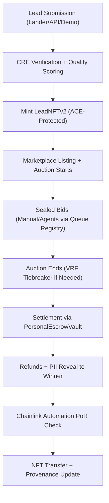
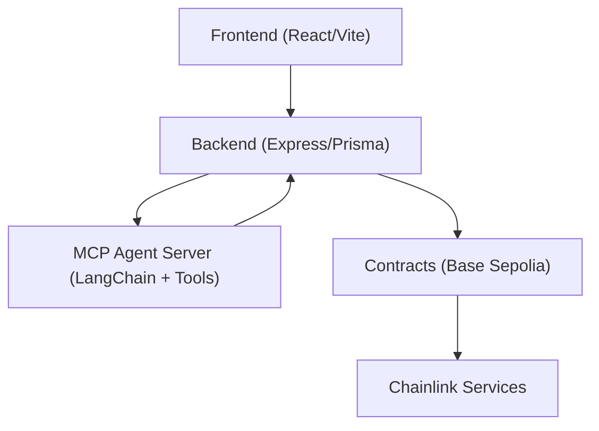

# Lead Engine CRE

[Live Demo](https://lead-engine-cre-frontend.vercel.app) | [X Profile](https://x.com/qasrn_exe) | Last Updated: February 23, 2026

---

## Overview

Lead Engine CRE is an on-chain marketplace for tokenized leads on Base Sepolia, transforming the $200B+ lead generation industry. Sellers submit leads, which are quality-scored via Chainlink CRE, minted as ACE-compliant LeadNFTs, and auctioned in sealed-bid formats. Buyers—manual or AI agents—compete with atomic USDC settlements via PersonalEscrowVault, ensuring fraud resistance, instant payouts, and verifiable provenance.

Key innovations include autonomous AI agents (e.g., Kimi-powered) using auto-bid rules for 24/7 participation, queue-based auction synchronization for real-time frontend updates, and privacy-preserving mechanics like commit-reveal bids. This "LeadFi" protocol addresses industry pain points: 30–50% fraud, delayed net terms, and manual matching.

Built for Chainlink Convergence 2026, it orchestrates six Chainlink services for a cohesive, real-world utility demo.

---

## Privacy & Confidential Computing

Sensitive PII is AES-256-GCM encrypted. CREVerifier uses Confidential HTTP (CHTT) Phase 2 for enclave-based scoring and fraud enrichment. Results are attested and decrypted backend-side. See `PRIVACY_INTEGRATION_AUDIT.md` for details.

Implications: GDPR/CCPA compliance scaffolding, with edge cases like reveal-only-to-winner minimizing exposure.

---

## How a Lead Moves Through the System

> Queue-based bidding ensures real-time desync-free updates; AI agents trigger via auto-rules post-injection.

---

## Key Features

- **One-Click Demo** — End-to-end lifecycle with real on-chain events (e.g., 7-cycle run: $189 settled, $16.45 income — see `demo-results-db4763d9.json`)
- **LeadNFTs** — Tokenized leads with secondary tradability and royalties
- **AI Agents** — Kimi-powered agent (`0x7be5ce88…`) uses `set_auto_bid_rules` for autonomous bidding; visible via 🤖 logs
- **Sealed-Bid Auctions** — Commit-reveal privacy, queue registry for sync, VRF tiebreakers
- **Escrow & Automation** — Atomic settlements, daily PoR, auto-refunds
- **MCP Tools** — 11 custom tools for agent workflows (search, bid, preferences)
- **Real-Time UX** — Socket.IO updates, optimistic pending states, agent badges

> Edge cases handled: ties, low-escrow aborts, nonce contention via gas escalation.

---

## Chainlink Integration

Six services across the lifecycle:

| Service | Role |
|---|---|
| CRE | Quality scoring + CHTT enrichment |
| ACE | Policy-protected mint/transfer |
| Automation | PoR checks + lock refunds |
| VRF v2.5 | Fair tiebreakers |
| Functions (ZK) | ZK-proof verification |
| Data Feeds | Price guards in escrow |

See `CHAINLINK_SERVICES_AUDIT.md` for full audit details.

---

## Tech Stack

| Layer | Technologies |
|---|---|
| Frontend | Vite + React + Tailwind + Zustand + Socket.IO |
| Backend | Express + Prisma + Socket.IO + LangChain |
| Oracles | Chainlink CRE, ACE, Automation, VRF v2.5, Functions, Data Feeds |
| Smart Contracts | Solidity + Hardhat (Base Sepolia) |
| AI Agents | MCP server with 11 tools; Kimi model integration |
| Database | Render Postgres |

---

## On-Chain Proofs

Contracts verified on Basescan as of 2026-02-24:

| Contract | Address | Status |
|---|---|---|
| PersonalEscrowVault | `0x56bB31bE214C54ebeCA55cd86d86512b94310F8C` | Verified, live activity |
| LeadNFTv2 | `0x73ebD9218aDe497C9ceED04E5CcBd06a00Ba7155` | Verified, ACE attached |
| CREVerifier | `0xfec22A5159E077d7016AAb5fC3E91e0124393af8` | Verified, subscription 3063 |
| VRFTieBreaker | `0x86c8f348d816c35fc0bd364e4a9fa8a1e0fd930e` | Verified |
| ACELeadPolicy | `0x013f3219012030aC32cc293fB51a92eBf82a566F` | Verified |

Certified run: `db4763d9` (7 cycles, PoR passed). See `onchain-activation-checklist.md`.

---

## Architecture

> Queue registry for bid sync; fire-and-forget auto-bid evaluations per injected lead.

---

## Market Opportunity

$200B+ global lead-gen market (solar, roofing, HVAC, mortgage, insurance). Solves fraud (CRE), delayed payouts (atomic escrow), lack of provenance (NFTs), and manual matching (agents).

Potential for "lead derivatives" and regulatory edges via ACE compliance enforcement.

---

## Quick Start & Demo Guide

1. Clone: `git clone https://github.com/bnmbnmai/lead-engine-cre`
2. Setup env: copy `.env.example`, add keys (e.g., `DEPLOYER_PRIVATE_KEY`)
3. Install: `npm i` in both `frontend/` and `backend/`
4. Run locally: `npm run dev`
5. Demo: enable floating panel via `VITE_DEMO_MODE=true` (Vercel env var)

See `demo-polish-next-steps.md` for curl triggers and faucet notes.

---

## Post-Hackathon Roadmap

- **Immediate** — Full demo video, submission polish
- **Short-Term** — Third-party audit, mainnet migration (Base/Arbitrum via CCIP)
- **Scaling** — Redis for `leadLockRegistry` (10k+ leads/day); BullMQ for bid queues; event-driven settlement
- **Features** — Multi-agent marketplace; lead derivatives; enterprise SDKs
- **Long-Term** — Generalized data exchange (health/KYC); agent-owned portfolios

See `ROADMAP.md` for full details.