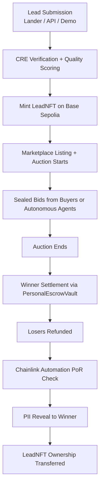
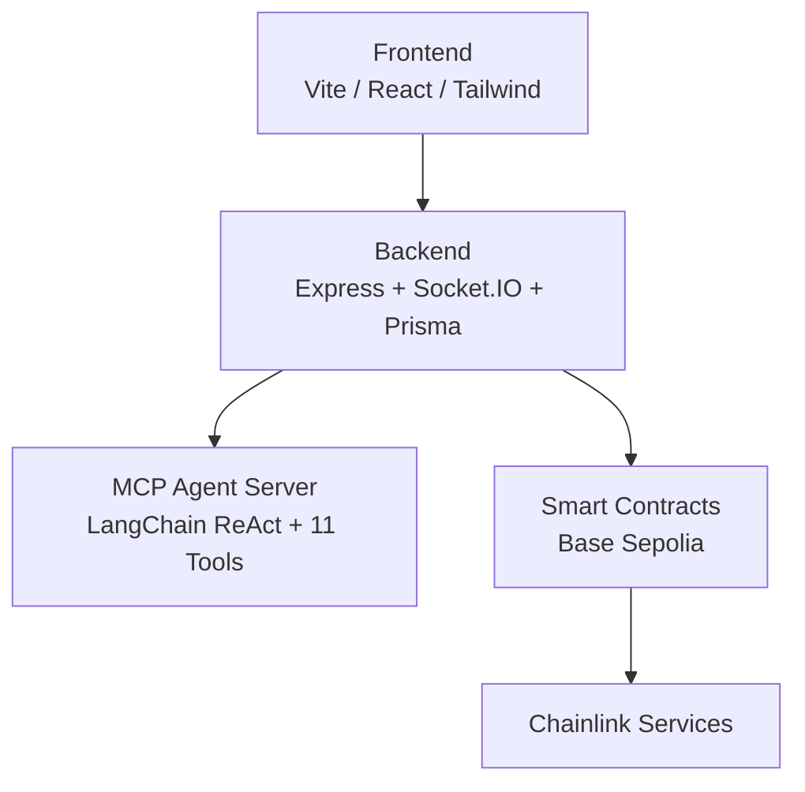

# Lead Engine CRE

On-chain tokenized lead marketplace with autonomous AI agents on Base.

[Live Demo](https://lead-engine-cre-frontend.vercel.app)

---

## Overview

Lead Engine CRE is an on-chain marketplace for tokenized leads. Sellers mint high-quality leads as tradable LeadNFTs. Buyers participate in real-time sealed-bid auctions with instant USDC settlement and verifiable provenance through Chainlink.

Autonomous MCP agents, powered by LangChain ReAct and 11 integrated tools, continuously hunt and bid on leads according to buyer-defined rules for verticals, quality scores, budgets, and geo-targeting.

The platform demonstrates production-grade integration across the Chainlink ecosystem while addressing core inefficiencies in lead generation: fraud, delayed payouts, lack of provenance, and poor matching.

---

## Privacy & Confidential Computing

All sensitive lead data uses AES-256-GCM encryption (backend/src/lib/privacy.service.ts).

CREVerifier implements Confidential HTTP (CHTT) Phase 2:

- Batched private score source executes inside DON enclave (zero outbound HTTP in production path)
- Inline quality scoring + HMAC fraud signals + ACE compliance
- Result returned AES-256-GCM encrypted with enclave key
- Backend decrypts and persists provenance fields

Full details in PRIVACY_INTEGRATION_AUDIT.md and chttaudit.md.

---

## How a Lead Moves Through the System

---

## Key Features

- One-click full on-chain demo showcasing complete lifecycle
- LeadNFTs for verifiable provenance and secondary market tradability
- Autonomous MCP agents operating 24/7 using buyer-configured preferences
- Programmable buyer bounties funded per vertical and executed via Chainlink Functions
- PersonalEscrowVault with Chainlink Automation for Proof of Reserves and automatic lock expiry
- Sealed-bid auctions with backend-managed bid privacy and Chainlink VRF tie resolution
- Dynamic verticals with drag-and-drop form builder
- Real-time analytics with Socket.IO events and vault reconciliation

---

## Chainlink Integration

Six Chainlink services are integrated on-chain:

| Service | Role |
|---------|------|
| **CRE** | On-chain quality scoring and parameter matching via Chainlink Functions |
| **ACE** | Official Automated Compliance Engine — LeadNFTv2 inherits `PolicyProtected` mixin and uses `ACELeadPolicy` for `mintLead()` and `transferFrom()` enforcement |
| **Automation** | Proof of Reserves every 24 hours and automatic refund of expired bid locks |
| **VRF v2.5** | Verifiable random tiebreaker for equal bids |
| **Functions (ZK)** | `requestZKProofVerification` dispatches Groth16/Plonk proof to DON |
| **Data Feeds** | USDC/ETH price guard in PersonalEscrowVault |

---

## On-Chain Proofs

All contracts deployed on Base Sepolia with exact-match source code on Basescan as of 2026-02-22.

Certified demo run ID: `05ad5f55-ae29-4569-9f00-8637f0e0746a` (5/5 cycles, $239 settled, PoR passed).

Full contract table and verification commands in [onchain-activation-checklist.md](./onchain-activation-checklist.md).

---

## Architecture

---

## Market Opportunity

Global lead generation market exceeds $200 billion annually. Key verticals include solar, roofing, HVAC, mortgage, and insurance.

---

## Post-Hackathon Roadmap

See [ROADMAP.md](./ROADMAP.md) for secondary marketplace, enterprise integrations, and production deployment steps.

---

## Documentation

- Current status: [current-status.md](./current-status.md)
- Privacy integration audit: [PRIVACY_INTEGRATION_AUDIT.md](./PRIVACY_INTEGRATION_AUDIT.md)
- On-chain activation: [onchain-activation-checklist.md](./onchain-activation-checklist.md)
- Chainlink services audit: [CHAINLINK_SERVICES_AUDIT.md](./CHAINLINK_SERVICES_AUDIT.md)
- Audit logs: `logs/audits/`

