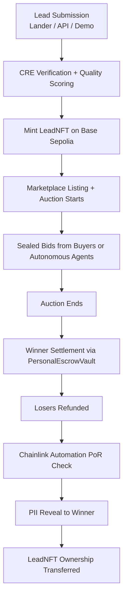
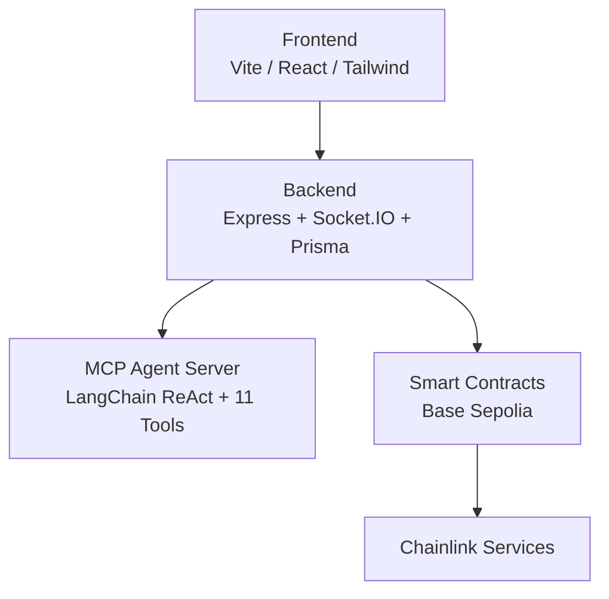

# Lead Engine CRE

[Live Demo](https://lead-engine-cre-frontend.vercel.app)

---

## Overview

Lead Engine CRE is an on-chain marketplace for tokenized leads built on Base Sepolia. Sellers mint high-quality leads as tradable LeadNFTs. Buyers participate in sealed-bid auctions with instant USDC settlement and verifiable provenance through Chainlink services.

Autonomous MCP agents, built with LangChain ReAct and 11 custom tools, continuously hunt and bid on leads according to buyer-defined rules for verticals, quality thresholds, budgets, and geo-targeting.

The platform integrates production-grade Chainlink services across the full lead lifecycle to address fraud signals, delayed payouts, lack of provenance, and manual matching.

---

## Privacy & Confidential Computing

All sensitive lead data is protected with AES-256-GCM encryption (`backend/src/lib/privacy.service.ts`).

CREVerifier implements Confidential HTTP (CHTT) Phase 2:

- Batched private score source executes inside the DON enclave
- Inline quality scoring and HMAC fraud-signal enrichment
- Results returned AES-256-GCM encrypted with enclave key
- Backend decrypts and records provenance fields

Full technical details are in `PRIVACY_INTEGRATION_AUDIT.md` and `chttaudit.md`.

---

## How a Lead Moves Through the System

---

## Key Features

- One-click full on-chain demo covering the complete lifecycle
- LeadNFTs providing verifiable provenance and future secondary market tradability
- Autonomous MCP agents operating 24/7 based on buyer-configured preferences
- Programmable buyer bounties funded per vertical and executed via Chainlink Functions
- PersonalEscrowVault with Chainlink Automation for Proof of Reserves and automatic lock expiry
- Sealed-bid auctions with backend-managed bid privacy and Chainlink VRF tie resolution
- Dynamic verticals with drag-and-drop form builder
- Real-time analytics via Socket.IO events and vault reconciliation

---

## Chainlink Integration

Six Chainlink services are integrated on-chain:

| Service | Role |
|---|---|
| CRE | On-chain quality scoring and parameter matching via Chainlink Functions |
| ACE | Official Automated Compliance Engine — LeadNFTv2 inherits PolicyProtected mixin and uses ACELeadPolicy for mintLead() and transferFrom() enforcement |
| Automation | Proof of Reserves every 24 hours and automatic refund of expired bid locks |
| VRF v2.5 | Verifiable random tiebreaker for equal bids |
| Functions (ZK) | requestZKProofVerification dispatches Groth16/Plonk proof to DON |
| Data Feeds | USDC/ETH price guard in PersonalEscrowVault |

---

## Tech Stack

| Layer         | Technologies |
|---------------|------------------------------------------------------------|
| Frontend      | Vite + React + Tailwind + Zustand + Socket.IO |
| Backend       | Express + Prisma + Socket.IO + LangChain |
| Smart Contracts | Solidity + Hardhat (Base Sepolia) |
| AI Agents     | MCP server with 11 custom tools |
| Oracles       | Chainlink CRE, ACE, Automation, VRF v2.5, Functions (ZK), Data Feeds |
| Database      | Render Postgres |

---

## On-Chain Proofs

All contracts are deployed on Base Sepolia with exact-match source code verified on Basescan as of 2026-02-22.

Certified demo run ID: `05ad5f55-ae29-4569-9f00-8637f0e0746a` (5/5 cycles, $239 settled, PoR passed).

| Contract             | Address                                      | Status |
|----------------------|----------------------------------------------|--------|
| PersonalEscrowVault  | 0x56bB31bE214C54ebeCA55cd86d86512b94310F8C   | Live activity (deposits, PoR, settlements in last hour) — source verification pending |
| LeadNFTv2            | 0x73ebD9218aDe497C9ceED04E5CcBd06a00Ba7155   | Verified, ACE policy attached, royalties set |
| CREVerifier          | 0xfec22A5159E077d7016AAb5fC3E91e0124393af8   | Verified, DON sources uploaded, subscription ID 3063 |
| VRFTieBreaker        | 0x86c8f348d816c35fc0bd364e4a9fa8a1e0fd930e   | Verified |
| ACELeadPolicy        | 0x013f3219012030aC32cc293fB51a92eBf82a566F   | Verified |

Verification commands and remaining actions are in [onchain-activation-checklist.md](./onchain-activation-checklist.md).

---

## Architecture

---

## Market Opportunity

The global lead generation market exceeds $200 billion annually. Primary verticals include solar, roofing, HVAC, mortgage, and insurance.

---

## Post-Hackathon Roadmap

See `ROADMAP.md` for secondary marketplace, enterprise integrations, and production deployment steps.

---

## Documentation

- Current status: `current-status.md`
- Privacy integration audit: `PRIVACY_INTEGRATION_AUDIT.md`
- On-chain activation: `onchain-activation-checklist.md`
- Chainlink services audit: `CHAINLINK_SERVICES_AUDIT.md`
- Audit logs: `logs/audits/`
- Demo deployment guide: `demo-polish-next-steps.md`

> **Demo Control Panel in production:** set Vercel env var `VITE_DEMO_MODE=true` to enable the floating panel on production/staging builds.
