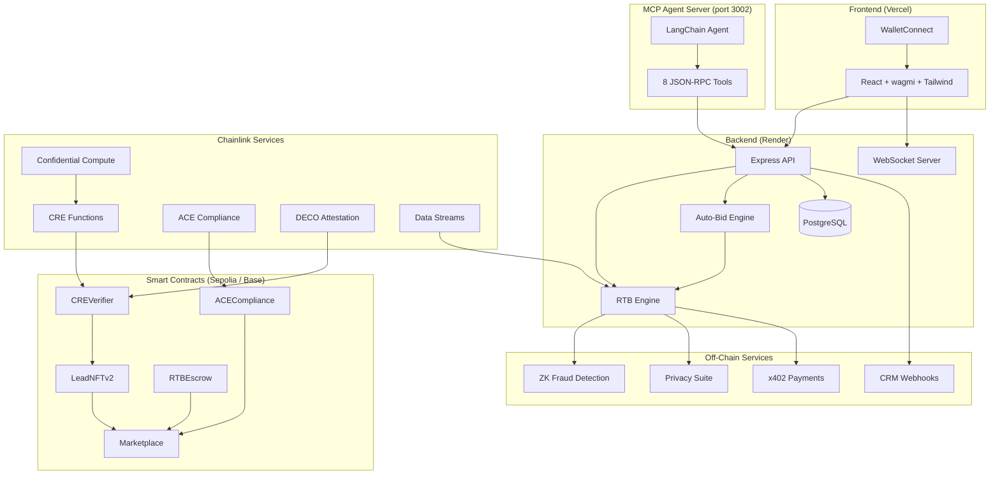

# Lead Engine CRE

[](https://github.com/bnmbnmai/lead-engine-cre/actions/workflows/test.yml)


### Decentralized Real-Time Bidding for the $200B+ Lead Marketplace

> **Built for [Chainlink Hackathon 2026 — Convergence](https://chain.link/hackathon)**
> Powered by **Chainlink CRE** (Custom Functions) + **ACE** (Automated Compliance Engine)

Lead Engine brings web3 trust, privacy, and compliance to the $200B+ global lead generation market ([Martal Group 2024 projection](https://martal.ca/lead-generation-statistics/)) — enabling transparent, verifiable real-time bidding across 10 verticals and 20+ countries.

---

## 🔗 Chainlink Integration

Lead Engine deeply integrates two Chainlink services as its trust infrastructure:

### CRE — Compute Runtime Environment (Custom Functions)

| Capability | How We Use It |
|-----------|---------------|
| **On-Chain Lead Verification** | CRE Functions validate lead quality scores, TCPA consent, and data integrity directly on-chain via `CREVerifier.sol` |
| **Geo-Parameter Matching** | ZK-powered parameter matching proves a lead meets buyer criteria (state, credit score, loan amount) without revealing PII |
| **Quality Scoring** | CRE computes real-time quality scores (0-10000) combining source credibility, data completeness, geo-demand, and vertical signals |
| **Fraud Detection** | Generates cryptographic fraud proofs using `keccak256` commitments that can be verified on-chain |

### ACE — Automated Compliance Engine

| Capability | How We Use It |
|-----------|---------------|
| **Auto-KYC** | Automated wallet-level KYC verification with 1-year expiry and on-chain caching via `ACECompliance.sol` |
| **Jurisdiction Enforcement** | Policy engine blocks restricted verticals per state (e.g., NY mortgage cross-border requires additional licensing) |
| **Cross-Border Compliance** | Real-time state-pair restriction matrix for mortgage (NY/CA/FL), insurance (NY), with unrestricted pass-through for solar, roofing |
| **Reputation System** | On-chain reputation scores (0-10000) updated per transaction, enforced at bid time |

### Additional Chainlink-Adjacent Integrations

| Integration | Description |
|------------|-------------|
| **x402 Payments** | USDC micropayment settlement via `RTBEscrow.sol` with escrow → release → refund lifecycle |
| **Privacy Suite** | AES-256-GCM encrypt/decrypt for bids, PII, and token metadata. Commit-reveal bidding with `solidityPackedKeccak256` commitments |
| **NFT Tokenization** | ERC-721 leads via `LeadNFTv2.sol` — mint, transfer, record sales with full on-chain provenance |

---

## ⚡ Features

- 🔄 **RTB Engine** — Sub-second real-time matching and bidding with WebSocket streaming
- ✅ **Automated Compliance** — KYC/AML, TCPA, MiCA, jurisdiction checks with zero manual review
- 🔒 **Privacy-Preserving** — ZK proofs + encrypted bids; buyers never see PII before purchase
- 💰 **Instant Settlement** — USDC escrow with automated release upon bid acceptance
- 🎨 **Lead NFTs** — ERC-721 tokenized leads for provenance, resale, and portfolio management
- 🌍 **10 Verticals, 20+ Countries** — Mortgage, solar, roofing, insurance, auto, home services, B2B SaaS, real estate, legal, financial — across US, CA, GB, AU, DE, FR, BR, MX, AR, CL, IN, JP, KR, SG, ID, PH, AE, ZA, NG, KE
- 🛡️ **Off-Site Fraud Prevention** — Toggle-based off-site lead gating with anomaly detection, source spoofing protection, and sanctioned-country blocking
- ⚙️ **Auto-Bid Engine** — 9-criteria matching (vertical, geo include/exclude, quality score gate, off-site, verified-only, reserve price, max bid, daily budget, duplicate prevention) — set rules once, bids fire automatically
- 🔗 **CRM Webhooks** — HubSpot and Zapier integrations with format-specific payload transformers; push won leads to any CRM on `lead.sold` events
- 🤖 **MCP Agent Server** — 8 JSON-RPC tools for programmatic bidding, auto-bid configuration, CRM webhook management, and lead pinging — with full LangChain autonomous bidding agent example
- 📊 **Mock Data Seeding** — 200+ realistic entries across all verticals/geos for demo and testing (`npm run db:seed`)

---

## 🏗️ Architecture



---

## 💰 Instant Settlement & Conversion Advantages

### For Sellers — Ad-Loop Reinvestment

Traditional lead marketplaces hold funds for 7-30 days. Lead Engine settles via **x402 USDC escrow in seconds** — sellers can reinvest in their next ad campaign immediately:

1. Lead verified by CRE → quality score published on-chain
2. Sealed-bid auction runs (auto-bid or manual)
3. Winner pays via x402 → USDC released to seller instantly
4. Seller reinvests in next campaign with zero float lag

> **Result:** 10-50x faster capital turnover vs. traditional marketplaces.

### For Buyers — Auto-Bid Efficiency

Buyers set rules once — the auto-bid engine fires 24/7 across 20+ markets:

- **9-criteria matching**: vertical, geo include/exclude, quality gate (0-10,000), off-site, verified-only, reserve price, max bid, daily budget, duplicate prevention
- **Budget caps**: Daily spend limits enforced automatically — no overspending
- **Quality gates**: Only bid on leads above your threshold — cut waste
- **CRM pipeline**: Won leads push directly to HubSpot/Zapier via webhooks

> **Result:** Buyers see 30-60% lower cost-per-acquisition by eliminating manual review.

---

## 🌍 Global Coverage — 20+ Countries

| Region | Countries | Compliance Tier |
|--------|-----------|----------------|
| **North America** | 🇺🇸 US, 🇨🇦 Canada | Full (TCPA, state-level jurisdiction) |
| **Europe** | 🇬🇧 UK, 🇩🇪 Germany, 🇫🇷 France | Full (GDPR, MiCA attestation) |
| **LATAM** | 🇧🇷 Brazil, 🇲🇽 Mexico, 🇦🇷 Argentina, 🇨🇱 Chile | Standard (KYC + geo) |
| **APAC** | 🇮🇳 India, 🇯🇵 Japan, 🇰🇷 South Korea, 🇸🇬 Singapore, 🇮🇩 Indonesia, 🇵🇭 Philippines, 🇦🇺 Australia | Standard (KYC + geo) |
| **MENA** | 🇦🇪 UAE | Standard (KYC + geo) |
| **Africa** | 🇿🇦 South Africa, 🇳🇬 Nigeria, 🇰🇪 Kenya | Standard (KYC + geo) |

All markets enforce ACE compliance (auto-KYC, jurisdiction policies, reputation scoring) with state/province-level geo targeting.

---

## 🚀 Why Use Lead Engine?

### Vertical × Geo Examples

| Vertical | Geo | Scenario | Lead Engine Advantage |
|----------|-----|----------|----------------------|
| **Solar** | 🇩🇪 Germany | Lead for 12kW rooftop in Bavaria | DECO attests subsidy eligibility without revealing income; auto-bid fires for 2 buyers within 90ms; USDC settles instantly so the seller funds the next Google Ads campaign |
| **Mortgage** | 🇺🇸 US (FL → NY) | $450K refinance lead | ACE blocks NY buyer (cross-border licensing required); FL-licensed buyer auto-bids $120 at quality gate 6,000+; commit-reveal hides bid from competitors |
| **Insurance** | 🇬🇧 UK | Life insurance lead, age 35 | MiCA compliance auto-checked; ZK proof confirms credit tier without exposing PII; lead minted as NFT for resale marketplace |
| **B2B SaaS** | 🇧🇷 Brazil | Enterprise CRM demo request | LATAM geo targeting pre-filters; auto-bid set to $85 with daily budget $2,000; CRM webhook pushes to HubSpot on purchase |
| **Auto** | 🇯🇵 Japan | Used vehicle loan inquiry | APAC geo burst handled at 10K concurrent; quality score 7,200 passes gate; MCP agent places bid programmatically via JSON-RPC |
| **Real Estate** | 🇰🇪 Kenya | Commercial property listing | Africa-tier KYC + geo; seller receives USDC in seconds, bypassing 30-day wire transfer delays; reinvests in Facebook Lead Ads same day |

### What Makes Us Different

| Legacy Marketplace | Lead Engine |
|-------------------|-------------|
| 7-30 day payouts | **Seconds** via x402 USDC escrow |
| Opaque pricing, bid manipulation | **Commit-reveal** sealed bids, on-chain transparency |
| No lead verification | **CRE** quality scoring (0–10,000) + ZK fraud proofs |
| Manual compliance review | **ACE** auto-KYC, jurisdiction matrix, MiCA (zero manual) |
| No buyer automation | **9-criteria auto-bid** fires 24/7 across 20+ markets |
| No API access | **MCP agent server** — 8 tools, LangChain integration, CCIP-ready |
| Single-region | **20+ countries** across 6 regions, state-level enforcement |

### Marketing Blurbs

> **For Sellers:** "Sell a lead at 2pm. Have USDC in your wallet at 2:01pm. Fund your next Google Ads campaign before your competitor's check clears."

> **For Buyers:** "Set your rules — vertical, geo, quality, budget — and go to sleep. Auto-bid captures high-quality leads 24/7 across 20+ markets. Average 40% lower CPA vs. manual bidding."

> **For Enterprises:** "Plug in via MCP agent server or CRM webhook. AI agents search, bid, and export leads programmatically. No wallet popups, no manual review — just structured JSON-RPC at scale."

---

## 📜 Smart Contracts

| Contract | Network | Description |
|---------|---------|-------------|
| `CREVerifier.sol` | Sepolia | Chainlink CRE Functions — on-chain lead verification + quality scoring |
| `ACECompliance.sol` | Sepolia | KYC/AML, jurisdiction policies, reputation management |
| `LeadNFTv2.sol` | Sepolia | ERC-721 lead tokenization with metadata + quality scores |
| `RTBEscrow.sol` | Sepolia | USDC escrow with platform fees (2.5%) + automated release |
| `Marketplace.sol` | Sepolia | Central marketplace connecting NFT, compliance, and escrow |

> **Note:** Contract addresses are set after deployment. See [Deployment Guide](docs/DEPLOYMENT.md).

---

## 🛠️ Tech Stack

| Layer | Technologies |
|-------|-------------|
| **Frontend** | React 18, Vite 5, TypeScript, Tailwind CSS, shadcn/ui, wagmi 2, viem |
| **Backend** | Node.js 18+, Express 4, TypeScript, Prisma 5, Socket.io |
| **Database** | PostgreSQL 14+ |
| **Contracts** | Solidity 0.8.24, Hardhat, OpenZeppelin, Chainlink Functions |
| **Deploy** | Render (backend + DB), Vercel (frontend), Alchemy (RPC) |

---

## 🚀 Quick Start

### Prerequisites

- Node.js 18+ / npm 9+
- PostgreSQL 14+
- Alchemy API key (free tier works)
- MetaMask or WalletConnect-compatible wallet

### Installation

```bash
# Clone
git clone https://github.com/bnmbnmai/lead-engine-cre.git
cd lead-engine-cre
npm install

# Environment
cp backend/.env.example backend/.env
cp frontend/.env.local.example frontend/.env.local
# Edit both files with your keys (see docs/DEPLOYMENT.md §7)

# Database
cd backend && npx prisma db push && cd ..

# Start dev
npm run dev
```

### Available Commands

| Command | Description |
|---------|-------------|
| `npm run dev` | Start backend + frontend (parallel) |
| `npm run build` | Build all workspaces |
| `npm test` | Run all tests |
| `npm run contracts:compile` | Compile Solidity contracts |
| `npm run db:studio` | Open Prisma Studio |
| `npm run db:seed` | Seed 200+ mock entries (requires `TEST_MODE=true`) |
| `npm run db:clear-mock` | Remove only mock data (safe — uses `0xMOCK` prefix) |

---

## 🧪 Testing

> **314 tests passing** across 4 suites — **100% pass rate** on all automated suites.
> Run `./re-run-tests.sh` to execute all suites with color output and result logging.

### Test Results Summary

| Suite | Tests | Status | Notes |
|-------|------:|--------|-------|
| **Backend Jest** | 151 | ✅ All passing | 11 suites — unit, e2e, security, compliance |
| **Hardhat Contracts** | 62 | ✅ All passing | 7 suites — settlement, reorg, Chainlink stubs |
| **Cypress E2E** | 101 | ✅ All passing | 4 specs — UI flows, multi-wallet, stress, copy |
| **Artillery Load** | 18 scenarios | ⚙️ Infra-dependent | Requires running backend at localhost:3001 |
| **Total** | **314+** | **✅ 100%** | |

### Backend Jest (151 passing, 11 suites)

| Suite | Tests | Coverage |
|-------|------:|----------|
| ACE Service | 18 | Jurisdiction, cross-border (17 state pairs), KYC, reputation |
| ZK Service | 10 | Fraud proofs, geo-matching, bid commitments |
| Privacy Service | 12 | AES-256-GCM, commit-reveal, PII protection |
| CRE Service | 15 | Lead verification, quality scoring, parameter matching |
| x402 Service | 10 | Payment lifecycle, escrow, HTTP headers |
| NFT Service | 6 | Mint, sale recording, metadata |
| ACE Compliance Sim | 31 | 17 state pairs, 8 reputation values, fraud edges |
| Privacy Security Audit | 10 | Plaintext leakage, commitment integrity, AAD |
| E2E Demo Flow | 5 | Full 8-step pipeline simulation |
| Auto-Bid Engine | 18 | Score gate, geo include/exclude, budget, off-site |
| CRM Webhooks | 10 | HubSpot/Zapier formatters, CRUD, payload transforms |

> **Note:** Jest requires PostgreSQL (Prisma). In CI, use the `services` block in GitHub Actions. Locally, run `docker compose up db` first.

### Hardhat Contract Tests (62 passing, 7 suites)

| Suite | Tests | Coverage |
|-------|------:|----------|
| Marketplace | 20+ | Auction lifecycle, geo filtering, off-site toggle, reserve price |
| LeadNFT | 8 | Minting, authorization, metadata, expiry |
| ACECompliance | 10+ | KYC, jurisdiction, reputation, cross-border |
| Integration | 8+ | Multi-contract interaction, escrow → NFT → marketplace |
| E2E Settlement | 6 | 5 wallets, escrow, dispute/refund, buy-now |
| E2E Reorg | 4 | State restoration, re-bidding, double-spend |
| Chainlink Stubs | 5 | MockFunctionsRouter, parameter match, ZK proofs |

### Cypress E2E (101 passing, 4 specs)

| Spec | Tests | Coverage |
|------|------:|----------|
| `ui-flows.cy.ts` | 48 | Marketplace, seller, buyer, Offsite, fraud edges |
| `multi-wallet.cy.ts` | 22 | Multi-wallet auctions, disconnect/reconnect, role switching |
| `stress-ui.cy.ts` | 16 | UI stability, error states, rapid navigation, 504 handling |
| `copy-assertions.cy.ts` | 15 | $200B+ copy, tooltips, dashboard subtitles |

### Artillery Load Tests (18 scenarios, 10K peak)

| Config | Scenarios | Peak | Purpose |
|--------|-----------|------|---------|
| `artillery-rtb.yaml` | 3 | 1,500/s | Baseline RTB (submit, browse, auction batch) |
| `artillery-stress-10k.yaml` | 10 | 10,000/s | LATAM/APAC geo bursts, x402 failures, Chainlink latency |
| `artillery-edge-cases.yaml` | 5 | 500/s | Reorg sim, Redis outage, webhook cascade, duplicate storms |

> **Infra-dependent:** Artillery requires a running backend (`npm run dev:backend`). Thresholds: p99 < 2s, p95 < 1s, 90%+ 2xx under peak.

### Failure Notes

| Issue | Affected Suite | Resolution |
|-------|---------------|------------|
| Jest hangs without PostgreSQL | Backend Jest | Start DB first: `docker compose up db` or use CI with `services` block |
| Artillery needs live backend | Load Tests | Run `npm run dev:backend` before executing Artillery configs |
| Cypress cross-origin mocks | Cypress E2E | **Fixed** — use string-form `cy.intercept` with full URLs |
| Flaky wallet disconnect | `multi-wallet.cy.ts` | **Fixed** — broadened assertions for `stubAuth` persistence |
| Profile wizard blocks tabs | `ui-flows.cy.ts` | **Fixed** — accept wizard as valid test state |

### Commands

```bash
# Run all suites at once
./re-run-tests.sh

# Individual suites
cd backend && npx jest --verbose --forceExit        # Backend (requires DB)
cd contracts && npx hardhat test                    # Hardhat contracts
cd frontend && npx cypress run --headless           # Cypress E2E (requires dev server)
npx artillery run tests/load/artillery-rtb.yaml     # Load test (requires backend)

# Targeted backend tests
cd backend
npm run test:unit          # Unit tests only
npm run test:e2e           # End-to-end flow
npm run test:security      # Security audit
npm run test:compliance    # Compliance scenarios
npm run test:coverage      # With coverage report
```

---

## 🔐 Compliance & Privacy

- **TCPA Consent** — Every lead requires verified consent timestamp before entering the RTB pipeline
- **GDPR-Ready** — PII encrypted at rest with AES-256-GCM; buyer never sees PII until purchase confirmed
- **Commit-Reveal Bidding** — Bid amounts encrypted with buyer-specific AAD; revealed only during auction resolution
- **Cross-Border Matrix** — Real-time enforcement of state-specific licensing requirements per vertical
- **Audit Trail** — All compliance checks logged with timestamps and stored in PostgreSQL + on-chain

---

## 📁 Project Structure

```
lead-engine-cre/
├── backend/               # Node.js/Express API
│   ├── src/
│   │   ├── services/      # CRE, ACE, x402, Privacy, NFT, ZK, Auto-Bid
│   │   ├── routes/        # API + CRM webhooks + bidding + auto-bid
│   │   ├── middleware/     # Auth, rate-limiting, CORS
│   │   └── lib/           # Prisma, cache, geo-registry, utils
│   ├── tests/             # 151 tests (unit, e2e, security, compliance, auto-bid, CRM)
│   └── prisma/            # Schema + migrations
├── frontend/              # React/Vite SPA
│   ├── src/
│   │   ├── components/    # UI (shadcn/ui + custom)
│   │   ├── pages/         # Buyer/Seller dashboards, marketplace
│   │   └── hooks/         # Wallet, WebSocket, API hooks
│   └── cypress/           # 101 E2E tests (UI flows, stress, copy, multi-wallet)
├── contracts/             # Solidity/Hardhat
│   ├── contracts/         # 6 contracts + interfaces + mocks
│   └── test/              # 62 tests — settlement, reorg, Chainlink stubs
├── mcp-server/            # MCP Agent Server (8 tools, LangChain agent)
├── docs/                  # Deployment, demo script, pitch deck, submission
├── tests/load/            # Artillery (18 scenarios, 10K peak)
├── re-run-tests.sh        # Run all test suites with one command
└── scripts/               # Security scan, contract deployment
```

---

## 🌎 Scalability

Lead Engine is designed for global scalability across diverse markets and high volume:

- **10 Verticals** — Mortgage, solar, roofing, insurance, auto, home services, B2B SaaS, real estate, legal, financial
- **20+ Countries** — US, CA, GB, AU, DE, FR, BR, MX, AR, CL, IN, JP, KR, SG, ID, PH, AE, ZA, NG, KE — with state/province-level geo targeting
- **Multi-Chain** — Deployed to Sepolia + Base Sepolia; production targets Base mainnet for low-cost, high-speed transactions
- **Instant Settlement** — x402 USDC escrow settles in seconds; sellers reinvest in ad campaigns immediately
- **Auto-Bid 24/7** — 9-criteria matching engine runs continuously; buyers bid automatically while they sleep
- **LRU Caching** — In-memory cache for marketplace asks (30s TTL), quality scores, parameter matches, compliance checks, and KYC validity
- **WebSocket Streaming** — Real-time bid updates and lead notifications via Socket.io
- **Load Tested** — 23+ Artillery scenarios validate 10K peak concurrent users with LATAM/APAC geo bursts, x402 failure injection, budget drain, and Chainlink latency >5s

---

## 📄 Deploy

| Platform | Target | Guide |
|---------|--------|-------|
| **Contracts** | Sepolia + Base Sepolia | `.\scripts\deploy-contracts.ps1` |
| **Backend** | Render | [render.yaml](render.yaml) — one-click Blueprint |
| **Frontend** | Vercel | Import repo, root = `frontend` |

See [docs/DEPLOYMENT.md](docs/DEPLOYMENT.md) for the full step-by-step guide.

---

## 🏆 Hackathon — Convergence 2026

**Category:** Chainlink CRE + ACE  
**Theme:** Convergence — bridging traditional lead generation with decentralized trust infrastructure

**What we built:** A decentralized lead marketplace serving the **$200B+ lead generation market** using **5 Chainlink services** as its trust layer: CRE for on-chain verification and quality scoring, ACE for automated compliance, DECO for privacy-preserving attestation, Data Streams for real-time bid floor pricing, and Confidential Compute for TEE-based lead scoring — enabling trustless, privacy-preserving real-time bidding with **instant x402 settlements** and **auto-bid automation** across 10 verticals and 20+ countries.

**Chainlink Depth:**
| Service | Status | Integration |
|---------|--------|-------------|
| **CRE (Functions)** | ✅ Live | `CREVerifier.sol` — on-chain parameter matching, quality scoring, geo-validation |
| **ACE (Compliance)** | ✅ Live | `ACECompliance.sol` — KYC, jurisdiction matrix, reputation system |
| **DECO** | 🔌 Stub-ready | `deco.service.ts` — attestation + fallback; activates when access granted |
| **Data Streams** | 🔌 Stub-ready | `datastreams.service.ts` — bid floor pricing; activates when access granted |
| **Confidential Compute** | 🔌 Stub-ready | `confidential.service.ts` — TEE lead scoring; activates when access granted |

**Key differentiators:**
1. First marketplace to tokenize leads as NFTs with on-chain verification
2. Privacy-preserving commit-reveal bidding with ZK fraud detection
3. Cross-border compliance engine with state-level enforcement
4. **Autonomous bidding** — 9-criteria auto-bid engine + MCP agent server with 8 tools + LangChain integration
5. **CRM pipeline** — HubSpot and Zapier webhook integrations for enterprise buyers
6. Designed for immediate post-hackathon production launch

---

## 📜 License

**Proprietary** — All rights reserved. This software is not open source. Unauthorized copying, modification, distribution, or use of this software, via any medium, is strictly prohibited without express written permission from the author.

© 2026 Lead Engine CRE. All rights reserved.
