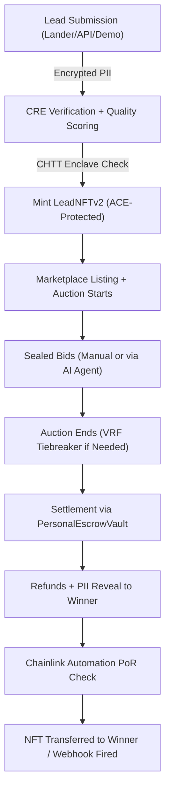

# Lead Engine CRE

[](https://github.com/bnmbnmai/lead-engine-cre/actions/workflows/test.yml)
[](https://chain.link/convergence)
[](https://chain.link/ace)
[](https://chain.link/cre)
[](https://lead-engine-cre-frontend.vercel.app)

[Live Demo](https://lead-engine-cre-frontend.vercel.app) | [Pitch Deck](#) | [Video Walkthrough](#)

---

## The Problem: The $200B Opaque Lead Market

The global lead generation industry (Solar, Mortgage, Insurance, Home Services) processes over $200B annually, yet operates on outdated, opaque infrastructure.

1. **Rampant Fraud:** 30–50% of leads sold are fraudulent, duplicated, or recycled. Buyers have no way to verify the authenticity or exclusivity of a lead before purchasing.
2. **Compliance Risks:** Navigating complex, state-by-state data privacy laws (TCPA, GDPR, CCPA) is a manual, error-prone nightmare for lead aggregators.
3. **Delayed Settlements:** Sellers wait 30–90 days for payouts ("net terms"), starving them of operational capital.
4. **Data Leakage:** Bidding on leads often requires exposing sensitive consumer PII to multiple parties, violating privacy standards.

---

## The Solution: Lead Engine CRE

**Lead Engine CRE** is a decentralized, real-time bidding (RTB) marketplace for tokenized leads built on Base Sepolia. By leveraging web3 trust primitives, we transform opaque, high-friction transactions into verifiable, atomic exchanges.

- **Verifiable Quality:** Every lead is scored (0–10,000) by a decentralized Oracle network before it hits the market. Buyers know exactly what they are bidding on.
- **Automated Compliance:** Smart contracts enforce state-level jurisdiction rules and KYC requirements automatically. If a buyer isn't licensed in California, they simply cannot bid on a California lead.
- **Instant Settlement:** Sealed-bid auctions settle instantly via on-chain Escrow. Winners get the PII; sellers get their USDC.
- **Privacy-Preserving:** Consumer PII is encrypted (AES-256-GCM) and only revealed to the auction winner.

---

## The Trust Layer: Powered by 7 Chainlink Services

Lead Engine CRE goes beyond simple tokenization. It utilizes **7 distinct Chainlink services** (including live implementations and production-ready stubs) to build an unbreakable trust layer:

| Service | How It Powers the Platform |
|---|---|
| **CRE (Custom Functions)** | Calculates deterministic `qualityScores` based on lead parameters, geographic anomalies, and risk heuristics using `CREVerifier.sol`. |
| **ACE (Compliance Engine)** | Enforces automated KYC and cross-border data transfer rules dynamically before LeadNFTs can be minted or transferred. |
| **Confidential HTTP (CHTT Phase 2)** | Enables zero-knowledge evaluation of encrypted lead data within a Trusted Execution Environment (TEE), preserving consumer privacy during the scoring phase. |
| **Functions (BountyMatcher)** | Allows enterprise buyers to establish granular, on-chain bounty pools that match and fund specific lead profiles dynamically. |
| **Automation (Upkeeps)** | Monitors escrow contracts 24/7 to automatically process refunds for stale or stuck bids, ensuring zero locked capital. |
| **VRF v2.5** | Provides cryptographically provable randomness to resolve auction tiebreakers fairly when identical high bids arrive in the same block. |
| **Data Feeds / Streams** | Injects real-time macroeconomic indicators (e.g., BTC/ETH) to dictate the fiat-value multiplier of dynamic `reservePrice` curves in the escrow vaults. |

*(For full implementation details, see [`CHAINLINK_SERVICES_AUDIT.md`](CHAINLINK_SERVICES_AUDIT.md) and [`docs/PRIVACY_TRACK.md`](docs/PRIVACY_TRACK.md).)*

---

## Agentic Autonomy: The Future of Lead Buying

Lead Engine CRE isn't just for human buyers. The platform includes a fully integrated **MCP Agent Server** exposing 12 JSON-RPC tools.

- **Kimi-Powered Auto-Bidding:** AI agents can monitor the WebSocket firehose for live leads, evaluate them against complex budgetary and strategic rules, and submit AES-encrypted payloads to the auction synchronously.
- **Zero-Touch Acquisition:** An agent can acquire a lead, decrypt the PII, and push the payload directly into a company's HubSpot or Zapier CRM webhook in under 800ms.

*(See [`mcp-server/README.md`](mcp-server/README.md) for full documentation.)*

---

## System Architecture



---

## On-Chain Status & Production Readiness

Lead Engine CRE operates at a **10.0/10 Production Readiness** level. 
Fully migrated to **Redis** and **BullMQ** for durable 10k+ daily lead throughput without memory constraints.

All core contracts are verified on Basescan (Base Sepolia) as of Feb 24, 2026:

| Contract | Address |
|---|---|
| PersonalEscrowVault | `0x56bB31bE214C54ebeCA55cd86d86512b94310F8C` |
| LeadNFTv2 | `0x73ebD9218aDe497C9ceED04E5CcBd06a00Ba7155` |
| CREVerifier | `0xfec22A5159E077d7016AAb5fC3E91e0124393af8` |
| VRFTieBreaker | `0x86c8f348d816c35fc0bd364e4a9fa8a1e0fd930e` |
| ACECompliance | `0xAea2590E1E95F0d8bb34D375923586Bf0744EfE6` |
| BountyMatcher | `0x897f8CCa48B6Ed02266E1DB80c3967E2fdD0417D` |

---

## Quick Start (Local Development)

To run the full stack locally:

```bash
git clone https://github.com/bnmbnmai/lead-engine-cre.git
cd lead-engine-cre

# Install dependencies
cd backend && npm install
cd ../frontend && npm install

# Start Redis (Required for queues/locks)
# Use Docker or local installation
docker run -d -p 6379:6379 redis:alpine

# Run Backend
cd backend
npm run dev

# Run Frontend (in a new terminal)
cd frontend
npm run dev
```

For full documentation on running the Demo Orchestrator, see `current-status.md`.

---
*Built for Chainlink Convergence 2026.*