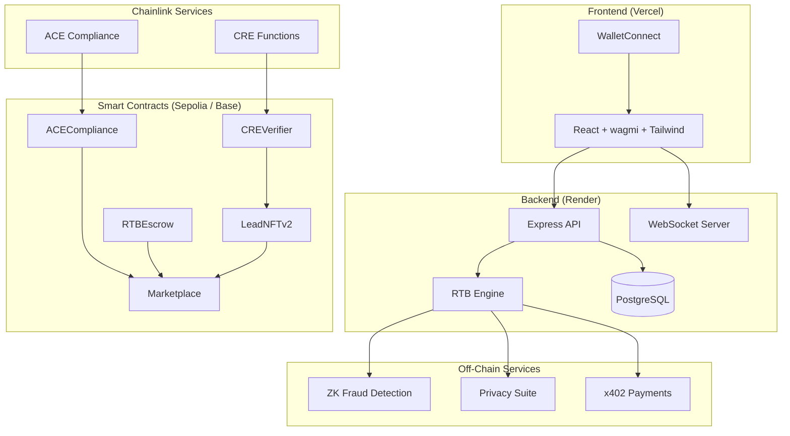

# Lead Engine CRE

### Decentralized Real-Time Bidding for the $100B+ Lead Marketplace

> **Built for [Chainlink Hackathon 2026 ΓÇö Convergence](https://chain.link/hackathon)**
> Powered by **Chainlink CRE** (Custom Functions) + **ACE** (Automated Compliance Engine)

Lead Engine brings web3 trust, privacy, and compliance to the global lead marketplace ΓÇö enabling transparent, verifiable real-time bidding across mortgage, solar, insurance, roofing, and any vertical.

---

## 🔗 Chainlink Integration

Lead Engine deeply integrates two Chainlink services as its trust infrastructure:

### CRE ΓÇö Compute Runtime Environment (Custom Functions)

| Capability | How We Use It |
|-----------|---------------|
| **On-Chain Lead Verification** | CRE Functions validate lead quality scores, TCPA consent, and data integrity directly on-chain via `CREVerifier.sol` |
| **Geo-Parameter Matching** | ZK-powered parameter matching proves a lead meets buyer criteria (state, credit score, loan amount) without revealing PII |
| **Quality Scoring** | CRE computes real-time quality scores (0-10000) combining source credibility, data completeness, geo-demand, and vertical signals |
| **Fraud Detection** | Generates cryptographic fraud proofs using `keccak256` commitments that can be verified on-chain |

### ACE ΓÇö Automated Compliance Engine

| Capability | How We Use It |
|-----------|---------------|
| **Auto-KYC** | Automated wallet-level KYC verification with 1-year expiry and on-chain caching via `ACECompliance.sol` |
| **Jurisdiction Enforcement** | Policy engine blocks restricted verticals per state (e.g., NY mortgage cross-border requires additional licensing) |
| **Cross-Border Compliance** | Real-time state-pair restriction matrix for mortgage (NY/CA/FL), insurance (NY), with unrestricted pass-through for solar, roofing |
| **Reputation System** | On-chain reputation scores (0-10000) updated per transaction, enforced at bid time |

### Additional Chainlink-Adjacent Integrations

| Integration | Description |
|------------|-------------|
| **x402 Payments** | USDC micropayment settlement via `RTBEscrow.sol` with escrow → release → refund lifecycle |
| **Privacy Suite** | AES-256-GCM encrypt/decrypt for bids, PII, and token metadata. Commit-reveal bidding with `solidityPackedKeccak256` commitments |
| **NFT Tokenization** | ERC-721 leads via `LeadNFTv2.sol` ΓÇö mint, transfer, record sales with full on-chain provenance |

---

## ΓÜí Features

- 🔄 **RTB Engine** — Sub-second real-time matching and bidding with WebSocket streaming
- ✅ **Automated Compliance** — KYC/AML, TCPA, jurisdiction checks with zero manual review
- 🔒 **Privacy-Preserving** — ZK proofs + encrypted bids; buyers never see PII before purchase
- 💰 **Instant Settlement** — USDC escrow with automated release upon bid acceptance
- 🎨 **Lead NFTs** — ERC-721 tokenized leads for provenance, resale, and portfolio management
- 🌍 **Multi-Vertical** — Mortgage, solar, roofing, insurance, home services, B2B SaaS
- 🤖 **AI Agent Ready** — Programmatic bidding API for automated lead acquisition

---

## 🏗️ Architecture



---

## 📜 Smart Contracts

| Contract | Network | Description |
|---------|---------|-------------|
| `CREVerifier.sol` | Sepolia | Chainlink CRE Functions ΓÇö on-chain lead verification + quality scoring |
| `ACECompliance.sol` | Sepolia | KYC/AML, jurisdiction policies, reputation management |
| `LeadNFTv2.sol` | Sepolia | ERC-721 lead tokenization with metadata + quality scores |
| `RTBEscrow.sol` | Sepolia | USDC escrow with platform fees (2.5%) + automated release |
| `Marketplace.sol` | Sepolia | Central marketplace connecting NFT, compliance, and escrow |

> **Note:** Contract addresses are set after deployment. See [Deployment Guide](docs/DEPLOYMENT.md).

---

## 🛠️ Tech Stack

| Layer | Technologies |
|-------|-------------|
| **Frontend** | React 18, Vite 5, TypeScript, Tailwind CSS, shadcn/ui, wagmi 2, viem |
| **Backend** | Node.js 18+, Express 4, TypeScript, Prisma 5, Socket.io |
| **Database** | PostgreSQL 14+ |
| **Contracts** | Solidity 0.8.24, Hardhat, OpenZeppelin, Chainlink Functions |
| **Deploy** | Render (backend + DB), Vercel (frontend), Alchemy (RPC) |

---

## 🚀 Quick Start

### Prerequisites

- Node.js 18+ / npm 9+
- PostgreSQL 14+
- Alchemy API key (free tier works)
- MetaMask or WalletConnect-compatible wallet

### Installation

```bash
# Clone
git clone https://github.com/bnmbnmai/lead-engine-cre.git
cd lead-engine-cre
npm install

# Environment
cp backend/.env.example backend/.env
cp frontend/.env.local.example frontend/.env.local
# Edit both files with your keys (see docs/ENV_HANDOFF.md)

# Database
cd backend && npx prisma db push && cd ..

# Start dev
npm run dev
```

### Available Commands

| Command | Description |
|---------|-------------|
| `npm run dev` | Start backend + frontend (parallel) |
| `npm run build` | Build all workspaces |
| `npm test` | Run all 123 tests (9 suites) |
| `npm run contracts:compile` | Compile Solidity contracts |
| `npm run db:studio` | Open Prisma Studio |

---

## 🧪 Testing

**123 tests passing across 9 suites:**

| Suite | Tests | Coverage |
|-------|-------|----------|
| CRE Service | 10 | Lead verification, quality scoring, parameter matching |
| ACE Service | 12 | Jurisdiction, cross-border, KYC, reputation |
| x402 Service | 10 | Payment lifecycle, escrow, HTTP headers |
| Privacy Service | 12 | AES-256-GCM, commit-reveal, PII protection |
| NFT Service | 6 | Mint, sale recording, metadata |
| ZK Service | 10 | Fraud proofs, geo-matching, bid commitments |
| E2E Demo Flow | 5 | Full 8-step pipeline simulation |
| Security Audit | 10 | Plaintext leakage, commitment integrity, AAD |
| Compliance Sim | 31 | 17 state pairs, 8 reputation values, fraud |

```bash
cd backend
npm run test:unit          # Unit tests only
npm run test:e2e           # End-to-end flow
npm run test:security      # Security audit
npm run test:compliance    # 50+ compliance scenarios
npm run test:coverage      # With coverage report
npm run test:load          # Artillery load test (requires running server)
```

---

## 🔐 Compliance & Privacy

- **TCPA Consent** ΓÇö Every lead requires verified consent timestamp before entering the RTB pipeline
- **GDPR-Ready** ΓÇö PII encrypted at rest with AES-256-GCM; buyer never sees PII until purchase confirmed
- **Commit-Reveal Bidding** ΓÇö Bid amounts encrypted with buyer-specific AAD; revealed only during auction resolution
- **Cross-Border Matrix** ΓÇö Real-time enforcement of state-specific licensing requirements per vertical
- **Audit Trail** ΓÇö All compliance checks logged with timestamps and stored in PostgreSQL + on-chain

---

## 📁 Project Structure

```
lead-engine-cre/
Γö£ΓöÇΓöÇ backend/               # Node.js/Express API
Γöé   Γö£ΓöÇΓöÇ src/
Γöé   Γöé   Γö£ΓöÇΓöÇ services/      # CRE, ACE, x402, Privacy, NFT, ZK
Γöé   Γöé   Γö£ΓöÇΓöÇ routes/        # API + integration demo endpoints
Γöé   Γöé   Γö£ΓöÇΓöÇ middleware/     # Auth, rate-limiting, CORS
Γöé   Γöé   ΓööΓöÇΓöÇ lib/           # Prisma, cache, utils
Γöé   Γö£ΓöÇΓöÇ tests/             # 123 tests (unit, e2e, security, compliance)
Γöé   ΓööΓöÇΓöÇ prisma/            # Schema + migrations
Γö£ΓöÇΓöÇ frontend/              # React/Vite SPA
Γöé   ΓööΓöÇΓöÇ src/
Γöé       Γö£ΓöÇΓöÇ components/    # UI (shadcn/ui + custom)
Γöé       Γö£ΓöÇΓöÇ pages/         # Buyer/Seller dashboards, marketplace
Γöé       ΓööΓöÇΓöÇ hooks/         # Wallet, WebSocket, API hooks
Γö£ΓöÇΓöÇ contracts/             # Solidity/Hardhat
Γöé   Γö£ΓöÇΓöÇ contracts/         # 6 contracts + interfaces + mocks
Γöé   ΓööΓöÇΓöÇ scripts/           # Deploy + gas profiling
Γö£ΓöÇΓöÇ docs/                  # ENV_HANDOFF, deployment guide, demo script
ΓööΓöÇΓöÇ scripts/               # Security scan, contract deployment
```

---

## 🌎 Scalability

Lead Engine is designed for global scalability across diverse markets and high volume:

- **Multi-Vertical** ΓÇö Configuration-driven vertical support: any industry with leads (mortgage, solar, insurance, roofing, B2B SaaS, auto, legal)
- **Multi-Chain** ΓÇö Deployed to Sepolia + Base Sepolia; production targets Base mainnet for low-cost, high-speed transactions
- **LRU Caching** ΓÇö In-memory cache for quality scores, parameter matches, compliance checks, and KYC validity
- **WebSocket Streaming** ΓÇö Real-time bid updates and lead notifications via Socket.io
- **Load Tested** ΓÇö Artillery tests validate 1000+ concurrent users with p99 latency < 2s

---

## 📄 Deploy

| Platform | Target | Guide |
|---------|--------|-------|
| **Contracts** | Sepolia + Base Sepolia | `.\scripts\deploy-contracts.ps1` |
| **Backend** | Render | [render.yaml](render.yaml) ΓÇö one-click Blueprint |
| **Frontend** | Vercel | Import repo, root = `frontend` |

See [docs/DEPLOYMENT.md](docs/DEPLOYMENT.md) for the full step-by-step guide.

---

## 🏆 Hackathon

**Category:** Chainlink CRE + ACE

**What we built:** A decentralized lead marketplace that uses Chainlink CRE for on-chain lead verification and quality scoring, and Chainlink ACE for automated KYC/AML and jurisdiction compliance ΓÇö enabling trustless, privacy-preserving real-time bidding across any vertical.

**Key differentiators:**
1. First marketplace to tokenize leads as NFTs with on-chain verification
2. Privacy-preserving commit-reveal bidding with ZK fraud detection
3. Cross-border compliance engine with state-level enforcement
4. Designed for immediate post-hackathon production launch

---

## 📜 License

MIT ΓÇö see [LICENSE](LICENSE) for details.
