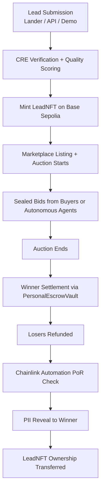
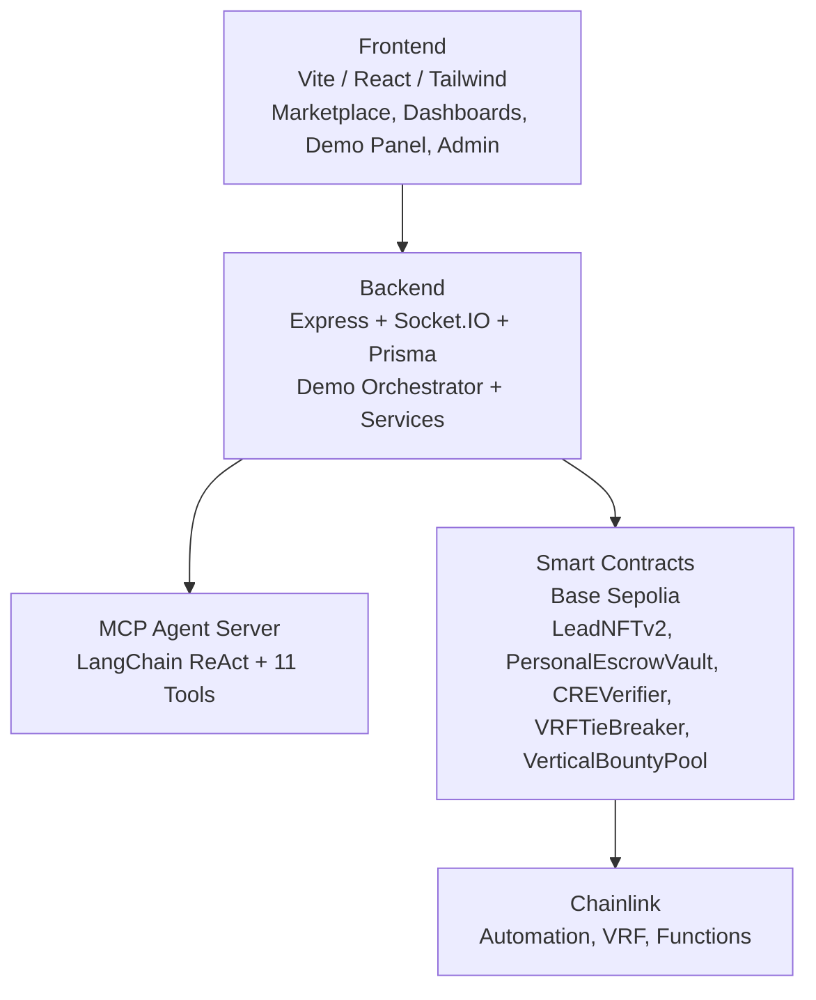

# Lead Engine CRE

**On-chain tokenized lead marketplace with autonomous AI agents on Base.**

[](https://github.com/bnmbnmai/lead-engine-cre/actions/workflows/test.yml)


[Live Demo](https://lead-engine-cre-frontend.vercel.app) | [GitHub](https://github.com/bnmbnmai/lead-engine-cre)

---


## Overview

Lead Engine CRE is an on-chain marketplace for tokenized leads. Sellers mint high-quality leads as tradable LeadNFTs. Buyers participate in real-time sealed-bid auctions with instant USDC settlement and verifiable provenance through Chainlink.

Autonomous MCP agents, powered by LangChain ReAct and 11 integrated tools, continuously hunt and bid on leads according to buyer-defined rules for verticals, quality scores, budgets, and geo-targeting.

Built for the **Chainlink Convergence Hackathon 2026** (CRE + ACE track), the platform demonstrates production-grade integration across the Chainlink ecosystem while addressing core inefficiencies in lead generation: fraud, delayed payouts, lack of provenance, and poor matching.

---

## How a Lead Moves Through the System



---

## Key Features

- **One-click full on-chain demo** showcasing the complete lifecycle: lead creation, NFT minting, autonomous bidding, settlement, PoR verification, and results persistence
- **LeadNFTs** for verifiable lead provenance and secondary market tradability
- **Autonomous MCP agents** that operate 24/7 using buyer-configured preferences and LangChain ReAct reasoning
- **Programmable buyer bounties** funded per vertical and executed via Chainlink Functions
- **PersonalEscrowVault** with Chainlink Automation for Proof of Reserves and automatic lock expiry
- **Sealed-bid auctions** with backend-managed bid privacy and Chainlink VRF for fair tie resolution between equal bids (VRFTieBreaker.sol)
- **Dynamic verticals** with drag-and-drop form builder and field-level auto-bid rules
- **Real-time analytics** with structured Socket.IO events and continuous vault reconciliation monitoring

---

## Chainlink Integration

Lead Engine integrates **six** Chainlink services on-chain:

| Service | Role |
|---------|------|
| **CRE** | On-chain quality scoring for lead verification and parameter matching (Chainlink Functions) |
| **ACE** | Official Chainlink Automated Compliance Engine — LeadNFTv2 inherits `PolicyProtected` mixin and uses `ACELeadPolicy` for policy enforcement on `mintLead()` and `transferFrom()` |
| **Automation** | Proof of Reserves every 24 hours and automatic refund of expired bid locks |
| **VRF v2.5** | Verifiable random tiebreaker for equal bids |
| **Functions (ZK)** | `requestZKProofVerification` dispatches Groth16/Plonk proof to DON; `fulfillRequest` stores fraud-signal result in `_zkFraudSignals[tokenId]` |
| **Data Feeds** | USDC/ETH price guard in PersonalEscrowVault — `lockForBid()` and `settleBid()` require a valid live price before moving funds |

This integration enables trust-minimized, verifiable lead transactions at scale.

---

## On-Chain Proofs

All contracts are deployed on Base Sepolia and have exact-match source code published on Basescan as of 2026-02-21.

| Contract | Address | Primary Chainlink Services | Basescan |
|----------|---------|---------------------------|----------|
| PersonalEscrowVault | `0xf09cf1d4389A1Af11542F96280dc91739E866e74` | Automation (PoR + lock expiry), Data Feeds (USDC/ETH liveness guard) | [View →](https://sepolia.basescan.org/address/0xf09cf1d4389A1Af11542F96280dc91739E866e74) |
| LeadNFTv2 | `0x73ebD9218aDe497C9ceED04E5CcBd06a00Ba7155` | Official Chainlink ACE (PolicyProtected + ACELeadPolicy) | [View →](https://sepolia.basescan.org/address/0x73ebD9218aDe497C9ceED04E5CcBd06a00Ba7155) |
| CREVerifier | `0xfec22A5159E077d7016AAb5fC3E91e0124393af8` | Chainlink Functions (quality scoring + live ZK fraud-signal) | [View →](https://sepolia.basescan.org/address/0xfec22A5159E077d7016AAb5fC3E91e0124393af8) |
| VRFTieBreaker | `0x86c8f348d816c35fc0bd364e4a9fa8a1e0fd930e` | VRF v2.5 (tie resolution) | [View →](https://sepolia.basescan.org/address/0x86c8f348d816c35fc0bd364e4a9fa8a1e0fd930e) |
| RTBEscrow | `0xf3fCB43f882b5aDC43c2E7ae92c3ec5005e4cBa2` | None | [View →](https://sepolia.basescan.org/address/0xf3fCB43f882b5aDC43c2E7ae92c3ec5005e4cBa2) |
| ACECompliance | `0xAea2590E1E95F0d8bb34D375923586Bf0744EfE6` | Official Chainlink ACE policy registry | [View →](https://sepolia.basescan.org/address/0xAea2590E1E95F0d8bb34D375923586Bf0744EfE6) |
| ACELeadPolicy | `0x013f3219012030aC32cc293fB51a92eBf82a566F` | Official Chainlink ACE (policy enforcement via ACECompliance.isCompliant) | [View →](https://sepolia.basescan.org/address/0x013f3219012030aC32cc293fB51a92eBf82a566F) |

**PersonalEscrowVault** implements `AutomationCompatibleInterface` — `checkUpkeep` verifies reserve balances and `performUpkeep` settles or refunds expired bid locks; `lockForBid` and `settleBid` both require a live Chainlink Data Feeds price from the USDC/ETH aggregator before moving funds.

**LeadNFTv2** is an ERC-721 contract that inherits the official Chainlink ACE `PolicyProtected` mixin. `mintLead()` and `transferFrom()` are protected by the `runPolicy` modifier, which enforces compliance through `ACELeadPolicy` calling `ACECompliance.isCompliant()`.

**CREVerifier** is a `FunctionsClient` that dispatches JavaScript source strings to the Chainlink Functions DON for both quality scoring (`requestQualityScore`) and ZK fraud-signal verification (`requestZKProofVerification`); the DON callback writes results to `_leadQualityScores` and `_zkFraudSignals` respectively.

**VRFTieBreaker** requests a single `uint256` random word from the VRF v2.5 coordinator; `fulfillRandomWords` selects the winner as `candidates[randomWord % candidates.length]`.

**RTBEscrow** handles atomic USDC escrow for sealed-bid auction settlement — funds are locked at bid time and released or refunded at auction close.

**ACECompliance** maintains an on-chain registry for KYC status, jurisdiction policy, and reputation scores; access is gated to authorized verifier addresses set by the contract owner.

### Verification Commands

```bash
# PersonalEscrowVault
npx hardhat verify --network baseSepolia 0xf09cf1d4389A1Af11542F96280dc91739E866e74 "0x036CbD53842c5426634e7929541eC2318f3dCF7e" "0x6BBcf283847f409a58Ff984A79eFD5719D3A9F70" "0x6BBcf283847f409a58Ff984A79eFD5719D3A9F70"

# LeadNFTv2
npx hardhat verify --network baseSepolia 0x1eAe80ED100239dd4cb35008274eE62B1d5aC4e4 "0x6BBcf283847f409a58Ff984A79eFD5719D3A9F70"

# CREVerifier
npx hardhat verify --network baseSepolia 0xfec22A5159E077d7016AAb5fC3E91e0124393af8 "0xf9B8FC078197181C841c296C876945aaa425B278" "0x66756e2d626173652d7365706f6c69612d310000000000000000000000000000" 3063 "0x1eAe80ED100239dd4cb35008274eE62B1d5aC4e4" "0x6BBcf283847f409a58Ff984A79eFD5719D3A9F70"

# VRFTieBreaker
npx hardhat verify --network baseSepolia 0x86c8f348d816c35fc0bd364e4a9fa8a1e0fd930e <VRF_SUBSCRIPTION_ID> "0x1eAe80ED100239dd4cb35008274eE62B1d5aC4e4"

# RTBEscrow
npx hardhat verify --network baseSepolia 0xf3fCB43f882b5aDC43c2E7ae92c3ec5005e4cBa2 "0x036CbD53842c5426634e7929541eC2318f3dCF7e" "0x6BBcf283847f409a58Ff984A79eFD5719D3A9F70" 250 "0x6BBcf283847f409a58Ff984A79eFD5719D3A9F70"

# ACECompliance
npx hardhat verify --network baseSepolia 0xAea2590E1E95F0d8bb34D375923586Bf0744EfE6
```

> All contracts have exact-match source code published on Basescan as of 2026-02-21.

---

## Architecture



---

## Market Opportunity

The global lead generation market exceeds **$200 billion annually**. Key verticals such as solar, roofing, HVAC, mortgage, and insurance are experiencing rapid growth but remain highly fragmented and inefficient.

Sellers face high fraud rates and delayed payouts. Buyers waste time and capital on low-quality leads. Lead Engine addresses these challenges with atomic settlement, verifiable quality scoring, and autonomous demand generation via AI agents.

---

## Post-Hackathon Vision

- Secondary marketplace for trading LeadNFTs
- Enterprise white-label version for large lead buyers
- Fiat on-ramps and direct CRM integrations (HubSpot, Salesforce)
- Expanded autonomous agent capabilities for multi-vertical orchestration
- Institutional lead portfolio tokenization as RWAs

---

## Getting Started

Detailed local development instructions are available in the repository.

The platform is fully deployed and functional on **Base Sepolia**.

---

## Built With

| Layer | Technology |
|-------|-----------|
| **Blockchain** | Base Sepolia |
| **Smart Contracts** | Solidity + Hardhat |
| **Backend** | Node.js, Express, Socket.IO, Prisma |
| **Frontend** | React, Vite, Tailwind, ethers.js |
| **AI Agents** | LangChain ReAct + Moonshot Kimi (OpenAI-compatible) |
| **Oracles** | Chainlink Automation, VRF v2.5, Functions (CRE scoring) |

---

*Lead Engine CRE provides a new infrastructure layer for the lead economy — transparent, instant, and autonomous.*

*Built for the Chainlink Convergence Hackathon 2026.*