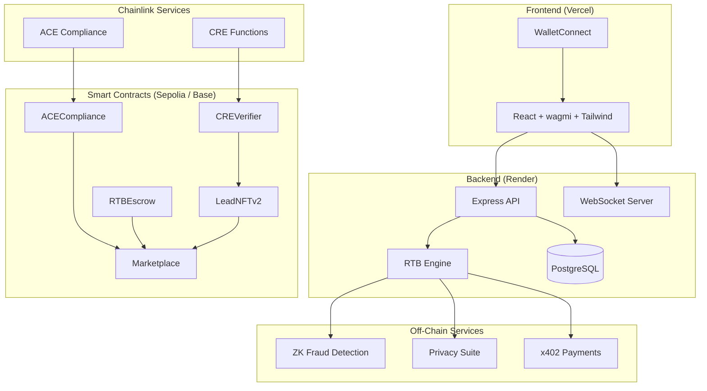

# Lead Engine CRE

### Decentralized Real-Time Bidding for the $100B+ Lead Marketplace

> **Built for [Chainlink Hackathon 2026 — Convergence](https://chain.link/hackathon)**
> Powered by **Chainlink CRE** (Custom Functions) + **ACE** (Automated Compliance Engine)

Lead Engine brings web3 trust, privacy, and compliance to the global lead marketplace — enabling transparent, verifiable real-time bidding across 10 verticals and 15+ countries.

---

## 🔗 Chainlink Integration

Lead Engine deeply integrates two Chainlink services as its trust infrastructure:

### CRE — Compute Runtime Environment (Custom Functions)

| Capability | How We Use It |
|-----------|---------------|
| **On-Chain Lead Verification** | CRE Functions validate lead quality scores, TCPA consent, and data integrity directly on-chain via `CREVerifier.sol` |
| **Geo-Parameter Matching** | ZK-powered parameter matching proves a lead meets buyer criteria (state, credit score, loan amount) without revealing PII |
| **Quality Scoring** | CRE computes real-time quality scores (0-10000) combining source credibility, data completeness, geo-demand, and vertical signals |
| **Fraud Detection** | Generates cryptographic fraud proofs using `keccak256` commitments that can be verified on-chain |

### ACE — Automated Compliance Engine

| Capability | How We Use It |
|-----------|---------------|
| **Auto-KYC** | Automated wallet-level KYC verification with 1-year expiry and on-chain caching via `ACECompliance.sol` |
| **Jurisdiction Enforcement** | Policy engine blocks restricted verticals per state (e.g., NY mortgage cross-border requires additional licensing) |
| **Cross-Border Compliance** | Real-time state-pair restriction matrix for mortgage (NY/CA/FL), insurance (NY), with unrestricted pass-through for solar, roofing |
| **Reputation System** | On-chain reputation scores (0-10000) updated per transaction, enforced at bid time |

### Additional Chainlink-Adjacent Integrations

| Integration | Description |
|------------|-------------|
| **x402 Payments** | USDC micropayment settlement via `RTBEscrow.sol` with escrow → release → refund lifecycle |
| **Privacy Suite** | AES-256-GCM encrypt/decrypt for bids, PII, and token metadata. Commit-reveal bidding with `solidityPackedKeccak256` commitments |
| **NFT Tokenization** | ERC-721 leads via `LeadNFTv2.sol` — mint, transfer, record sales with full on-chain provenance |

---

## ⚡ Features

- 🔄 **RTB Engine** — Sub-second real-time matching and bidding with WebSocket streaming
- ✅ **Automated Compliance** — KYC/AML, TCPA, MiCA, jurisdiction checks with zero manual review
- 🔒 **Privacy-Preserving** — ZK proofs + encrypted bids; buyers never see PII before purchase
- 💰 **Instant Settlement** — USDC escrow with automated release upon bid acceptance
- 🎨 **Lead NFTs** — ERC-721 tokenized leads for provenance, resale, and portfolio management
- 🌍 **10 Verticals, 15+ Countries** — Mortgage, solar, roofing, insurance, auto, home services, B2B SaaS, real estate, legal, financial — across US, CA, GB, AU, DE, FR, BR, MX, IN, JP, KR, SG, AE, ZA, NG
- 🛡️ **Off-Site Fraud Prevention** — Toggle-based off-site lead gating with anomaly detection, source spoofing protection, and sanctioned-country blocking
- 🤖 **AI Agent Ready** — Programmatic bidding API for automated lead acquisition
- 📊 **Mock Data Seeding** — 200+ realistic entries across all verticals/geos for demo and testing (`npm run db:seed`)

---

## 🏗️ Architecture



---

## 📜 Smart Contracts

| Contract | Network | Description |
|---------|---------|-------------|
| `CREVerifier.sol` | Sepolia | Chainlink CRE Functions — on-chain lead verification + quality scoring |
| `ACECompliance.sol` | Sepolia | KYC/AML, jurisdiction policies, reputation management |
| `LeadNFTv2.sol` | Sepolia | ERC-721 lead tokenization with metadata + quality scores |
| `RTBEscrow.sol` | Sepolia | USDC escrow with platform fees (2.5%) + automated release |
| `Marketplace.sol` | Sepolia | Central marketplace connecting NFT, compliance, and escrow |

> **Note:** Contract addresses are set after deployment. See [Deployment Guide](docs/DEPLOYMENT.md).

---

## 🛠️ Tech Stack

| Layer | Technologies |
|-------|-------------|
| **Frontend** | React 18, Vite 5, TypeScript, Tailwind CSS, shadcn/ui, wagmi 2, viem |
| **Backend** | Node.js 18+, Express 4, TypeScript, Prisma 5, Socket.io |
| **Database** | PostgreSQL 14+ |
| **Contracts** | Solidity 0.8.24, Hardhat, OpenZeppelin, Chainlink Functions |
| **Deploy** | Render (backend + DB), Vercel (frontend), Alchemy (RPC) |

---

## 🚀 Quick Start

### Prerequisites

- Node.js 18+ / npm 9+
- PostgreSQL 14+
- Alchemy API key (free tier works)
- MetaMask or WalletConnect-compatible wallet

### Installation

```bash
# Clone
git clone https://github.com/bnmbnmai/lead-engine-cre.git
cd lead-engine-cre
npm install

# Environment
cp backend/.env.example backend/.env
cp frontend/.env.local.example frontend/.env.local
# Edit both files with your keys (see docs/ENV_HANDOFF.md)

# Database
cd backend && npx prisma db push && cd ..

# Start dev
npm run dev
```

### Available Commands

| Command | Description |
|---------|-------------|
| `npm run dev` | Start backend + frontend (parallel) |
| `npm run build` | Build all workspaces |
| `npm test` | Run all tests |
| `npm run contracts:compile` | Compile Solidity contracts |
| `npm run db:studio` | Open Prisma Studio |
| `npm run db:seed` | Seed 200+ mock entries (requires `TEST_MODE=true`) |
| `npm run db:clear-mock` | Remove only mock data (safe — uses `0xMOCK` prefix) |

---

## 🧪 Testing

### Unit & Integration Tests

| Suite | Tests | Coverage |
|-------|-------|----------|
| CRE Service | 10 | Lead verification, quality scoring, parameter matching |
| ACE Service | 12 | Jurisdiction, cross-border, KYC, reputation |
| x402 Service | 10 | Payment lifecycle, escrow, HTTP headers |
| Privacy Service | 12 | AES-256-GCM, commit-reveal, PII protection |
| NFT Service | 6 | Mint, sale recording, metadata |
| ZK Service | 10 | Fraud proofs, geo-matching, bid commitments |
| E2E Demo Flow | 5 | Full 8-step pipeline simulation |
| Security Audit | 10 | Plaintext leakage, commitment integrity, AAD |
| Compliance Sim | 31 | 17 state pairs, 8 reputation values, fraud |

### Security Compliance Sim (29 tests — all passing)

Standalone simulation covering 7 categories: off-site fraud (toggle, source spoofing, anomaly detection), ACE compliance (cross-border EU, sanctioned countries), privacy, on-chain gas, KYC gating, TCPA/MiCA.

```bash
cd backend && npx ts-node --compiler-options '{"module":"commonjs"}' ../scripts/security-compliance-sim.ts
```

### Artillery Load Test (13 scenarios, 1500 peak concurrent)

Scenarios include cross-border ACE (EU→non-EU solar), EU geo-match batch (50 leads), off-site fraud toggle, and bid burst spike (10x rapid-fire → 429 rate limiting).

```bash
cd backend && npx artillery run tests/load-test.yml
```

### Cypress E2E (38 UI tests)

Covers marketplace browsing, seller flows (submit tabs, API curl examples, 10 vertical forms), buyer flows, off-site toggle/fraud edge cases, hybrid buyer/seller role switching.

```bash
cd frontend && npx cypress run
```

### Commands

```bash
cd backend
npm run test:unit          # Unit tests only
npm run test:e2e           # End-to-end flow
npm run test:security      # Security audit
npm run test:compliance    # 50+ compliance scenarios
npm run test:coverage      # With coverage report
npm run test:load          # Artillery load test (requires running server)
```

---

## 🔐 Compliance & Privacy

- **TCPA Consent** — Every lead requires verified consent timestamp before entering the RTB pipeline
- **GDPR-Ready** — PII encrypted at rest with AES-256-GCM; buyer never sees PII until purchase confirmed
- **Commit-Reveal Bidding** — Bid amounts encrypted with buyer-specific AAD; revealed only during auction resolution
- **Cross-Border Matrix** — Real-time enforcement of state-specific licensing requirements per vertical
- **Audit Trail** — All compliance checks logged with timestamps and stored in PostgreSQL + on-chain

---

## 📁 Project Structure

```
lead-engine-cre/
├── backend/               # Node.js/Express API
│   ├── src/
│   │   ├── services/      # CRE, ACE, x402, Privacy, NFT, ZK
│   │   ├── routes/        # API + integration demo endpoints
│   │   ├── middleware/     # Auth, rate-limiting, CORS
│   │   └── lib/           # Prisma, cache, utils
│   ├── tests/             # 123 tests (unit, e2e, security, compliance)
│   └── prisma/            # Schema + migrations
├── frontend/              # React/Vite SPA
│   └── src/
│       ├── components/    # UI (shadcn/ui + custom)
│       ├── pages/         # Buyer/Seller dashboards, marketplace
│       └── hooks/         # Wallet, WebSocket, API hooks
├── contracts/             # Solidity/Hardhat
│   ├── contracts/         # 6 contracts + interfaces + mocks
│   └── scripts/           # Deploy + gas profiling
├── docs/                  # ENV_HANDOFF, deployment guide, demo script
└── scripts/               # Security scan, contract deployment
```

---

## 🌎 Scalability

Lead Engine is designed for global scalability across diverse markets and high volume:

- **10 Verticals** — Mortgage, solar, roofing, insurance, auto, home services, B2B SaaS, real estate, legal, financial
- **15+ Countries** — US, CA, GB, AU, DE, FR, BR, MX, IN, JP, KR, SG, AE, ZA, NG — with state/province-level geo targeting
- **Multi-Chain** — Deployed to Sepolia + Base Sepolia; production targets Base mainnet for low-cost, high-speed transactions
- **LRU Caching** — In-memory cache for marketplace asks (30s TTL), quality scores, parameter matches, compliance checks, and KYC validity
- **WebSocket Streaming** — Real-time bid updates and lead notifications via Socket.io
- **Load Tested** — 13 Artillery scenarios validate 1500 peak concurrent users with cross-border ACE, geo-match batches, and bid burst spikes

---

## 📄 Deploy

| Platform | Target | Guide |
|---------|--------|-------|
| **Contracts** | Sepolia + Base Sepolia | `.\scripts\deploy-contracts.ps1` |
| **Backend** | Render | [render.yaml](render.yaml) — one-click Blueprint |
| **Frontend** | Vercel | Import repo, root = `frontend` |

See [docs/DEPLOYMENT.md](docs/DEPLOYMENT.md) for the full step-by-step guide.

---

## 🏆 Hackathon

**Category:** Chainlink CRE + ACE

**What we built:** A decentralized lead marketplace that uses Chainlink CRE for on-chain lead verification and quality scoring, and Chainlink ACE for automated KYC/AML and jurisdiction compliance — enabling trustless, privacy-preserving real-time bidding across any vertical.

**Key differentiators:**
1. First marketplace to tokenize leads as NFTs with on-chain verification
2. Privacy-preserving commit-reveal bidding with ZK fraud detection
3. Cross-border compliance engine with state-level enforcement
4. Designed for immediate post-hackathon production launch

---

## 📜 License

**Proprietary** — All rights reserved. This software is not open source. Unauthorized copying, modification, distribution, or use of this software, via any medium, is strictly prohibited without express written permission from the author.

© 2026 Lead Engine CRE. All rights reserved.
