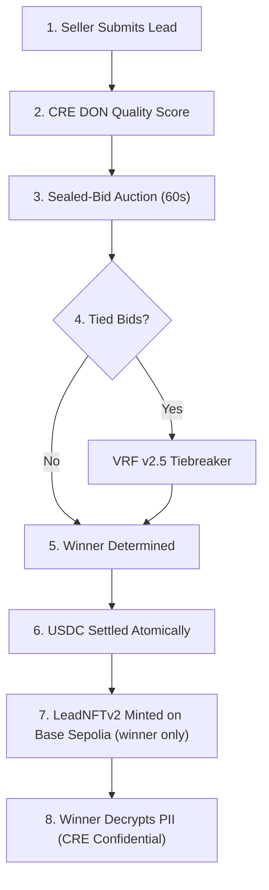
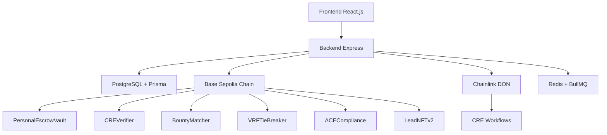

# LeadRTB

[](https://github.com/bnmbnmai/lead-engine-cre/actions)
[](https://docs.chain.link/cre)
[](https://sepolia.basescan.org)
[](https://leadrtb.com)

## 🎥 Watch the 5-Minute Hackathon Demo

[](https://youtu.be/0J2GWDbXsFs)

Full end-to-end demo video (March 2026 submission).

---

**LeadRTB is a production-grade, on-chain marketplace for real-time lead bidding — quality-scored by Chainlink CRE, settled atomically in USDC, with winner-only PII decryption via Confidential Compute.**

🔗 **Live demo:** [leadrtb.com](https://leadrtb.com) &nbsp;|&nbsp; 📡 **API:** [api.leadrtb.com](https://api.leadrtb.com/health)

---

## Why LeadRTB?

The $200B+ lead generation market is broken: buyers can't verify quality before purchase, sellers wait weeks for payment, and sensitive PII is exposed during bidding. LeadRTB fixes all three with on-chain infrastructure.

## Key Features

- **Chainlink CRE Quality Scoring** — Every lead scored by a 7-gate deterministic evaluation inside the Chainlink DON with BFT consensus. On-chain `requestOnChainQualityScore()` fires after every NFT mint. No off-chain trust assumptions.
- **Winner-Only PII Decryption** — Lead data encrypted at rest; only the auction winner decrypts via CRE Confidential Compute (`encryptOutput: true`).
- **Atomic USDC Settlement** — PersonalEscrowVault locks funds on-chain at bid time and releases instantly at auction close. No net terms, no chargebacks.
- **VRF v2.5 Fair Tiebreaking** — Provably random, verifiable on-chain tie resolution.
- **Chainlink Automation** — Live upkeep on PersonalEscrowVaultUpkeep (10 LINK funded, Active) runs 24h Proof-of-Reserves checks and auto-refunds expired bid locks. Verifiable on [automation.chain.link](https://automation.chain.link/base-sepolia/21294876610015716277122175951088366648605324800147651647408453016017624655922).
- **Granular Bounty Hunting via Functions** — Buyers post field-specific bounties ("solar leads in CA with 700+ credit"). The BountyMatcher contract auto-evaluates and settles additional USDC rewards at close.
- **Autonomous AI Agent** — Kimi K2.5 LLM + LangChain ReAct with 15 MCP tools (incl. official `chainlink-agent-skills/cre-skills`) bids alongside human buyers in real-time using the same on-chain vault and rule engine.
- **1-Click End-to-End Demo** — CRE scoring → sealed-bid auction → VRF tiebreak → USDC settlement → LeadNFTv2 mint → PII reveal. Every step with Basescan proof links. The demo-results JSON contains resolved on-chain CRE DON quality scores (0–100) for every cycle.
- **Production Scale** — 40 test suites, 994 tests, BullMQ/Redis/WebSocket sharding, lint-clean codebase.

## Hackathon Track Eligibility

| Track | Integration |
|-------|-------------|
| **Privacy** | Winner-only PII decryption (CRE Confidential Compute); encrypted lead data at rest; CHTT Phase 2 SubtleCrypto |
| **CRE & AI** | `EvaluateBuyerRulesAndMatch` workflow (7-gate DON evaluation); `DecryptForWinner` confidential output |
| **DeFi & Tokenization** | LeadNFTv2 tokenized leads; PersonalEscrowVault atomic USDC settlement; Chainlink Automation PoR |
| **Autonomous Agents** | Kimi K2.5 + LangChain ReAct + 15 MCP tools (incl. `cre-skills`); fully autonomous bidding |

## Chainlink Integration Summary

9 verified contracts + 2 CRE workflows deployed on Base Sepolia:

| Service | Contract | Verified |
|---------|----------|----------|
| CRE Quality Scoring + CHTT | `CREVerifier` | ✅ |
| Functions (Bounty Match) | `BountyMatcher` | ✅ |
| Automation (PoR + Refunds) | `PersonalEscrowVaultUpkeep` | ✅ |
| VRF v2.5 (Tiebreakers) | `VRFTieBreaker` | ✅ |
| ACE Compliance | `ACECompliance` | ✅ |
| ACE Lead Policy | `ACELeadPolicy` | ✅ |
| LeadNFTv2 | `LeadNFTv2` | ✅ |
| Bounty Pool (USDC) | `VerticalBountyPool` | ✅ |
| Escrow Vault | `PersonalEscrowVault` | ✅ |

> Full contract addresses, Basescan links, Tenderly traces, and backend file mappings → [`CONTRACTS.md`](CONTRACTS.md)
>
> All 9 contracts receive **real on-chain transactions** during the 1-click demo — including VRFTieBreaker (real `requestResolution()` call on every forced tie).

---

## How a Lead Moves Through LeadRTB


```mermaid
flowchart TD
    A["1. Seller Submits Lead"] --> B["2. CRE DON Quality Score"]
    B --> C["3. Sealed-Bid Auction (60s)"]
    C --> D{"4. Tied Bids?"}
    D -- Yes --> E["VRF v2.5 Tiebreaker"]
    D -- No --> F["5. Winner Determined"]
    E --> F
    F --> G["6. USDC Settled Atomically"]
    G --> H["7. LeadNFTv2 Minted on Base Sepolia (winner only)"]
    H --> I["8. Winner Decrypts PII (CRE Confidential)"]
```

## CRE Workflow: `EvaluateBuyerRulesAndMatch`

Production CRE workflow that evaluates buyer preference rules against incoming leads inside the Chainlink DON using `@chainlink/cre-sdk`. Uses Confidential HTTP to fetch buyer preference sets from the API with Vault DON secrets (API key never in config or node memory), then runs a deterministic 7-gate rule evaluation with BFT consensus.

### Hybrid Architecture

```text
+-----------------------------------------------------------+
|                 Chainlink DON (BFT Consensus)              |
|                                                            |
|  1. CronCapability trigger                                 |
|  2. ConfidentialHTTPClient -> GET /api/v1/auto-bid/pending |
|     (API key injected from Vault DON via {{.creApiKey}})   |
|  3. ConfidentialHTTPClient -> GET /api/v1/auto-bid/prefs   |
|  4. Deterministic 7-gate evaluation:                       |
|     +-- Gate 1: Vertical match (exact or wildcard '*')     |
|     +-- Gate 2: Geo country match                          |
|     +-- Gate 3: Geo state include/exclude                  |
|     +-- Gate 4: Quality score threshold                    |
|     +-- Gate 5: Off-site toggle                            |
|     +-- Gate 6: Verified-only toggle                       |
|     +-- Gate 7: Field-level filter evaluation              |
|  5. consensusIdenticalAggregation -> match results         |
|  Output: { leadId, matchedSets[], suggestedBidAmounts[] }  |
+-----------------------------------------------------------+
                           |
                           v
+-----------------------------------------------------------+
|                Backend Server (Real-Time)                   |
|                                                            |
|  triggerBuyerRulesWorkflow() receives DON match results:   |
|  6. Daily budget enforcement (requires real-time DB state) |
|  7. Vault balance lock (requires on-chain tx)              |
|  8. Duplicate bid check (requires real-time DB state)      |
|  9. Sealed-bid creation + commitment hash                  |
|                                                            |
|  Centralized hook: afterLeadCreated() fires on ALL paths:  |
|  +-- API, Webhook, Demo, Drip                              |
|                                                            |
|  Fallback: CRE_WORKFLOW_ENABLED=false -> local auto-bid    |
+-----------------------------------------------------------+
```

**Key files:**

- [`cre-workflows/EvaluateBuyerRulesAndMatch/main.ts`](cre-workflows/EvaluateBuyerRulesAndMatch/main.ts) — CRE SDK workflow (7-gate evaluation)
- [`cre-workflows/DecryptForWinner/main.ts`](cre-workflows/DecryptForWinner/main.ts) — Winner-only PII decryption (`encryptOutput: true`)
- [`backend/src/services/cre.service.ts`](backend/src/services/cre.service.ts) — `triggerBuyerRulesWorkflow()` integration

> **Note:** CRE workflows use local simulation + hybrid fallback. The `afterLeadCreated()` hook fires unconditionally on all lead paths (API, webhook, demo, drip), ensuring every lead goes through the same CRE quality scoring pipeline.

## Try the 1-Click Demo

**Live at [https://leadrtb.com](https://leadrtb.com)**

1. **Connect** — Visit [leadrtb.com](https://leadrtb.com) and connect any wallet on Base Sepolia
2. **Run** — Click the purple **"Run Full On-Chain Demo"** button
3. **Explore** — Switch to **Buyer** persona to see won leads, CRE Quality badges, and decrypt PII
4. **Verify** — Open the **On-Chain Log** (Ctrl+Shift+L) to watch every tx with Basescan proof links

## Architecture


```mermaid
graph TD
    A[Frontend React.js] --> B[Backend Express]
    B --> C[PostgreSQL + Prisma]
    B --> D[Base Sepolia Chain]
    D --> E[PersonalEscrowVault]
    D --> F[CREVerifier]
    D --> G[BountyMatcher]
    D --> H[VRFTieBreaker]
    D --> I[ACECompliance]
    D --> J[LeadNFTv2]
    B --> K[Chainlink DON]
    K --> L[CRE Workflows]
    B --> M[Redis + BullMQ]
```

## Tech Stack

| Layer | Technologies |
|-------|-------------|
| Frontend | Vite + React + Tailwind + Zustand + Socket.IO |
| Backend | Express + Prisma + PostgreSQL + BullMQ + Redis |
| Blockchain | Ethers v6 + Base Sepolia + USDC + LeadNFTv2 |
| CRE | @chainlink/cre-sdk + Confidential HTTP + DON Secrets |
| AI Agent | Kimi K2.5 LLM + LangChain ReAct + MCP Server (15 tools) |

## Quick Start

```bash
git clone https://github.com/bnmbnmai/lead-engine-cre
cd lead-engine-cre
cd backend && cp .env.example .env  # populate required keys
npm install
cd ../frontend && npm install
npm run dev                # both frontend and backend
```

Set `VITE_DEMO_MODE=true` to enable the Demo Control Panel.

## For Judges

- **All 9 contracts verified "Exact Match"** on Basescan — see [`CONTRACTS.md`](CONTRACTS.md)
- **Live demo:** [leadrtb.com](https://leadrtb.com) (connect any Base Sepolia wallet)
- **CRE Workflow simulation:** `cd cre-workflows && cre workflow simulate ./EvaluateBuyerRulesAndMatch --target-staging-settings`
- **Certified demo artifacts:** `certified-runs/March-6-2026/` (demo-results JSON + CRE simulation JSON + screenshot)
- **Tenderly VNet (refreshed March 6, 2026):** [Explorer](https://dashboard.tenderly.co/explorer/vnet/5ce481f4-3d52-4c72-ba73-1c978a7d20ba/transactions) — all 9 contracts + fresh simulations of March-6 certified run (NFT mints #65–#70, PoR, VRF tiebreakers, escrow settlements, bounty payouts). Repopulate with `bash scripts/tenderly-replay-march6.sh`
- **994/994 tests passing** across 40 suites

## Submission Tracks

We are submitting to **all six eligible tracks**:

| Track | Prize | One-Pager |
|-------|-------|-----------|
| DeFi & Tokenization | $20,000 | [`defi-tokenization.md`](docs/tracks/defi-tokenization.md) |
| CRE & AI | $20,000 | [`cre-ai.md`](docs/tracks/cre-ai.md) |
| Privacy | $16,000 | [`privacy.md`](docs/tracks/privacy.md) |
| Risk & Compliance | $10,000 | [`risk-compliance.md`](docs/tracks/risk-compliance.md) |
| Autonomous Agents | $10,000 | [`autonomous-agents.md`](docs/tracks/autonomous-agents.md) |
| Tenderly & CRE Workflows | $5,000 | [`tenderly-cre-workflows.md`](docs/tracks/tenderly-cre-workflows.md) |


## Documentation

- [`CONTRACTS.md`](CONTRACTS.md) — Contract verification status and addresses
- [`ROADMAP.md`](ROADMAP.md) — Phased development plan and market analysis
- [`docs/PRIVACY_TRACK.md`](docs/PRIVACY_TRACK.md) — Confidential Compute and CHTT details
- [`submission-checklist.md`](docs/submission/submission-checklist.md) — Hackathon submission requirements
- [`swagger.yaml`](backend/swagger.yaml) — Full API documentation (24 KB, ~95 endpoints)

## Market Opportunity

The global lead generation services market is valued at ~$14.5B in 2025 with sustained double-digit growth. Primary verticals: solar, roofing, HVAC, mortgage, insurance. LeadRTB addresses core industry challenges — fraud, delayed payouts, lack of provenance, and manual matching — while establishing infrastructure for tokenized sensitive data assets.

See [`ROADMAP.md`](ROADMAP.md) for TAM analysis and post-hackathon expansion plan.
