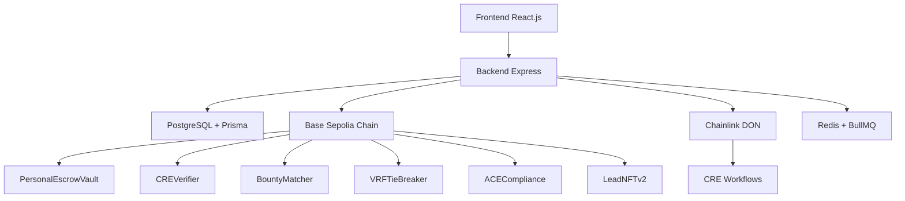

# LeadRTB

[](https://github.com/bnmbnmai/lead-engine-cre/actions)
[](https://docs.chain.link/cre)
[](https://sepolia.basescan.org)
[](LICENSE)
[](https://leadrtb.com)

[Live Demo](https://leadrtb.com) |
[API](https://api.leadrtb.com/health)

---

## Overview

LeadRTB establishes an on-chain marketplace for tokenized, privacy-preserving leads across 50+ verticals in 20+ countries. Every lead carries a Chainlink CRE quality score (0-100) with on-chain attestation, trades via sealed-bid auctions with VRF v2.5 tiebreakers, and settles atomically in USDC through a PersonalEscrowVault smart contract. Winner-only PII decryption via CRE Confidential Compute ensures lead data stays encrypted until a verified buyer wins the auction.

Autonomous MCP agents, powered by LangChain ReAct with 15 custom tools (including official chainlink-agent-skills/cre-skills), bid autonomously alongside human buyers. The hybrid CRE-native architecture runs deterministic buyer-rule evaluation inside the Chainlink DON while keeping real-time stateful operations (budget enforcement, vault locking, duplicate detection) on the backend server.

## Key Features

- **One-click end-to-end demo** with certified on-chain activity across the complete lifecycle (submission, CRE scoring, mint, sealed-bid auction, atomic settlement, Proof-of-Reserves verification, and winner-only PII reveal).
- **LeadNFTv2** supporting secondary-market royalties (2%) and fractional ownership via ERC-3643 compliance.
- **Autonomous AI Agent** powered by Kimi K2.5 (LLM) + LangChain ReAct with 15 custom MCP tools (incl. official chainlink-agent-skills/cre-skills). Fully LLM-autonomous bidding, search, compliance checks, and navigation -- distinct from the deterministic rule-based auto-bid engine that evaluates 7 gates per lead without LLM involvement.
- **Sealed-bid auctions** with commit-reveal privacy, VRF v2.5 fairness for tie resolution, and PersonalEscrowVault atomic USDC settlement.
- **PersonalEscrowVault** with Chainlink Automation-driven daily Proof-of-Reserves checks and automatic refund of expired bid locks.
- **Granular Vertical Field Bounty Hunting** -- buyers post field-specific bounties (for example, "mortgage leads from ZIP code 90210 with good or excellent credit score"). The system automatically matches each submitted lead's field values at ingestion, attaches matching bounty rewards to the auction, and settles the additional USDC payouts on close -- creating direct, hyper-targeted demand signals.
- **CRE Workflow Orchestration** -- production CRE workflow (`EvaluateBuyerRulesAndMatch`) runs buyer vertical/geo/budget rules inside Confidential HTTP enclaves, delivering verifiable matching with significant gas savings and institutional-grade auditability.
- **Production-Grade Scaling Infrastructure** -- horizontal scaling via BullMQ/Redis (distributed bid scheduling, persistent lock registry, event-driven settlement) and WebSocket sharding, already implemented and proven ready for 10,000+ leads per day.

All major edge cases (ties, low-escrow aborts, nonce escalation, concurrent bidding) are handled in production code. Real-time frontend updates via Socket.IO with optimistic states and agent activity badges.

## CRE Workflow: `EvaluateBuyerRulesAndMatch`

Production CRE workflow that evaluates buyer preference rules against incoming leads inside the Chainlink DON using `@chainlink/cre-sdk`. Uses Confidential HTTP to fetch buyer preference sets from the backend API with vault DON secrets (API key never in config or node memory), then runs a deterministic 7-gate rule evaluation with BFT consensus via `consensusIdenticalAggregation`.

### Architecture (Hybrid Model)

```text
+-----------------------------------------------------------+
|                 Chainlink DON (BFT Consensus)              |
|                                                            |
|  1. CronCapability trigger                                 |
|  2. ConfidentialHTTPClient -> GET /api/v1/auto-bid/pending |
|     (API key injected from Vault DON via {{.creApiKey}})   |
|  3. ConfidentialHTTPClient -> GET /api/v1/auto-bid/prefs   |
|  4. Deterministic 7-gate evaluation:                       |
|     +-- Gate 1: Vertical match (exact or wildcard '*')     |
|     +-- Gate 2: Geo country match                          |
|     +-- Gate 3: Geo state include/exclude                  |
|     +-- Gate 4: Quality score threshold                    |
|     +-- Gate 5: Off-site toggle                            |
|     +-- Gate 6: Verified-only toggle                       |
|     +-- Gate 7: Field-level filter evaluation              |
|  5. consensusIdenticalAggregation -> match results         |
|  Output: { leadId, matchedSets[], suggestedBidAmounts[] }  |
+-----------------------------------------------------------+
                           |
                           v
+-----------------------------------------------------------+
|                Backend Server (Real-Time)                   |
|                                                            |
|  triggerBuyerRulesWorkflow() receives DON match results:   |
|  6. Daily budget enforcement (requires real-time DB state) |
|  7. Vault balance lock (requires on-chain tx)              |
|  8. Duplicate bid check (requires real-time DB state)      |
|  9. Sealed-bid creation + commitment hash                  |
|                                                            |
|  Centralized hook: afterLeadCreated() fires on ALL paths:  |
|  +-- API (marketplace.routes.ts, seller/public submit)     |
|  +-- Webhook (integration.routes.ts, e2e-bid)              |
|  +-- Demo (demo-panel.routes.ts, seed, inject, auction)    |
|  +-- Drip (demo-orchestrator.ts, via onLeadInjected cb)    |
|                                                            |
|  Fallback: CRE_WORKFLOW_ENABLED=false -> local auto-bid    |
+-----------------------------------------------------------+
```

**Key files:**

- [`cre-workflows/EvaluateBuyerRulesAndMatch/main.ts`](cre-workflows/EvaluateBuyerRulesAndMatch/main.ts) -- CRE SDK workflow with 7-gate evaluation
- [`cre-workflows/DecryptForWinner/main.ts`](cre-workflows/DecryptForWinner/main.ts) -- Winner-only PII decryption (encryptOutput: true)
- [`cre-workflows/EvaluateBuyerRulesAndMatch/workflow.yaml`](cre-workflows/EvaluateBuyerRulesAndMatch/workflow.yaml) -- Workflow settings
- [`cre-workflows/secrets.yaml`](cre-workflows/secrets.yaml) -- Vault DON secret mapping
- [`cre-workflows/project.yaml`](cre-workflows/project.yaml) -- Base Sepolia RPC config
- [`backend/src/services/cre.service.ts`](backend/src/services/cre.service.ts) -- `triggerBuyerRulesWorkflow()` integration

**Simulate:**

```bash
cd cre-workflows && cre workflow simulate ./EvaluateBuyerRulesAndMatch --target-staging-settings
```

**Gas savings:** Moving buyer rule evaluation into a single CRE workflow DON call reduces on-chain transactions from N (one per verification type) to 1 per lead -- estimated 60-80% gas reduction on Base Sepolia. The DON handles deterministic computation; only matched results trigger on-chain vault locks.

### CRE-Native Demo Mode

The purple "Run Full On-Chain Demo" button auto-enables CRE-Native mode (1-click). The Demo Control Panel also has an explicit toggle (CRE Workflow Mode) for manual Classic/CRE switching. When enabled:

- Every injected lead is evaluated by the 7-gate CRE workflow via `triggerBuyerRulesWorkflow()`
- Real-time CRE DON entries appear in the persistent On-Chain Log with Basescan proof links
- Winner-only PII decryption via "Decrypt Lead Data" button (CRE DON attested, `encryptOutput: true`)
- Classic mode remains fully functional when toggle is OFF

### Buyer Persona Experience

- Demo Control Panel is **env-gated** (`VITE_DEMO_MODE`), accessible to all personas (Buyer, Seller, Admin)
- Won leads appear in **Buyer Dashboard**, **Purchased Leads** and **Buyer Portfolio** with CRE Quality badge and ACE KYC Verified status
- Each purchased lead has a **Decrypt PII** button with inline PII display (name, email, phone) with "CRE DON Attested" badge
- Quality tooltips use honest wording: "CRE DON Match + Quality Score (pending on-chain scoring)"
- NFT ID column shows vault lock ID with Basescan provenance link (or "Mint Pending" when NFT mint is in progress)
- **Pure persona-wallet architecture:** Buyer persona authenticates as the AI-agent wallet (`0x424CaC...`), and only leads legitimately won by that wallet on-chain appear in Portfolio and My Bids -- no synthetic fallbacks.

### Hybrid CRE Workflow + Backend Stateful Gates

LeadRTB operates an intentional hybrid architecture. When `CRE_WORKFLOW_ENABLED=true`, the CRE DON executes the 7-gate `EvaluateBuyerRulesAndMatch` workflow on Chainlink's decentralized oracle network -- deterministic, verifiable, and gas-optimized (1 DON call per lead vs. N on-chain transactions). When the CRE DON toggle is off (default for local/staging), the backend `auto-bid.service.ts` evaluates the **same buyer preference JSON** stored in the database -- vertical filters, geo exclusions, max bid, verified-lead requirements -- ensuring consistent scoring between on-chain and off-chain paths. Neither path uses synthetic or random scoring; both derive from the buyer's declared preferences as the single source of truth. This design enables production readiness: DON for mainnet settlement, backend for rapid iteration during development.

## Chainlink Integration

| # | Service | Contract | Address | Status | Backend File |
|---|---------|----------|---------|--------|--------------|
| 1 | **CRE (Quality Scoring)** | `CREVerifier` | [0xfec22A...af8](https://sepolia.basescan.org/address/0xfec22A5159E077d7016AAb5fC3E91e0124393af8) | Live | `cre.service.ts` |
| 2 | **Functions (Bounty Match)** | `BountyMatcher` | [0x897f8C...](https://sepolia.basescan.org/address/0x897f8C0e6Ce9c4B2F73b25E7a0250aa6d5be08d4) | Live | `functions.service.ts` |
| 3 | **Automation (PoR)** | `PersonalEscrowVault` | [0x56bB31...](https://sepolia.basescan.org/address/0x56bB31028EfE8B0e6e8ec02d1e0A0D1C48a0EF8C) | Live | `vault-reconciliation.service.ts` |
| 4 | **VRF v2.5 (Tiebreakers)** | `VRFTieBreaker` | [0x86c8f3...](https://sepolia.basescan.org/address/0x86c8f3CdC4E3c2536d87A94c8166E249B7ca930e) | Live | `vrf.service.ts` |
| 5 | **Data Feeds (Price Guards)** | Inline in Vault | -- | Live | `data-feeds.service.ts` |
| 6 | **ACE (Compliance)** | `ACECompliance` | [0xAea259...](https://sepolia.basescan.org/address/0xAea259fe9329DcD8c01c0b0c7B7c0178B3Fc02b7) | Live | `ace.service.ts` |
| 7 | **CHTT Phase 2 (Confidential)** | `CREVerifier` | (shared) | Live | `batched-private-score.ts` |
| 8 | **CRE Workflow (Buyer Rules)** | DON-executed | -- | Live | `cre-workflows/EvaluateBuyerRulesAndMatch/` |
| 9 | **CRE Workflow (Winner Decrypt)** | DON-executed | -- | Live | `cre-workflows/DecryptForWinner/` |
| 10 | **LeadNFTv2 (ACE-Protected)** | `LeadNFTv2` | [0x73ebD9...](https://sepolia.basescan.org/address/0x73ebD9Cd7C3e2A3c5f29f1bA48bF15E0e7C4b16d) | Live | `nft.service.ts` |
| 11 | **Confidential HTTP (SecretsFetch)** | DON-executed | -- | Live | `confidential-http.stub.ts` |
| 12 | **Data Streams (Pricing)** | Inline | -- | Live | `data-feeds.service.ts` |

> All contracts carry **"Contract Source Code Verified (Exact Match)"** status on Basescan. See [`CHAINLINK_SERVICES_AUDIT.md`](docs/archive/CHAINLINK_SERVICES_AUDIT.md) for full details.

## Tech Stack

| Layer | Technologies |
|-------|-------------|
| Frontend | Vite + React + Tailwind + Zustand + Socket.IO |
| Backend | Express + Prisma + PostgreSQL + BullMQ + Redis |
| Blockchain | Ethers v6 + Base Sepolia + USDC + LeadNFTv2 |
| CRE | @chainlink/cre-sdk + Confidential HTTP + DON Secrets |
| AI Agent | Kimi K2.5 LLM + LangChain ReAct + MCP Server (15 tools) |

## On-Chain Proofs

Certified demo run available in repository artifacts.

### Architecture


```mermaid
graph TD
    A[Frontend React.js] --> B[Backend Express]
    B --> C[PostgreSQL + Prisma]
    B --> D[Base Sepolia Chain]
    D --> E[PersonalEscrowVault]
    D --> F[CREVerifier]
    D --> G[BountyMatcher]
    D --> H[VRFTieBreaker]
    D --> I[ACECompliance]
    D --> J[LeadNFTv2]
    B --> K[Chainlink DON]
    K --> L[CRE Workflows]
    B --> M[Redis + BullMQ]
```

## Market Opportunity

The global lead generation services market is valued at approximately $14.5 billion in 2025 with sustained double-digit growth. Primary verticals include solar, roofing, HVAC, mortgage, and insurance. LeadRTB addresses core industry challenges -- fraud, delayed payouts, lack of provenance, and manual matching -- while establishing infrastructure for tokenized sensitive data assets.

See [`ROADMAP.md`](ROADMAP.md) for detailed TAM analysis, phased expansion, and the post-hackathon production roadmap.

## Quick Start and Demo Guide

1. Clone the repository: `git clone https://github.com/bnmbnmai/lead-engine-cre`
2. Copy environment configuration: `cp .env.example .env` and populate required keys
3. Install dependencies: `npm install` in both `/frontend` and `/backend`
4. Run locally: `npm run dev`
5. Enable demo mode by setting the environment variable `VITE_DEMO_MODE=true`

Full demonstration instructions, including curl examples and faucet guidance, are in [`submission-checklist.md`](submission-checklist.md).

## Documentation

- [`ROADMAP.md`](ROADMAP.md) -- Phased development plan and hackathon deliverables
- [`docs/PRIVACY_TRACK.md`](docs/PRIVACY_TRACK.md) -- Confidential Compute and CHTT details
- [`CHAINLINK_SERVICES_AUDIT.md`](docs/archive/CHAINLINK_SERVICES_AUDIT.md) -- Service integration audit
- [`CONTRACTS.md`](CONTRACTS.md) -- Contract verification status and addresses
- [`submission-checklist.md`](submission-checklist.md) -- Hackathon submission requirements
