# Lead Engine CRE

[](https://github.com/bnmbnmai/lead-engine-cre/actions/workflows/test.yml)


> **Built for Chainlink Convergence Hackathon 2026 · Mandatory CRE + ACE Track**

**Lead Engine CRE** is a decentralized, tokenized real-time bidding marketplace for verified sales leads in the $200B+ lead generation industry.

Sellers submit high-intent leads that receive cryptographic quality scores via **Chainlink CRE**. **ACE** enforces wallet KYC, jurisdiction policies, and reputation gating. Buyers compete in sealed-bid auctions backed by **pre-funded on-chain USDC PersonalEscrowVaults** with **Chainlink Automation** delivering 24-hour Proof-of-Reserves and automatic refunds. Every purchased lead is minted as an immutable **ERC-721 LeadNFT** with full provenance, resale rights, and royalties.

[🚀 Live Demo](https://lead-engine-cre-frontend.vercel.app) · [3-Min Demo Video (coming soon)](https://www.loom.com/share/...) · [ROADMAP](./ROADMAP.md) · [Full Docs](./docs)

---

## Live Demo & Guided Flow

Experience the full end-to-end flow on Base Sepolia (gas-sponsored — no ETH required).

**Quick Try (5 minutes):**
1. Visit the [Live Demo](https://lead-engine-cre-frontend.vercel.app) and connect a test wallet.
2. **As Seller**: Submit a lead via the CRO lander (pre-filled demo data available).
3. **As Buyer**: Deposit USDC to your PersonalEscrowVault, set field-level auto-bid rules or use the MCP LangChain agent.
4. Watch the 60-second sealed-bid auction in real time via WebSocket.
5. Win → atomic settlement, PII decryption, LeadNFT mint, and bounty release.
6. Check PoR status and 7-day auto-refund protection.

**Seeded demo data** available via `pnpm run seed:demo` (populates solar/roofing leads).

**Screenshots** (add these to `/assets/` folder):
- `assets/marketplace-sealed-bid.png` — Sealed-bid interface with hidden amounts
- `assets/seller-cro-lander.png` — CRO lander with trust badges
- `assets/mcp-agent-console.png` — Autonomous bidding agent
- `assets/leadnft-metadata.png` — Example LeadNFT on Basescan
- `assets/vault-por-status.png` — PersonalEscrowVault + PoR dashboard

---

## Table of Contents
- [Problem & Solution](#problem--solution)
- [Key Differentiators](#key-differentiators)
- [How a Lead Moves Through the System](#how-a-lead-moves-through-the-system)
- [Fraud Prevention](#fraud-prevention)
- [Lead Engine vs. Legacy](#lead-engine-vs-legacy)
- [Chainlink Integrations](#chainlink-integrations)
- [Architecture Overview](#architecture-overview)
- [Security, Trust & Solvency](#security-trust--solvency)
- [Core Features](#core-features)
- [Pricing](#pricing)
- [Smart Contracts](#smart-contracts)
- [Quick Start](#quick-start)
- [Roadmap](#roadmap)
- [For Hackathon Judges](#for-hackathon-judges)
- [Contributing](#contributing)

---

## Problem & Solution

**The $200B lead generation market** is plagued by slow payouts (7–30 days), rampant fraud (20–40% loss), commingled funds, opaque quality scoring, manual compliance, and zero provenance.

**Lead Engine CRE** delivers the first fully on-chain, trustless alternative:
- Cryptographic quality + compliance via Chainlink CRE + ACE
- Instant USDC settlement with institutional-grade solvency
- Tokenized leads as tradable ERC-721 assets
- Autonomous AI bidding and buyer-funded bounties

Result: Sellers get paid instantly with upside from royalties and bounties. Buyers get verifiable quality, zero chargebacks, and programmatic precision.

---

## Key Differentiators

- **PII never touches the blockchain** — non-PII previews only; AES-256 encrypted full data revealed post-purchase
- **Sealed-bid commit-reveal auctions** with keccak256 commitments
- **Instant atomic USDC settlement** via per-user PersonalEscrowVaults
- **Immutable LeadNFT provenance** with built-in royalties
- **Buyer-funded bounties** with criteria matching (stackable, 2× cap, auto-release)
- **MCP LangChain Agents** — 12-tool autonomous bidding server
- **Dynamic verticals** — 50+ instantly creatable, zero-code sync
- **Field-level filtering & auto-bidding** on granular attributes
- **CRO landers + My Funnels redesign** with built-in trust signals

---

## How a Lead Moves Through the System


---

## Fraud Prevention

| Fraud Type          | Legacy Approach                  | Lead Engine Protection                          |
|---------------------|----------------------------------|-------------------------------------------------|
| Click/Form Stuffing | Post-facto detection             | CRE + ZK proofs reject at submission           |
| Lead Farming/Sybil  | Manual review                    | ACE wallet KYC + reputation + unique LeadNFT   |
| Recycled Leads      | None                             | Immutable ERC-721 ownership history            |
| Bounty Gaming       | Easy exploitation                | 2× cap + scoring + Functions criteria match    |

---

## Lead Engine vs. Legacy

| Dimension     | Legacy Marketplaces          | Lead Engine                              |
|---------------|------------------------------|------------------------------------------|
| Payout Speed  | 7–30 days                    | Instant USDC                             |
| Trust         | Opaque                       | CRE score + ZK proofs + PoR              |
| Privacy       | Full PII exposed             | Non-PII previews only                    |
| Compliance    | Manual                       | ACE auto-KYC + jurisdiction engine       |
| Provenance    | None                         | LeadNFT with royalties                   |
| Incentives    | Fixed pricing                | Stacked buyer bounties + resale royalties|

---

## Chainlink Integrations

| Service              | Role                                      | Status          |
|----------------------|-------------------------------------------|-----------------|
| **CRE**              | Quality scoring (0–10,000) + ZK proofs    | Implemented     |
| **ACE**              | Wallet KYC, jurisdiction, reputation      | Implemented     |
| **Automation**       | 24h PoR + 7-day auto-refunds              | Implemented     |
| **Functions**        | Bounty criteria matching                  | Implemented     |
| **VRF**              | Fair tiebreakers                          | Implemented     |
| **Data Streams**     | Real-time floor prices                    | Implemented     |
| **DECO**             | zkTLS lead provenance                     | Architectural stub |
| **Confidential HTTP**| TEE fraud signals on encrypted PII        | Architectural stub |

**Deep Dive** (concise):
- **CRE**: `CREVerifier.sol` evaluates TCPA, geo, completeness via ZK proofs.
- **ACE**: Per-vertical policies (e.g., mortgage state-restricted).
- **Automation**: `verifyReserves()` every 24h + gas-capped refunds.
- **Functions**: `matchBounties()` triggered at auction close; DON secrets refreshed via GitHub Actions.
- **Data Producer**: Anonymized market metrics published as public custom feed.

---

## Architecture Overview

```mermaid
graph TD
    A[Frontend Vercel] --> B[API + MCP Server]
    B --> C[Chainlink Services<br>CRE • ACE • Automation • Functions • VRF]
    B --> D[PersonalEscrowVault + RTBEscrow]
    D --> E[LeadNFTv2 + VerticalBountyPool]
    F[WebSocket] <--> B
    G[Dynamic Verticals Admin] --> B
    style C fill:#375BD2,color:#fff,stroke:#2a4aa0
```



---

## Security, Trust & Solvency

Institutional-grade foundation:

- **PersonalEscrowVault** (`0xcB949C0867B39C5adDDe45031E6C760A0Aa0CE13` on Base Sepolia): Per-user USDC pre-funding with atomic settlement.
- **Chainlink Automation PoR**: 24-hour `verifyReserves()` + automatic 7-day refunds for expired locks.
- **2-Pass Security Review** (Feb 2026): 11 findings identified, 10 fixed, 1 low-risk acknowledged. Full details in [`current-stubs-audit.md`](./current-stubs-audit.md).
- **Test Coverage**: 42 dedicated vault tests + 1,288 total passing Hardhat tests with full CI.
- **Gas Sponsorship**: Buyers require zero ETH for bidding and settlement.
- **PII Privacy**: AES-256 encrypted, never stored on-chain.
- All contracts verified on Basescan.

---

## Core Features

**Marketplace**
- Real-time 60-second sealed-bid auctions
- WebSocket streaming + field-level redaction
- Buy-It-Now fallback

**Buyer Tools**
- Field-level auto-bid engine (credit, ZIP, roof condition, etc.)
- MCP LangChain 12-tool ReAct agents for autonomous trading

**Seller Tools**
- CRO landers with Chainlink trust badges and social proof
- My Funnels horizontal gallery with metrics
- Dynamic vertical creation (admin → instant template sync)

**Bounties**
- Per-vertical USDC pools with granular criteria
- Stacking capped at 2× lead price
- Auto-release via Functions

---

## Pricing

| Channel                  | Platform Fee | Convenience Fee | Total          |
|--------------------------|--------------|-----------------|----------------|
| Manual / Buy It Now      | 5%           | $1.00           | 5% + $1        |
| Auto-bid / MCP Agent     | 5%           | $1.00           | 5% + $1        |
| Bounty Release           | 5%           | $1.00           | 5% + $1        |

---

## Smart Contracts (Base Sepolia)

| Contract                  | Address / Status                  | Description                          |
|---------------------------|-----------------------------------|--------------------------------------|
| PersonalEscrowVault.sol   | `0xcB949C0867B39C5adDDe45031E6C760A0Aa0CE13` | Per-user USDC vault + PoR           |
| CREVerifier.sol           | Deployed & verified               | Quality scoring + ZK proofs         |
| ACECompliance.sol         | Deployed & verified               | KYC, jurisdiction, reputation       |
| LeadNFTv2.sol             | Deployed & verified               | ERC-721 tokenized leads + royalties |
| VerticalBountyPool.sol    | Deployed & verified               | Buyer-funded bounties               |
| RTBEscrow.sol             | Deployed & verified               | Atomic settlement                   |
| CustomLeadFeed.sol        | Deployed & verified               | Public market metrics feed          |
| VerticalNFT.sol / Auction | Deployed & verified               | Vertical ownership                  |

Full list and verification links in [`contracts/deployments`](./contracts).

---

## Quick Start

```bash
git clone https://github.com/bnmbnmai/lead-engine-cre.git
cd lead-engine-cre

# Frontend + Backend + MCP
pnpm install

# Backend + MCP (separate terminals)
cd backend && pnpm dev
cd mcp && pnpm dev

# Frontend
cd frontend && pnpm dev
```

---

## Roadmap

- **Q1 2026**: Mainnet migration, full DECO + Confidential HTTP
- **Q2 2026**: BullMQ scaling, secondary LeadNFT marketplace, dispute arbitration
- **Q3+**: Enterprise white-label verticals, fiat on-ramp, CRM deep integrations

See full [ROADMAP.md](./ROADMAP.md).