# Lead Engine CRE: Decentralized Real-Time Bidding for the $200B+ Lead Marketplace with Deep Chainlink Integration

[](https://github.com/bnmbnmai/lead-engine-cre/actions/workflows/test.yml)


> **Built for Chainlink Convergence Hackathon 2026 · Mandatory CRE + ACE Track**

Lead Engine is the first **tokenized, real-time bidding marketplace for verified leads** — powered by eight **Chainlink** services. Sellers submit leads, **Chainlink CRE** scores them cryptographically, **ACE** clears compliance, and buyers compete in sealed-bid auctions with **pre-funded on-chain USDC vaults**. Every purchased lead is minted as an **ERC-721 LeadNFT** with immutable quality proof, resale rights, and royalties.

| Chainlink Service | Role | Status |
|---|---|---|
| **CRE** | On-chain quality scoring (0–10,000) with ZK fraud proofs | ✅ Implemented |
| **ACE** | Auto-KYC, jurisdiction policy enforcement, reputation gating | ✅ Implemented |
| **Automation** | 24h Proof-of-Reserves checks + 7-day expired lock auto-refunds | ✅ Implemented |
| **Functions** | Bounty criteria matching triggered at auction close | ✅ Implemented |
| **VRF v2.5** | Provably fair tiebreaker for auction bids + bounty allocation | ✅ Implemented |
| **Data Feeds** | Real-time ETH/USD → dynamic bid floor prices per vertical | ✅ Implemented |
| **DECO** | zkTLS verification of off-site lead provenance | 🔶 Stubbed (post-event) |
| **Confidential HTTP** | Off-chain fraud signal aggregation in a TEE | 🔶 Stubbed (post-event) |

**Hackathon Focus:** CRE, ACE, and Automation are fully integrated with deployed contracts. Functions, VRF, and Data Feeds are functional with production contracts. DECO and Confidential HTTP are architecturally integrated as stubs ready for mainnet.

### Recent Updates (Feb 18, 2026)

- **On-Chain Vaults** — `PersonalEscrowVault.sol` deployed on Base Sepolia with pre-bid fund locking, atomic settlement, and full refunds
- **Proof of Reserves** — Chainlink Automation verifies vault solvency every 24h via `verifyReserves()`
- **Expired Lock Auto-Refunds** — Automation sweeps locks older than 7 days, gas-capped at 50 per upkeep
- **Gas Sponsorship** — backend sponsors gas for all vault operations (`lockForBid`, `settleBid`, `refundBid`), so buyers never need ETH for bidding
- **2-Pass Security Audit** — 11 findings identified, 10 fixed, 42 Hardhat tests passing
- **Sealed-bid UX** — highest bid amount hidden during BIDDING phase; only revealed after auction ends

---

## Key Differentiators

- **On-Chain USDC Vault** — `PersonalEscrowVault.sol` holds buyer funds; bids are pre-funded and locked before auction, settled or refunded atomically on-chain
- **Proof of Reserves** — Chainlink Automation verifies vault solvency every 24h; expired locks auto-refund after 7 days
- **PII never touches the blockchain** — non-PII previews only; full data revealed after escrow release
- **Sealed-bid commit-reveal auctions** — keccak256 commitments prevent front-running
- **Instant USDC settlement** — bid amount → seller, $1 fee → platform wallet, all on-chain
- **Gas-sponsored bidding** — backend sponsors gas for all vault operations (lock, settle, refund) so buyers never need ETH in their wallet to participate
- **LeadNFT provenance** — every lead = ERC-721 with quality proof and royalties
- **Buyer-Funded Bounties** — standing USDC pools per vertical with criteria (geo, QS, credit, age); 2x stacking cap; auto-release to sellers on match; refundable anytime
- **Unified Marketplace** — all open leads visible to sellers and buyers with real-time WebSocket streaming
- **MCP LangChain Agents** — 12-tool JSON-RPC server for autonomous bidding, monitoring, and portfolio management
- **Field-Level Filtering** — buyers filter and auto-bid on granular attributes (credit ranges, ZIP codes, roof condition, system size)
- **50+ Dynamic Verticals** — admin-created instantly, auto-synced to seller templates, no code changes

---

## Fraud Prevention

Traditional platforms lose billions to bots. Lead Engine stops them at the smart-contract level:

| Fraud Type | How It Works Today | How Lead Engine Stops It |
|---|---|---|
| **Click Fraud** | Bots fake ad clicks, submit junk forms | CRE + ZK fraud proofs reject or zero-score invalid leads |
| **Form Stuffing** | Bots auto-fill thousands of fake submissions | `CREVerifier.sol` enforces rules (credit, geo, TCPA) via ZK proof |
| **Lead Farming / Sybil** | One seller recycles leads across wallets | ACE auto-KYC + wallet reputation (0–10,000) + NFT royalty deterrence |
| **Recycled Leads** | Same lead resold 50 times | Every purchase mints a unique ERC-721 with immutable ownership |
| **Bounty Gaming** | Fabricating leads to drain bounty pools | Bounties release only after CRE scoring + auction completion + criteria match; 2x cap prevents over-incentivization |
| **Fund Mismanagement** | Platforms commingle buyer deposits | On-chain PoR via Chainlink Automation; `verifyReserves()` checks USDC balance ≥ claimed deposits every 24h |
| **Reserve Tampering** | Platforms misreport reserves or siphon funds | Verifiable on-chain PoR — `USDC.balanceOf(vault) ≥ totalDeposited - totalWithdrawn`, checked by Chainlink Automation; insolvency emits `ReservesVerified(false)` |
| **Expired Lock Exploitation** | Stale fund locks drain buyer liquidity indefinitely | Chainlink Automation auto-refunds bid locks older than 7 days; gas-capped at 50 per upkeep to prevent block gas abuse |

---

## Lead Engine vs. Legacy

| Dimension | Legacy Marketplaces | Lead Engine |
|---|---|---|
| **Speed** | 7–30 day payouts | Instant USDC via on-chain vault settlement |
| **Trust** | Limited verification | CRE quality score (0–10,000) + ZK proofs |
| **Solvency** | Trust-based audits, opaque reserves | On-chain verifiable reserves (PoR) checked every 24h by Chainlink Automation |
| **Privacy** | Full PII on submit | Non-PII previews; full data only after purchase |
| **Compliance** | Manual reviews | ACE auto-KYC and jurisdiction policy engine |
| **Escrow** | Manual chargebacks, platform-held funds | Automated on-chain refunds via Chainlink Automation; per-user vault with pre-bid locking |
| **Automation** | Basic rules | Field-level auto-bid + LangChain agents + Chainlink Automation |
| **Provenance** | No audit trail | ERC-721 LeadNFT with full on-chain history |
| **Incentives** | Fixed pricing | Buyer Bounties — per-vertical pools with criteria-based auto-release |

---

## How a Lead Moves Through the System

```mermaid
sequenceDiagram
    participant BP as 💰 Buyer Bounty Pool
    participant S as 🟢 Seller
    participant API as ⚡ Lead Engine API
    participant CRE as 🔗 Chainlink CRE
    participant ACE as 🔵 Chainlink ACE
    participant FN as ⚙️ Chainlink Functions
    participant RTB as 🟪 RTB Engine
    participant B as 👤 Buyer
    participant V as 🏦 PersonalEscrowVault
    participant AUTO as ⏰ Chainlink Automation

    Note over V: Buyer deposits USDC into vault
    Note over BP: Buyer funds bounty pool ($75, solar, CA, credit>720)

    S->>API: Submit lead (non-PII preview)
    API->>CRE: Quality score + ZK fraud check
    CRE-->>API: Score (0-10,000) + proof
    API->>ACE: KYC and jurisdiction check
    ACE-->>API: Cleared

    Note over RTB: 60-second sealed-bid auction

    RTB->>B: Non-PII preview (WebSocket)
    B->>RTB: Sealed bid (keccak256 commitment)
    RTB->>V: lockForBid (bid + $1 fee)
    V-->>RTB: lockId

    Note over RTB: Auction closes, reveal phase

    B->>RTB: Reveal (amount + salt)
    RTB->>RTB: Verify commitments, pick winner

    RTB->>V: settleBid (lockId, seller)
    V->>S: Bid amount in USDC
    V->>API: $1 fee to platform wallet
    RTB->>B: Decrypted PII + mint LeadNFT
    RTB->>V: refundBid (loser lockIds)

    API->>FN: matchBounties(lead, criteria)
    FN-->>API: Matching pools found
    BP->>S: Bounty bonus auto-released

    Note over AUTO: Every 24h: verifyReserves()
    Note over AUTO: Every check: refund expired locks (7d)
```



### Service Integration Points


---

## Pricing and Fees

| Purchase Channel | Platform Fee | Vault Fee | Bounty Cut | Total |
|---|---|---|---|---|
| Manual (browser bid) | — | $1.00 | — | $1 (locked on-chain at bid time) |
| Auto-bid engine | — | $1.00 | — | $1 (locked on-chain at bid time) |
| API / MCP agent | — | $1.00 | — | $1 (locked on-chain at bid time) |
| Buy It Now | 2.5% | — | — | 2.5% |
| Buyer Bounty release | — | — | 1% | 1% of bounty amount |

The $1 vault fee is locked on-chain alongside the bid amount in `PersonalEscrowVault.sol` when the bid is placed. On settlement, the bid amount goes to the seller and the $1 fee goes to the platform wallet. Losing bids are fully refunded (including the $1 fee). The 1% bounty cut is taken when bounty funds are released to a seller.

---

## Chainlink Integration — Deep Dive

### CRE — Custom Runtime Environment

*Implemented.* On-chain lead quality scoring is the backbone of Lead Engine. Every lead is scored by `CREVerifier.sol` using ZK fraud proofs evaluated off-chain via **CRE** and posted on-chain.

- **Scoring dimensions:** TCPA consent freshness, geo verification, parameter completeness, encryption validity, source trust
- **Output:** Quality score (0–10,000), stored immutably on the LeadNFT
- **Contract:** `CREVerifier.sol` (deployed on Base Sepolia)

### ACE — Automated Compliance Engine

*Implemented.* Identity and jurisdiction gating for every wallet that touches the marketplace.

- **Wallet-level auto-KYC** with 1-year expiry + in-memory caching
- **Jurisdiction policy engine** per vertical — mortgage/insurance restricted by state, solar/roofing unrestricted
- **Reputation scoring** (0–10,000) with decay and boost mechanics
- **Contract:** `ACECompliance.sol` (deployed on Base Sepolia)

### Chainlink Automation + PersonalEscrowVault

*Implemented.* `PersonalEscrowVault.sol` is a per-user on-chain USDC pool that replaces post-bid escrow with **pre-bid fund locking**. Chainlink Automation handles two recurring jobs:

- **Proof of Reserves (every 24h):** `verifyReserves()` checks that `USDC.balanceOf(vault)` ≥ `totalDeposited - totalWithdrawn`. Insolvency sets `lastPorSolvent = false` and emits `ReservesVerified(false)`
- **Expired Lock Auto-Refunds (every check):** `_refundExpiredLocks()` scans active bid locks older than 7 days and refunds them to the buyer’s vault balance. Gas-capped at 50 locks per upkeep to stay within block gas limits
- **Pre-bid locking:** `lockForBid(user, bidAmount)` atomically locks the bid + $1 fee from the buyer’s vault balance. Re-bids refund the old lock before creating a new one
- **Atomic settlement:** `settleBid(lockId, seller)` transfers bid amount to seller, $1 fee to platform wallet, and updates `totalDeposited` for accurate PoR
- **Full refunds:** `refundBid(lockId)` returns bid + fee back to the buyer’s vault balance
- **2-pass security audit** completed (11 findings, 10 fixed, 3 acknowledged low-risk)
- **Contract:** `PersonalEscrowVault.sol` (`0xcB949C0867B39C5adDDe45031E6C760A0Aa0CE13` on Base Sepolia)
- **Tests:** 42 Hardhat tests covering deposit, withdraw, lock, settle, refund, PoR, Automation, edge cases

### Chainlink Functions — Off-Chain Bounty Matching

*Implemented.* `BountyMatcher.sol` runs bounty-criteria matching off-chain in the Chainlink DON and stores the verified result on-chain:

- Backend sends lead attributes + pool criteria → DON executes AND-logic matching (quality score, geo state/country, credit score, lead age)
- DON returns comma-separated matched pool IDs → contract splits and stores in `MatchResult`
- `VerticalBountyPool.releaseBounty()` can optionally gate releases behind `BountyMatcher.isMatchVerified()` (toggled via `setRequireFunctionsAttestation`)
- **Gas:** ~130k total (80k request + 50k callback) — all criteria evaluation runs off-chain
- Falls back to in-memory matching when Functions is disabled (`BOUNTY_FUNCTIONS_ENABLED=false`)
- **DON secrets** refreshed every 48h via GitHub Actions


### VRF v2.5 — Provably Fair Tie-Breaking

*Implemented.* **`VRFTieBreaker.sol`** requests Chainlink VRF v2.5 randomness when two or more parties are tied:

- **Auction ties** — when 2+ bidders submit identical highest effective bids, VRF selects the winner: `candidates[randomWord % count]`
- **Bounty allocation** — when 2+ bounty pools match a lead with equal amounts, VRF determines priority ordering
- Winner selection is auditable on-chain via the `TieResolved` event (includes `randomWord`, `winner`, `leadIdHash`)
- Graceful fallback: if VRF is unavailable or subscription unfunded, the backend uses deterministic ordering (earliest bid / existing sort)

### Data Feeds — Dynamic Bid Floor Pricing

*Implemented.* The ETH/USD Chainlink Price Feed on Base Sepolia (`0x4aDC67696bA383F43DD60A9e78F2C97Fbbfc7cb1`) drives dynamic, market-responsive floor prices across the platform:

- **On-chain read:** `AggregatorV3Interface.latestRoundData()` returns ETH/USD with 8 decimals
- **Market multiplier:** Compares current price to a $2,500 baseline; clamped to ±20% deviation. Bullish markets raise floors, bearish markets lower them
- **Per-vertical base tables:** 10 verticals × 5 countries (US/CA/GB/DE/AU) with calibrated floor/ceiling pairs (e.g. solar US = $85/$200)
- **Auto-bid integration:** The auto-bid engine reads the floor and adjusts bids upward to `max(autoBidAmount, floor)`, capped by `maxBidPerLead`
- **MCP agent tools:** `get_bid_floor` and `suggest_bid_amount` let the LangChain agent query real-time floors and recommend quality-weighted bid amounts
- **Frontend:** `useFloorPrice` hook auto-refreshes every 60s; LeadCard shows a "Floor $XX" badge; AuctionPage shows a dedicated Market Floor stat card
- **Caching:** 60s in-memory TTL to avoid RPC spam; stale fallback when chain reads fail
- **Service:** `datastreams.service.ts` — Data Feeds integration (15 unit tests covering floor calc, multiplier clamping, fallback, multi-vertical)

### DECO — zkTLS Verification

*Stubbed for hackathon, full integration post-event.*

**DECO** will verify off-site lead provenance via zkTLS attestations — proving a lead was captured from a real landing page without revealing the page content. Architecture wired, awaiting DECO mainnet availability.

### Confidential HTTP

*Stubbed for hackathon, full integration post-event.*

**Confidential HTTP** will aggregate fraud signals from third-party APIs (phone validation, email reputation, IP geolocation) inside a TEE — enabling fraud checks on encrypted PII without exposing it to any party.

### Data Producer — Giving Back to the Ecosystem

Lead Engine publishes anonymized market metrics as a **public custom data feed** via `CustomLeadFeed.sol`: average quality score, volume settled, leads tokenized, fill rate. Other dApps can consume these on-chain.

---

## Trust and Provenance Layer

| Layer | Technology | Function |
|---|---|---|
| **Lead Quality** | CRE + CREVerifier.sol | Cryptographic quality scoring + ZK fraud rejection |
| **Identity** | ACE + ACECompliance.sol | Auto-KYC, jurisdiction gating, reputation |
| **Escrow** | PersonalEscrowVault.sol | Per-user on-chain USDC vault; pre-bid locking, atomic settle/refund |
| **Solvency** | Chainlink Automation + PoR | 24h on-chain reserve verification; 7-day expired lock auto-refunds |
| **Economic Deterrence** | LeadNFTv2.sol | Immutable ownership history + royalties on resale |
| **Bounty Incentives** | VerticalBountyPool.sol | Per-vertical USDC pools, criteria matching, auto-release |
| **Privacy** | AES-256-GCM + commit-reveal | PII encrypted at rest, sealed bids prevent front-running |

---

## Features

### Core Marketplace

- Real-time 60-second sealed-bid auctions with WebSocket streaming
- Non-PII previews with per-vertical field redaction
- Every lead minted as `LeadNFTv2.sol` (ERC-721)
- Auto-bid engine with field-level rules (vertical, geo, quality, budget, roof condition, system size)
- Buy It Now for unsold leads
- CRM webhooks (HubSpot, Zapier, custom)

### Buyer-Funded Bounties

Standing USDC pools per vertical with criteria-based auto-release:

| Criteria | Example |
|---|---|
| Geo (state/country) | CA, TX only |
| Min Quality Score | 7,000+ / 10,000 |
| Min Credit Score | 720+ |
| Max Lead Age | 24 hours or less |

Multiple buyers stack bounties on the same vertical (capped at 2x lead price). Matching pools auto-release to sellers as a bonus. Unmatched funds refundable anytime. On-chain via `VerticalBountyPool.sol`.

### MCP LangChain Agents

12-tool JSON-RPC server (port 3002) with a full **LangChain ReAct** autonomous bidding agent:

- `list_verticals`, `search_leads`, `get_lead`, `place_bid`, `get_my_bids`, `get_my_leads`
- `get_market_stats`, `set_autobid_rules`, `get_autobid_rules`
- `deposit_bounty`, `withdraw_bounty`, `get_bounty_info`

Buyers can run (or write their own) agents that watch the live non-PII stream and bid autonomously.

### CRO Lander System

Hosted lead capture forms with conversion optimization:

- **Social proof** — live lead count, recent activity feed
- **Auto-format validation** — phone, email, ZIP auto-correction on input
- **A/B toggles** — sellers enable/disable CRO features per funnel

### My Funnels Redesign

Horizontal gallery view with per-funnel conversion metrics, search and filtering across all funnels, pin favorites for quick access, and mobile-first responsive cards.

### Dynamic Verticals

50+ seeded verticals across solar, mortgage, roofing, insurance, home services, B2B SaaS, real estate, auto, legal, and financial services. New verticals are created instantly in the admin dashboard and auto-synced to seller templates, field schemas, and marketplace filters with zero code changes.

---

## Smart Contracts (11 on Base Sepolia)

| Contract | Description | Status |
|---|---|---|
| `PersonalEscrowVault.sol` | Per-user USDC vault with pre-bid locking, Chainlink Automation PoR + auto-refunds | ✅ Deployed |
| `CREVerifier.sol` | Quality scoring + ZK fraud proofs | ✅ Deployed |
| `ACECompliance.sol` | KYC, jurisdiction, reputation | ✅ Deployed |
| `RTBEscrow.sol` | Atomic USDC escrow settlement (legacy) | ✅ Deployed |
| `LeadNFTv2.sol` | ERC-721 tokenized leads | ✅ Deployed |
| `BountyMatcher.sol` | Chainlink Functions bounty criteria matching | ✅ Compiled |
| `VerticalBountyPool.sol` | Buyer-funded bounty pools | ✅ Compiled |
| `CustomLeadFeed.sol` | Public market metrics feed | ✅ Deployed |
| `VerticalNFT.sol` | Community vertical ownership | ✅ Deployed |
| `VerticalAuction.sol` | Ascending auctions for verticals | ✅ Deployed |
| `VRFTieBreaker.sol` | Chainlink VRF v2.5 provably fair tie-breaking | ✅ Compiled |

---

## Quick Start

```bash
# 1. Clone and install
git clone https://github.com/bnmbnmai/lead-engine-cre.git
cd lead-engine-cre
npm install

# 2. Start everything (dev mode)
npm run dev
```

- **Frontend:** http://localhost:3000
- **Backend:** http://localhost:3001
- **MCP Agent:** http://localhost:3002

Hardhat node + contracts already deployed locally. Full configuration in `.env.example`.

**Required vault env vars** (in `backend/.env`):

| Variable | Value | Purpose |
|---|---|---|
| `VAULT_ADDRESS_BASE_SEPOLIA` | `0xcB949C0867B39C5adDDe45031E6C760A0Aa0CE13` | PersonalEscrowVault contract |
| `VAULT_PLATFORM_WALLET` | Your platform wallet address | Receives $1 bid fees |
| `USDC_CONTRACT_ADDRESS` | USDC token address on Base Sepolia | ERC-20 payment token |
| `AUTOMATION_REGISTRY` | Chainlink Automation registry address | Automation upkeep registration |
| `POR_FEED_ADDRESS` | PoR feed address (post-hackathon) | External Proof-of-Reserves feed |

### DON Secrets Renewal

**Chainlink Functions** DON secrets expire every 48 hours. Renewal is automated via GitHub Actions (`.github/workflows/renew-don-secrets.yml`, runs every 48h) or can be done manually:

```bash
cd contracts && npx ts-node scripts/upload-don-secrets.ts
```

---

## Hackathon Demo Flow (2 minutes)

1. **Buyer deposits USDC** — funds `PersonalEscrowVault.sol` via MetaMask
2. **Buyer sets bounty** — $75 pool on `solar.residential` with criteria: CA only, QS 7,000+
3. **Seller submits lead** — CRE scores (8,200/10,000) + ACE clears KYC
4. **Auction opens** — buyers (or LangChain agent) receive non-PII preview via WebSocket
5. **Sealed bids submitted** — vault locks bid + $1 fee on-chain, keccak256 commitments prevent front-running
6. **Auction closes** — vault settles winner (USDC → seller), refunds losers, mints LeadNFT
7. **Bounty auto-matches** — seller receives $75 bonus on top of winning bid
8. **PoR check** — Chainlink Automation verifies vault solvency (runs every 24h)

**Live demo:** https://lead-engine-cre-frontend.vercel.app
**Repo:** https://github.com/bnmbnmai/lead-engine-cre

---

## Post-Hackathon Roadmap

| Priority | Item | Current State |
|---|---|---|
| ✅ Done | On-chain PersonalEscrowVault with pre-bid locking | Deployed + audited (2-pass) |
| ✅ Done | Chainlink Automation — PoR (24h) + expired lock refunds (7d) | Implemented in vault |
| ✅ Done | Sealed-bid commit-reveal with pre-funded escrow | Working E2E |
| High | DECO zkTLS attestations for off-site lead provenance | Stubbed, full integration planned |
| High | Confidential HTTP for encrypted fraud signal aggregation | Stubbed, full integration planned |
| 🔄 In Progress | Advanced PoR — Chainlink PoR Feed integration for external auditability | Architecture designed, env var wired |
| Medium | Secondary market for LeadNFT and VerticalNFT trading | Contracts ready |
| Medium | Cross-chain settlement (Arbitrum, Optimism, Polygon) | Architecture planned |
| Ready | VerticalNFT revenue-share flow (2% royalties) | Contracts deployed |
| Ready | Multi-language CRO landers | Frontend ready |

See `ROADMAP.md` for high-volume scaling considerations and enterprise features (target: 10k+ leads/day).
See `docs/MAINNET_MIGRATION.md` for the full migration plan.

---

## Stubs Migration Status

See `current-stubs-audit.md` for the full 17-entry audit. Key migration highlights:

| Stub | Previous State | Current State |
|---|---|---|
| Off-chain vault / escrow fallback | DB-only balance tracking | ✅ **Migrated** — on-chain `PersonalEscrowVault.sol` with PoR + Automation |
| Chainlink Keepers (quarterly reset) | Simulated cron-based upkeep | ✅ **Migrated** — Chainlink Automation handles PoR (24h) + expired lock refunds (7d) |
| Expired bids/bounties cleanup | Manual or unhandled | ✅ **Ready** — `_refundExpiredLocks()` in vault, gas-capped at 50 per upkeep |
| DECO zkTLS attestation | Stub | 🔶 Stubbed (awaiting mainnet) |
| Confidential HTTP (TEE) | Stub | 🔶 Stubbed (post-hackathon) |
| ACE off-chain fallbacks | Implicit DB fallback | 🟡 Partial — on-chain preferred, DB fallback when contract unavailable |
