# Lead Engine CRE

> **Built for Chainlink Convergence Hackathon 2026**

[🚀 Live Demo](https://lead-engine-cre-frontend.vercel.app) · [GitHub](https://github.com/bnmbnmai/lead-engine-cre) · [Video (coming soon)](#)

## Overview

Lead Engine CRE is an on-chain marketplace for tokenized leads. Sellers mint high-quality leads as tradable LeadNFTs. Buyers participate in real-time sealed-bid auctions with instant USDC settlement and verifiable provenance through Chainlink.

Autonomous MCP agents, powered by LangChain ReAct and 11 integrated tools, continuously hunt and bid on leads according to buyer-defined rules for verticals, quality scores, budgets, and geo-targeting.

Built for the Chainlink Convergence Hackathon 2026 (CRE + ACE track), the platform demonstrates deep integration across the Chainlink ecosystem while addressing core inefficiencies in lead generation: fraud, delayed payouts, lack of provenance, and poor matching.

## Key Features

- One-click full on-chain demo that runs the complete lifecycle end-to-end
- LeadNFTs with built-in royalties for recurring creator revenue
- Autonomous MCP agents that operate using buyer-configured preferences and LangChain ReAct reasoning
- Programmable buyer bounties funded per vertical and executed via Chainlink Functions
- PersonalEscrowVault with Chainlink Automation for Proof of Reserves and automatic lock expiry
- Sealed-bid auctions with commit-reveal privacy and Chainlink VRF for fair tie resolution
- Dynamic verticals with drag-and-drop form builder and field-level auto-bid rules
- Real-time analytics with structured Socket.IO events and continuous vault reconciliation monitoring

## Chainlink Integration

The platform uses six Chainlink services in production flows:

| Service | Role |
|---------|------|
| **CRE** | On-chain quality scoring with ZK proofs for lead verification and parameter matching |
| **ACE** | TCPA consent management, jurisdiction validation, and compliance checks |
| **Automation** | Proof of Reserves every 24 hours and automatic refund of expired bid locks |
| **VRF v2.5** | Verifiable random tiebreaker for equal bids |
| **Functions** | Dynamic bounty matching and payout execution |
| **Data Feeds** | Real-time price references for bidding logic |

This integration enables trust-minimized, verifiable lead transactions at scale.

## How a Lead Moves Through the System

```mermaid
sequenceDiagram
    participant BP as 💰 Buyer Bounty Pool
    participant S as 📤 Seller
    participant API as 🛠️ Lead Engine API
    participant CRE as 🔗 Chainlink CRE
    participant ACE as 🛡️ Chainlink ACE
    participant FN as ⚙️ Chainlink Functions
    participant RTB as ⚡ RTB Engine
    participant B as 👤 Buyer
    participant X as 🏦 PersonalEscrowVault

    Note over BP: Buyer funds pool (e.g., solar, CA, credit>720)

    S->>API: Submit lead (non-PII preview)
    API->>CRE: Quality score + ZK fraud proofs
    CRE-->>API: Score (0-10,000) + proof
    API->>ACE: KYC & jurisdiction check
    ACE-->>API: Cleared

    Note over RTB: 60-second sealed-bid auction

    RTB->>B: Non-PII preview (WebSocket)
    B->>RTB: Sealed bid (keccak256 commitment)

    Note over RTB: Auction closes, reveal phase

    B->>RTB: Reveal (amount + salt)
    RTB->>RTB: Verify commitments, pick winner (VRF tiebreak)

    B->>X: Winner pays USDC from vault
    X->>S: Instant settlement (minus 2.5%)
    X->>B: Decrypted PII + mint LeadNFTv2

    API->>FN: matchBounties(lead, criteria)
    FN-->>API: Matching pools
    BP->>S: Bounty auto-released
```

## Architecture

## Market Opportunity

The global lead generation market exceeds $200 billion annually. Key verticals such as solar, roofing, HVAC, mortgage, and insurance are experiencing rapid growth but remain highly fragmented and inefficient.

Sellers face high fraud rates and delayed payouts. Buyers waste time and capital on low-quality leads. Lead Engine addresses these challenges with atomic settlement, verifiable quality scoring, recurring royalties through LeadNFTs, and autonomous demand generation via AI agents.

## Post-Hackathon Vision

- Secondary marketplace for trading LeadNFTs
- Enterprise white-label version for large lead buyers
- Fiat on-ramps and direct CRM integrations (HubSpot, Salesforce)
- Expanded autonomous agent capabilities for multi-vertical orchestration
- Institutional lead portfolio tokenization as RWAs

## Getting Started

The platform is fully deployed and functional on Base Sepolia. Detailed local development instructions are available in the repository.

## Built With

| Layer | Technology |
|-------|-----------|
| Blockchain | Base Sepolia |
| Smart Contracts | Solidity + Hardhat |
| Backend | Node.js, Express, Socket.IO, Prisma |
| Frontend | React, Vite, Tailwind, ethers.js |
| AI Agents | LangChain ReAct + Moonshot Kimi (OpenAI-compatible) |
| Chainlink Services | CRE, ACE, Automation, VRF, Functions, Data Feeds |

---

Lead Engine CRE provides a new infrastructure layer for the lead economy — transparent, instant, and autonomous.  
Built for the Chainlink Convergence Hackathon 2026.