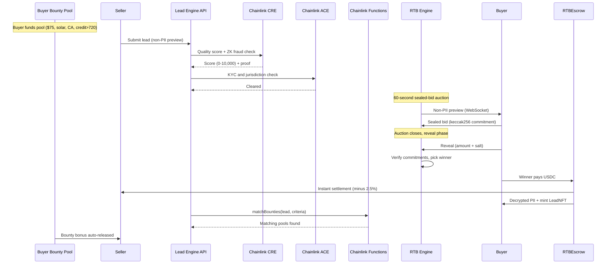

# Lead Engine CRE: Decentralized Real-Time Bidding for the $200B+ Lead Marketplace with Deep Chainlink Integration

[](https://github.com/bnmbnmai/lead-engine-cre/actions/workflows/test.yml)


> **Built for Chainlink Convergence Hackathon 2026 · Mandatory CRE + ACE Track**

Lead Engine is the first **tokenized, real-time bidding marketplace for verified leads** — powered by seven **Chainlink** services. Sellers submit leads, **Chainlink CRE** scores them cryptographically, **ACE** clears compliance, and buyers compete in sealed-bid auctions settled instantly in USDC. Every purchased lead is minted as an **ERC-721 LeadNFT** with immutable quality proof, resale rights, and royalties.

| Chainlink Service | Role | Status |
|---|---|---|
| **CRE** | On-chain quality scoring (0–10,000) with ZK fraud proofs | Implemented |
| **ACE** | Auto-KYC, jurisdiction policy enforcement, reputation gating | Implemented |
| **Functions** | Bounty criteria matching triggered at auction close | Implemented |
| **VRF** | Cryptographic tiebreaker for equal-amount bids | Implemented |
| **Data Streams** | Real-time bidding floor prices per vertical | Implemented |
| **DECO** | zkTLS verification of off-site lead provenance | Stubbed for hackathon, full integration post-event |
| **Confidential HTTP** | Off-chain fraud signal aggregation in a TEE | Stubbed for hackathon, full integration post-event |

**Hackathon Focus:** CRE + ACE are fully integrated. Functions, VRF, and Data Streams are functional with production contracts. DECO and Confidential HTTP are architecturally integrated as stubs ready for mainnet.

---

## Key Differentiators

- **PII never touches the blockchain** — non-PII previews only; full data revealed after escrow release
- **Sealed-bid commit-reveal auctions** — keccak256 commitments prevent front-running
- **Instant USDC settlement** — client-side RTBEscrow signing, zero chargebacks
- **LeadNFT provenance** — every lead = ERC-721 with quality proof and royalties
- **Buyer-Funded Bounties** — standing USDC pools per vertical with criteria (geo, QS, credit, age); 2x stacking cap; auto-release to sellers on match; refundable anytime
- **Unified Marketplace** — all open leads visible to sellers and buyers with real-time WebSocket streaming
- **MCP LangChain Agents** — 12-tool JSON-RPC server for autonomous bidding, monitoring, and portfolio management
- **CRO Lander System** — hosted lead capture forms with trust badges, social proof, auto-format validation, and A/B toggles
- **My Funnels Redesign** — horizontal gallery with per-funnel metrics, search, pinning, and mobile-first cards
- **Field-Level Filtering** — buyers filter and auto-bid on granular attributes (credit ranges, ZIP codes, roof condition, system size)
- **50+ Dynamic Verticals** — admin-created instantly, auto-synced to seller templates, no code changes

---

## Fraud Prevention

Traditional platforms lose billions to bots. Lead Engine stops them at the smart-contract level:

| Fraud Type | How It Works Today | How Lead Engine Stops It |
|---|---|---|
| **Click Fraud** | Bots fake ad clicks, submit junk forms | CRE + ZK fraud proofs reject or zero-score invalid leads |
| **Form Stuffing** | Bots auto-fill thousands of fake submissions | `CREVerifier.sol` enforces rules (credit, geo, TCPA) via ZK proof |
| **Lead Farming / Sybil** | One seller recycles leads across wallets | ACE auto-KYC + wallet reputation (0–10,000) + NFT royalty deterrence |
| **Recycled Leads** | Same lead resold 50 times | Every purchase mints a unique ERC-721 with immutable ownership |
| **Bounty Gaming** | Fabricating leads to drain bounty pools | Bounties release only after CRE scoring + auction completion + criteria match; 2x cap prevents over-incentivization |

---

## Lead Engine vs. Legacy

| Dimension | Legacy Marketplaces | Lead Engine |
|---|---|---|
| **Speed** | 7–30 day payouts | Instant USDC via on-chain escrow |
| **Trust** | Limited verification | CRE quality score (0–10,000) + ZK proofs |
| **Privacy** | Full PII on submit | Non-PII previews; full data only after purchase |
| **Compliance** | Manual reviews | ACE auto-KYC and jurisdiction policy engine |
| **Automation** | Basic rules | Field-level auto-bid + LangChain autonomous agents |
| **Provenance** | No audit trail | ERC-721 LeadNFT with full on-chain history |
| **Incentives** | Fixed pricing | Buyer Bounties — per-vertical pools with criteria-based auto-release |

---

## How a Lead Moves Through the System



---

## Pricing and Fees

| Purchase Channel | Platform Fee | Convenience Fee | Bounty Cut | Total |
|---|---|---|---|---|
| Manual (browser bid / Buy It Now) | 2.5% | — | — | 2.5% |
| Auto-bid engine | 2.5% | $1.00 | — | 2.5% + $1 |
| API / MCP agent | 2.5% | $1.00 | — | 2.5% + $1 |
| Buyer Bounty release | — | — | 1% | 1% of bounty amount |

The $1 convenience fee covers gas and platform costs for server-side (non-MetaMask) purchases. The 1% bounty cut is taken when bounty funds are released to a seller.

---

## Chainlink Integration — Deep Dive

### CRE — Custom Runtime Environment

*Implemented.* On-chain lead quality scoring is the backbone of Lead Engine. Every lead is scored by `CREVerifier.sol` using ZK fraud proofs evaluated off-chain via **CRE** and posted on-chain.

- **Scoring dimensions:** TCPA consent freshness, geo verification, parameter completeness, encryption validity, source trust
- **Output:** Quality score (0–10,000), stored immutably on the LeadNFT
- **Contract:** `CREVerifier.sol` (deployed on Base Sepolia)

### ACE — Automated Compliance Engine

*Implemented.* Identity and jurisdiction gating for every wallet that touches the marketplace.

- **Wallet-level auto-KYC** with 1-year expiry + in-memory caching
- **Jurisdiction policy engine** per vertical — mortgage/insurance restricted by state, solar/roofing unrestricted
- **Reputation scoring** (0–10,000) with decay and boost mechanics
- **Contract:** `ACECompliance.sol` (deployed on Base Sepolia)

### Chainlink Functions

*Implemented.* Bounty criteria matching runs through **Chainlink Functions** at auction resolution:

- `matchBounties()` evaluates lead attributes against all active pool criteria
- Triggered automatically when an auction closes with a winner
- Matching pools release funds to the seller as a bonus
- **DON secrets** refreshed every 48h via GitHub Actions

### VRF — Verifiable Random Function

*Implemented.* When two or more bids tie at the same highest amount, **VRF** provides a provably fair, cryptographically random tiebreaker.

### Data Streams

*Implemented.* Real-time bidding floor prices per vertical, used by the auto-bid engine to set competitive reserve minimums. Published as a custom data feed.

### DECO — zkTLS Verification

*Stubbed for hackathon, full integration post-event.*

**DECO** will verify off-site lead provenance via zkTLS attestations — proving a lead was captured from a real landing page without revealing the page content. Architecture wired, awaiting DECO mainnet availability.

### Confidential HTTP

*Stubbed for hackathon, full integration post-event.*

**Confidential HTTP** will aggregate fraud signals from third-party APIs (phone validation, email reputation, IP geolocation) inside a TEE — enabling fraud checks on encrypted PII without exposing it to any party.

### Data Producer — Giving Back to the Ecosystem

Lead Engine publishes anonymized market metrics as a **public custom data feed** via `CustomLeadFeed.sol`: average quality score, volume settled, leads tokenized, fill rate. Other dApps can consume these on-chain.

---

## Trust and Provenance Layer

| Layer | Technology | Function |
|---|---|---|
| **Lead Quality** | CRE + CREVerifier.sol | Cryptographic quality scoring + ZK fraud rejection |
| **Identity** | ACE + ACECompliance.sol | Auto-KYC, jurisdiction gating, reputation |
| **Economic Deterrence** | LeadNFTv2.sol | Immutable ownership history + royalties on resale |
| **Settlement** | RTBEscrow.sol | Atomic USDC escrow, instant payout, zero chargebacks |
| **Bounty Incentives** | VerticalBountyPool.sol | Per-vertical USDC pools, criteria matching, auto-release |
| **Privacy** | AES-256-GCM + commit-reveal | PII encrypted at rest, sealed bids prevent front-running |

---

## Features

### Core Marketplace

- Real-time 60-second sealed-bid auctions with WebSocket streaming
- Non-PII previews with per-vertical field redaction
- Every lead minted as `LeadNFTv2.sol` (ERC-721)
- Auto-bid engine with field-level rules (vertical, geo, quality, budget, roof condition, system size)
- Buy It Now for unsold leads
- CRM webhooks (HubSpot, Zapier, custom)

### Buyer-Funded Bounties

Standing USDC pools per vertical with criteria-based auto-release:

| Criteria | Example |
|---|---|
| Geo (state/country) | CA, TX only |
| Min Quality Score | 7,000+ / 10,000 |
| Min Credit Score | 720+ |
| Max Lead Age | 24 hours or less |

Multiple buyers stack bounties on the same vertical (capped at 2x lead price). Matching pools auto-release to sellers as a bonus. Unmatched funds refundable anytime. On-chain via `VerticalBountyPool.sol`.

### MCP LangChain Agents

12-tool JSON-RPC server (port 3002) with a full **LangChain ReAct** autonomous bidding agent:

- `list_verticals`, `search_leads`, `get_lead`, `place_bid`, `get_my_bids`, `get_my_leads`
- `get_market_stats`, `set_autobid_rules`, `get_autobid_rules`
- `deposit_bounty`, `withdraw_bounty`, `get_bounty_info`

Buyers can run (or write their own) agents that watch the live non-PII stream and bid autonomously.

### CRO Lander System

Hosted lead capture forms with conversion optimization:

- **Trust badges** — Chainlink verification seal, on-chain quality guarantee
- **Social proof** — live lead count, recent activity feed
- **Auto-format validation** — phone, email, ZIP auto-correction on input
- **A/B toggles** — sellers enable/disable CRO features per funnel

### My Funnels Redesign

Horizontal gallery view with per-funnel conversion metrics, search and filtering across all funnels, pin favorites for quick access, and mobile-first responsive cards.

### Dynamic Verticals

50+ seeded verticals across solar, mortgage, roofing, insurance, home services, B2B SaaS, real estate, auto, legal, and financial services. New verticals are created instantly in the admin dashboard and auto-synced to seller templates, field schemas, and marketplace filters with zero code changes.

---

## Smart Contracts (10 deployed on Base Sepolia)

| Contract | Description |
|---|---|
| `CREVerifier.sol` | Quality scoring + ZK fraud proofs |
| `ACECompliance.sol` | KYC, jurisdiction, reputation |
| `RTBEscrow.sol` | Atomic USDC escrow settlement |
| `LeadNFTv2.sol` | ERC-721 tokenized leads |
| `VerticalBountyPool.sol` | Buyer-funded bounty pools |
| `CustomLeadFeed.sol` | Public market metrics feed |
| `VerticalNFT.sol` | Community vertical ownership |
| `VerticalAuction.sol` | Ascending auctions for verticals |

---

## Quick Start

```bash
# 1. Clone and install
git clone https://github.com/bnmbnmai/lead-engine-cre.git
cd lead-engine-cre
npm install

# 2. Start everything (dev mode)
npm run dev
```

- **Frontend:** http://localhost:3000
- **Backend:** http://localhost:3001
- **MCP Agent:** http://localhost:3002

Hardhat node + contracts already deployed locally. Full configuration in `.env.example` and deployment instructions in `DEPLOY.md`.

### DON Secrets Renewal

**Chainlink Functions** DON secrets expire every 72 hours. Renewal is automated via GitHub Actions (`.github/workflows/renew-don-secrets.yml`, runs every 48h) or can be done manually:

```bash
cd contracts && npx ts-node scripts/upload-don-secrets.ts
```

---

## Hackathon Demo Flow (2 minutes)

1. **Buyer deposits bounty** — $75 pool on `solar.residential` with criteria: CA only, QS 7,000+
2. **Seller submits lead** — CRE scores (8,200/10,000) + ACE clears KYC
3. **Auction opens** — buyers (or LangChain agent) receive non-PII preview via WebSocket
4. **Sealed bids submitted** — keccak256 commitments prevent front-running
5. **Auction closes** — winner pays USDC via RTBEscrow, lead minted as LeadNFT
6. **Bounty auto-matches** — seller receives $75 bonus on top of winning bid

**Live demo:** https://lead-engine-cre-frontend.vercel.app
**Repo:** https://github.com/bnmbnmai/lead-engine-cre

---

## Post-Hackathon Roadmap

| Priority | Item | Current State |
|---|---|---|
| High | DECO zkTLS attestations for off-site lead provenance | Stubbed, full integration planned |
| High | Confidential HTTP for encrypted fraud signal aggregation | Stubbed, full integration planned |
| Medium | Secondary market for LeadNFT and VerticalNFT trading | Contracts ready |
| Medium | Cross-chain settlement (Arbitrum, Optimism, Polygon) | Architecture planned |
| Ready | VerticalNFT revenue-share flow (2% royalties) | Contracts deployed |
| Ready | Multi-language CRO landers | Frontend ready |

See `ROADMAP.md` for the full breakdown.
