# Lead Engine CRE

[](https://github.com/bnmbnmai/lead-engine-cre/actions/workflows/test.yml)


### Decentralized Real-Time Bidding for the $200B+ Lead Marketplace

**Built for Chainlink Convergence Hackathon 2026**  
**Mandatory CRE + ACE track** · First tokenized lead marketplace · Contributes custom data feed back to the ecosystem

Lead Engine brings web3 trust, privacy, and compliance to the $200B+ global lead generation market.  
Sellers get paid in seconds. Buyers get verified, compliant leads with on-chain provenance.  
Every purchased lead is minted as an **ERC-721 LeadNFT** — immutable quality score, resale rights, and royalties.

### Key Differentiators
- PII never touches the blockchain or the NFT (non-PII previews only)
- Sealed-bid commit-reveal auctions for fairness
- Real on-chain escrow + instant USDC settlement (client-side RTBEscrow signing)
- LeadNFT as immutable provenance and royalty-bearing asset
- **Field-Level Filtering & Granular Autobidding**  
  Buyers can filter and auto-bid on specific attributes (credit score ranges, ZIP codes, roof condition, system size, etc.).  
  - Powered by the new VerticalField schema (automatically synced from admin-created verticals)  
  - Live "X leads match" counter on the marketplace  
  - Quality score filtering (0–100) via live Chainlink CREVerifier  
  - Works for both manual browsing and MCP autonomous agents
- **Dynamic Verticals – Horizontal Scaling**  
  50+ seeded verticals. New verticals are created instantly in the admin dashboard and become live seller templates with no code changes. VerticalNFT auctions let the community launch and own new verticals, with 2% royalties on secondary sales of the ownership token (contracts ready, full revenue-share flow post-hackathon).

---

## 🛡️ Battle-Tested Against Click, Lead & Form Fraud

Traditional platforms lose billions to bots. Lead Engine stops them at the smart-contract level:

| Fraud Type              | How It Works Today                          | How Lead Engine Stops It |
|-------------------------|---------------------------------------------|--------------------------|
| **Click Fraud**         | Bots fake ad clicks → junk forms submitted  | Leads only enter after **CRE + ZK fraud proofs**. No valid proof = rejected or zero score. |
| **Form Stuffing**       | Bots auto-fill thousands of fake submissions| **CREVerifier.sol** enforces rules (credit score, geo, TCPA timestamp) via zero-knowledge proofs. |
| **Lead Farming / Sybil**| One seller creates 100 wallets to recycle leads | **ACE Auto-KYC** + wallet-level reputation (0–10,000) + **LeadNFT royalties** create economic deterrence. |
| **Recycled Leads**      | Same lead resold 50×                        | Every purchase mints a **unique ERC-721** with immutable quality proof and ownership history. |

Fraud is cryptographically prevented **before** any buyer sees the lead.

---

## 🎯 Lead-Centric Overview

| Problem          | Legacy Marketplaces                  | Lead Engine |
|------------------|--------------------------------------|-------------|
| **Speed**        | 7–30 day payouts                     | Instant USDC via on-chain escrow |
| **Trust**        | Limited verification                 | CRE quality score (0–10,000) + ZK proofs |
| **Privacy**      | Full PII on submit                   | Non-PII previews → full data only after purchase |
| **Compliance**   | Manual reviews                       | ACE auto-KYC & jurisdiction rules |
| **Automation**   | Basic rules                          | Field-level auto-bid rules + LangChain autonomous agent |
| **Provenance**   | No audit trail                       | ERC-721 LeadNFT with full history |

### How a Lead Moves Through the System

```mermaid
sequenceDiagram
    participant S as 🟢 Seller
    participant API as ⚡ Lead Engine API
    participant CRE as 🔗 Chainlink CRE
    participant ACE as 🔵 Chainlink ACE
    participant RTB as 🟪 RTB Engine
    participant B as 👤 Buyer
    participant X as 🟩 RTBEscrow

    S->>API: Submit lead
    API->>CRE: Quality + ZK fraud check
    CRE-->>API: Score + proof
    API->>ACE: KYC & jurisdiction
    ACE-->>API: ✅ Cleared

    Note over RTB: 60-second sealed-bid auction

    RTB->>B: Non-PII preview (WebSocket)
    B->>RTB: Sealed bid (keccak256 commitment)

    Note over RTB: Auction closes at 60s

    B->>RTB: Reveal (amount + salt)
    RTB->>RTB: Verify commitment, pick winner

    B->>X: Winner pays USDC
    X->>S: Instant settlement (minus 2.5% + $2 if auto-bid/API)
    X->>B: Decrypted lead + mint LeadNFT
```



## 💰 Pricing & Fees

| Purchase Channel | Platform Fee | Convenience Fee | Total |
|---|---|---|---|
| Manual (browser bid / Buy It Now) | 2.5% | — | 2.5% |
| Auto-bid engine | 2.5% | $2.00 | 2.5% + $2 |
| API / MCP agent | 2.5% | $2.00 | 2.5% + $2 |

The $2 convenience fee covers gas and platform costs for server-side (non-MetaMask) purchases. Manual browser bids only pay the 2.5% platform fee.

---

## 🔗 Chainlink Integration

### CRE — Custom Runtime Environment

- On-chain lead quality scoring (0–10,000)
- ZK fraud proofs for data integrity and parameter matching
- TCPA consent verification
- `CREVerifier.sol`

### ACE — Automated Compliance Engine

- Wallet-level auto-KYC (1-year expiry + caching)
- Jurisdiction policy engine (`ACECompliance.sol`)
- Cross-border restrictions (mortgage, insurance) + unrestricted solar/roofing
- On-chain reputation scoring

### Other Chainlink Services

- **RTBEscrow** → atomic USDC escrow + Buy-It-Now flow
- **Privacy Suite** → AES-256-GCM + commit-reveal bidding
- **DECO / Data Streams / Confidential Compute** → stub-ready (full integration planned post-hackathon)

### Data Producer Contribution

Lead Engine publishes anonymized market metrics as a public custom data feed (average quality score, volume settled, leads tokenized, fill rate). Other dApps can consume these on-chain.

---

## 🔐 Trust & Provenance Layer

### Lead Quality & Fraud Protection (CRE + ZK)

Every lead carries a cryptographically verified quality score. Junk, stuffed, or botted leads are rejected or zero-scored before the auction.

### Identity & Compliance (ACE)

Only KYC'd, jurisdiction-compliant wallets can submit or bid. Multi-account farming and regulatory violations are blocked automatically.

### Economic Deterrence (LeadNFT + Reputation)

Every purchased lead becomes an ERC-721 NFT with immutable quality proof and ownership history. Bad sellers lose reputation and future buyers; good sellers earn royalties on resale.

### Instant, Chargeback-Proof Settlement (RTBEscrow)

Atomic escrow → release on win or Buy-It-Now. No wires, no chargebacks, no 30–60 day waits.

### Field-Level Filtering & Granular Autobidding

Buyers can now filter and auto-bid on specific lead attributes (credit score ranges, ZIP codes, roof condition, system size, etc.).
- Powered by the new VerticalField schema (automatically synced from admin-created verticals)
- Live "X leads match" counter on the marketplace
- Quality score filtering (0–100) via live Chainlink CREVerifier
- Works for both manual browsing and MCP autonomous agents

### Dynamic Verticals – Horizontal Scaling

New verticals are created instantly in the admin dashboard and become live seller templates with no code changes. VerticalNFT auctions let the community launch and own new verticals with 2% royalties.

---

## ⚡ Features

### Core

- Real-time 1-minute sealed-bid auctions with WebSocket streaming
- Non-PII previews (per-vertical redaction)
- Every lead minted as `LeadNFTv2.sol` (ERC-721)
- Auto-bid engine with field-level rules (vertical, geo, quality, budget + granular field filters like roof_condition, system_size)
- Field-level rule builder UI (multi-select chips, operator dropdowns, boolean toggles)
- CRM webhooks (HubSpot, Zapier, custom)
- 10 seeded verticals + AI dynamic vertical creation

### Advanced

- **MCP Agent Server** (port 3002) — 12 JSON-RPC tools + full LangChain ReAct autonomous bidding agent example. Buyers can run (or write their own) agents that watch the live non-PII stream and bid automatically.
- Off-site fraud toggles + anomaly detection
- Mock data seeding for instant demos

### Optional Vertical NFT Layer (post-hackathon ready)

- `VerticalNFT.sol` with ACE gating and 2% royalties
- Ascending auctions for new verticals

---

## 📜 Smart Contracts (9 deployed)

| Contract | Description |
|----------|-------------|
| `LeadNFTv2.sol` | Tokenized leads |
| `ACECompliance.sol` | KYC & jurisdiction |
| `CREVerifier.sol` | Quality + ZK proofs |
| `RTBEscrow.sol` | USDC escrow settlement |
| `VerticalNFT.sol` + `VerticalAuction.sol` | Optional vertical NFTs |
| `CustomLeadFeed.sol` | Public metrics feed |

---

## 🚀 Quick Start

```bash
# 1. Clone & install
git clone https://github.com/bnmbnmai/lead-engine-cre.git
cd lead-engine-cre
npm install

# 2. Start everything (dev mode)
npm run dev
```

- **Frontend:** http://localhost:3000
- **Backend:** http://localhost:3001
- **MCP Agent:** http://localhost:3002

Hardhat node + contracts already deployed locally.  
Full environment variables and production deploy instructions are in `.env.example` and `DEPLOY.md`.

---

## 🏆 Hackathon — Chainlink Convergence 2026

This submission uses **CRE as the core computation layer** and **ACE as the compliance layer** — exactly the combination Chainlink is promoting for regulated real-world assets.  
We contribute back by publishing anonymized market metrics as a public custom data feed.

**Demo flow (2 minutes):**

1. Seller submits lead → CRE scores + ACE clears
2. Buyers (or LangChain agent) receive non-PII preview via WebSocket
3. Auction ends → winner pays USDC via RTBEscrow → lead minted as NFT

**Live demo:** https://lead-engine-cre-frontend.vercel.app  
**Repo:** https://github.com/bnmbnmai/lead-engine-cre

**Post-hackathon roadmap** (see `ROADMAP.md`):  
DECO zkTLS attestations, full Confidential Compute for private auctions, secondary market for LeadNFTs and VerticalNFTs.
