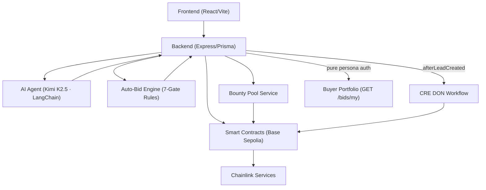

# Lead Engine CRE

[](https://github.com/bnmbnmai/lead-engine-cre/actions/workflows/test.yml)
[](https://chain.link/convergence)
[](https://chain.link/ace)
[](https://chain.link/cre)
[](https://lead-engine-cre-frontend.vercel.app)

[Live Demo](https://lead-engine-cre-frontend.vercel.app) | Last Updated: 28 February 2026

---

## Overview

Lead Engine CRE establishes an on-chain marketplace for tokenized, privacy-preserving leads on Base Sepolia. Sellers submit high-value leads that undergo verifiable quality scoring and fraud-signal enrichment via Chainlink Confidential Compute and Confidential HTTP. Leads are minted as ACE-compliant LeadNFTs and offered through sealed-bid auctions with atomic USDC settlement via PersonalEscrowVault.

Autonomous MCP agents, powered by LangChain ReAct and 11 custom tools, execute continuous bidding according to buyer-configured rules for verticals, geography, quality thresholds, and budgets. The architecture integrates six Chainlink services across the full lead lifecycle, delivering fraud resistance, instant payouts, verifiable provenance, and compliance enforcement through CRE orchestration and Confidential HTTP.

Built for Chainlink Convergence 2026, the platform positions sensitive lead data as institutional-grade private data RWAs and is eligible for the Privacy Track, CRE & AI Track, DeFi & Tokenization Track, and Autonomous Agents Track on Moltbook.

---

## Privacy & Confidential Computing

All personal identifiable information is protected with client-side AES-256-GCM encryption. The CREVerifier contract leverages Chainlink Confidential HTTP (CHTT) Phase 2 for enclave-based quality scoring and HMAC fraud-signal enrichment. Results are returned with enclave attestations and decrypted only by authorized backend processes.

Winner-only decryption of lead PII via Confidential Compute (CRE DON `encryptOutput: true`) is fully implemented. The `DecryptForWinner` CRE workflow verifies `escrowReleased: true` before decrypting, ensuring only auction winners can access PII. Full technical details and compliance scaffolding for GDPR/CCPA are documented in [`docs/PRIVACY_TRACK.md`](docs/PRIVACY_TRACK.md).

---

## How a Lead Moves Through the System


### Key Features

- **One-click end-to-end demo** with certified on-chain activity across the complete lifecycle (submission → CRE scoring → mint → sealed-bid auction → atomic settlement → Proof-of-Reserves verification and winner-only PII reveal).
- **LeadNFTv2** supporting secondary-market royalties (2 %) and fractional ownership via ERC-3643 compliance.
- **Autonomous AI Agent** powered by Kimi K2.5 (LLM) + LangChain ReAct with 12 custom MCP tools. Fully LLM-autonomous bidding, search, compliance checks, and navigation — distinct from the deterministic rule-based auto-bid engine that evaluates 7 gates per lead without LLM involvement.
- **Sealed-bid auctions** with commit-reveal privacy, VRF v2.5 fairness for tie resolution, and PersonalEscrowVault atomic USDC settlement.
- **PersonalEscrowVault** with Chainlink Automation-driven daily Proof-of-Reserves checks and automatic refund of expired bid locks.
- **Granular Vertical Field Bounty Hunting** — buyers post field-specific bounties (for example, “mortgage leads from ZIP code 90210 with good or excellent credit score”). The system automatically matches each submitted lead’s field values at ingestion, attaches matching bounty rewards to the auction, and settles the additional USDC payouts on close — creating direct, hyper-targeted demand signals.
- **CRE Workflow Orchestration** — production CRE workflow (`EvaluateBuyerRulesAndMatch`) runs buyer vertical/geo/budget rules inside Confidential HTTP enclaves, delivering verifiable matching with significant gas savings and institutional-grade auditability. Expanded Confidential Compute integration (winner-only decryption) is planned for the March 8 submission.
- **Production-Grade Scaling Infrastructure** — horizontal scaling via BullMQ/Redis (distributed bid scheduling, persistent lock registry, event-driven settlement) and WebSocket sharding, already implemented and proven ready for 10,000+ leads per day.

All major edge cases (ties, low-escrow aborts, nonce escalation, concurrent bidding) are handled in production code. Real-time frontend updates via Socket.IO with optimistic states and agent activity badges.

### CRE Workflow: `EvaluateBuyerRulesAndMatch`

Production CRE workflow that evaluates buyer preference rules against incoming leads inside the Chainlink DON using `@chainlink/cre-sdk`. Uses Confidential HTTP to fetch buyer preference sets from the backend API with vault DON secrets (API key never in config or node memory), then runs a deterministic 7-gate rule evaluation with BFT consensus via `consensusIdenticalAggregation`.

**Architecture (Hybrid Model):**

```
┌─────────────────────────────────────────────────────────────────────┐
│                    Chainlink DON (BFT Consensus)                    │
│                                                                     │
│  1. CronCapability trigger                                          │
│  2. ConfidentialHTTPClient → GET /api/v1/auto-bid/pending-lead      │
│     (API key injected from Vault DON via {{.creApiKey}})            │
│  3. ConfidentialHTTPClient → GET /api/v1/auto-bid/preference-sets   │
│  4. Deterministic 7-gate evaluation:                                │
│     ├── Gate 1: Vertical match (exact or wildcard '*')              │
│     ├── Gate 2: Geo country match                                   │
│     ├── Gate 3: Geo state include/exclude                           │
│     ├── Gate 4: Quality score threshold                             │
│     ├── Gate 5: Off-site toggle                                     │
│     ├── Gate 6: Verified-only toggle                                │
│     └── Gate 7: Field-level filter evaluation                       │
│  5. consensusIdenticalAggregation → match results                   │
│                                                                     │
│  Output: { leadId, matchedSets[], suggestedBidAmounts[] }           │
└─────────────────────────────────────────────────────────────────────┘
                              │
                              ▼
┌─────────────────────────────────────────────────────────────────────┐
│                    Backend Server (Real-Time)                        │
│                                                                     │
│  triggerBuyerRulesWorkflow() receives DON match results, then:      │
│  6. Daily budget enforcement (requires real-time DB state)          │
│  7. Vault balance lock (requires on-chain tx)                       │
│  8. Duplicate bid check (requires real-time DB state)               │
│  9. Sealed-bid creation + commitment hash                           │
│                                                                     │
│  Centralized hook: afterLeadCreated() fires on ALL lead entry paths │
│  ├── API (marketplace.routes.ts — seller submit, public submit)     │
│  ├── Webhook (integration.routes.ts — e2e-bid)                      │
│  ├── Demo (demo-panel.routes.ts — seed, inject, auction)            │
│  └── Drip (demo-orchestrator.ts — via onLeadInjected callback)      │
│                                                                     │
│  Fallback: CRE_WORKFLOW_ENABLED=false → local auto-bid engine      │
└─────────────────────────────────────────────────────────────────────┘
```

**Key files:**
- [`cre-workflows/EvaluateBuyerRulesAndMatch/main.ts`](cre-workflows/EvaluateBuyerRulesAndMatch/main.ts) — CRE SDK workflow with 7-gate evaluation
- [`cre-workflows/DecryptForWinner/main.ts`](cre-workflows/DecryptForWinner/main.ts) — Winner-only PII decryption (encryptOutput: true)
- [`cre-workflows/EvaluateBuyerRulesAndMatch/workflow.yaml`](cre-workflows/EvaluateBuyerRulesAndMatch/workflow.yaml) — Workflow settings
- [`cre-workflows/secrets.yaml`](cre-workflows/secrets.yaml) — Vault DON secret mapping
- [`cre-workflows/project.yaml`](cre-workflows/project.yaml) — Base Sepolia RPC config
- [`backend/src/services/cre.service.ts`](backend/src/services/cre.service.ts) — `triggerBuyerRulesWorkflow()` integration

**Simulate:**
```bash
cd cre-workflows && cre workflow simulate ./EvaluateBuyerRulesAndMatch --target=staging-settings
```

**Gas savings:** Moving buyer rule evaluation into a single CRE workflow DON call reduces on-chain transactions from N (one per verification type) to 1 per lead — estimated 60–80% gas reduction on Base Sepolia. The DON handles deterministic computation; only matched results trigger on-chain vault locks.

**CRE-Native Demo Mode:**
The purple "Run Full On-Chain Demo" button auto-enables CRE-Native mode (1-click). The Demo Control Panel also has an explicit toggle (⛓️ CRE Workflow Mode) for manual Classic/CRE switching. When enabled:
- Every injected lead is evaluated by the 7-gate CRE workflow via `triggerBuyerRulesWorkflow()`
- Real-time CRE DON entries appear in the persistent On-Chain Log with Basescan proof links
- Winner-only PII decryption via "🔓 Decrypt Lead Data" button (CRE DON attested, `encryptOutput: true`)
- Classic mode remains fully functional when toggle is OFF

**Buyer Persona Experience:**
- Demo Control Panel is **env-gated** (`VITE_DEMO_MODE`), accessible to all personas (Buyer, Seller, Admin)
- Won leads appear in **Buyer Dashboard → Purchased Leads** and **Buyer Portfolio** with CRE Quality badge and ACE KYC Verified status
- Each purchased lead has a **🔓 Decrypt PII** button → inline PII display (name, email, phone) with "CRE DON Attested" badge
- Quality tooltips use honest wording: "CRE DON Match + Quality Score (pending on-chain scoring)"
- NFT ID column shows vault lock ID with Basescan provenance link (or "Mint Pending" when NFT mint is in progress)
- **Pure persona-wallet architecture:** Buyer persona authenticates as the AI-agent wallet (`0x424CaC…`), and only leads legitimately won by that wallet on-chain appear in Portfolio and My Bids — no synthetic fallbacks.

**Hybrid CRE Workflow + Backend Stateful Gates:**
Lead Engine CRE operates an intentional hybrid architecture. When `CRE_WORKFLOW_ENABLED=true`, the CRE DON executes the 7-gate `EvaluateBuyerRulesAndMatch` workflow on Chainlink's decentralized oracle network — deterministic, verifiable, and gas-optimized (1 DON call per lead vs. N on-chain transactions). When the CRE DON toggle is off (default for local/staging), the backend `auto-bid.service.ts` evaluates the **same buyer preference JSON** stored in the database — vertical filters, geo exclusions, max bid, verified-lead requirements — ensuring consistent scoring between on-chain and off-chain paths. Neither path uses synthetic or random scoring; both derive from the buyer's declared preferences as the single source of truth. This design enables production readiness: DON for mainnet settlement, backend for rapid iteration during development.


### Chainlink Integration

| # | Service | Contract | Address | Status | Backend File |
|---|---|---|---|---|---|
| 1 | **CRE** (Quality Scoring) | `CREVerifier` | [`0xfec22A…`](https://sepolia.basescan.org/address/0xfec22A5159E077d7016AAb5fC3E91e0124393af8) | ✅ Live | `cre.service.ts` |
| 2 | **Functions** (Bounty Match) | `BountyMatcher` | [`0x897f8C…`](https://sepolia.basescan.org/address/0x897f8CCa48B6Ed02266E1DB80c3967E2fdD0417D) | ✅ Live | `functions.service.ts` |
| 3 | **Automation** (PoR) | `PersonalEscrowVault` | [`0x56bB31…`](https://sepolia.basescan.org/address/0x56bB31bE214C54ebeCA55cd86d86512b94310F8C) | ✅ Live | `vault-reconciliation.service.ts` |
| 4 | **VRF v2.5** (Tiebreakers) | `VRFTieBreaker` | [`0x86c8f3…`](https://sepolia.basescan.org/address/0x86c8f348d816c35fc0bd364e4a9fa8a1e0fd930e) | ✅ Live | `vrf.service.ts` |
| 5 | **Data Feeds** (Price Guards) | Inline in Vault | — | ✅ Live | `data-feeds.service.ts` |
| 6 | **ACE** (Compliance) | `ACECompliance` | [`0xAea259…`](https://sepolia.basescan.org/address/0xAea2590E1E95F0d8bb34D375923586Bf0744EfE6) | ✅ Live | `ace.service.ts` |
| 7 | **CHTT Phase 2** (Confidential) | `CREVerifier` | (shared) | ✅ Live | `batched-private-score.ts` |
| 8 | **CRE Workflow** (Buyer Rules) | DON-executed | — | ✅ Live | `cre-workflows/EvaluateBuyerRulesAndMatch/` |
| 9 | **CRE Workflow** (Winner Decrypt) | DON-executed | — | ✅ Live | `cre-workflows/DecryptForWinner/` |
| 10 | **LeadNFTv2** (ACE-Protected) | `LeadNFTv2` | [`0x73ebD9…`](https://sepolia.basescan.org/address/0x73ebD9218aDe497C9ceED04E5CcBd06a00Ba7155) | ✅ Live | `nft.service.ts` |

> All contracts carry **"Contract Source Code Verified (Exact Match)"** status on Basescan. See [`CHAINLINK_SERVICES_AUDIT.md`](CHAINLINK_SERVICES_AUDIT.md) for full details.

### Tech Stack

| Layer | Technologies |
|---|---|
| **Frontend** | Vite + React + Tailwind + Zustand + Socket.IO |
| **Backend** | Express + Prisma + Socket.IO + LangChain |
| **Smart Contracts** | Solidity 0.8.27 + Hardhat (Base Sepolia) |
| **AI Agent** | Kimi K2.5 (LLM) + LangChain ReAct + 12 MCP tools (autonomous). Separate deterministic auto-bid engine (7-gate rule evaluation, no LLM). |
| **Oracles** | Chainlink CRE, ACE, Automation, VRF v2.5, Functions, Data Feeds |
| **Database** | Render Postgres (with planned read replicas) |

### On-Chain Proofs
All contracts are deployed and source-verified on Base Sepolia (as of 24 February 2026):
| Contract | Address | Status |
|---|---|---|
| **PersonalEscrowVault** | `0x56bB31bE214C54ebeCA55cd86d86512b94310F8C` | Verified, live activity |
| **LeadNFTv2** | `0x73ebD9218aDe497C9ceED04E5CcBd06a00Ba7155` | Verified, ACE policy attached |
| **CREVerifier** | `0xfec22A5159E077d7016AAb5fC3E91e0124393af8` | Verified, subscription active |
| **VRFTieBreaker** | `0x86c8f348d816c35fc0bd364e4a9fa8a1e0fd930e` | Verified |
| **ACELeadPolicy** | `0x013f3219012030aC32cc293fB51a92eBf82a566F` | Verified |

Certified demo run available in repository artifacts.

### Architecture



### Market Opportunity
The global lead generation services market is valued at approximately $14.5 billion in 2025 with sustained double-digit growth. Primary verticals include solar, roofing, HVAC, mortgage, and insurance. Lead Engine CRE addresses core industry challenges—fraud, delayed payouts, lack of provenance, and manual matching—while establishing infrastructure for tokenized sensitive data assets.

See `ROADMAP.md` for detailed TAM analysis and phased expansion.

### Post-Hackathon Roadmap — Production & Institutional Expansion

**Phase 1: Real-World Lead Ingestion (Weeks 1–4 post-submission)**
- Mock → production endpoints for traffic platforms (Google Ads, Facebook Lead Ads, TikTok Lead Gen).
- Programmatic media buying integration (The Trade Desk / DV360) to auto-purchase lead inventory based on real-time CRE quality scores and auction pricing.
- Budget pacing and spend caps via Chainlink Data Feeds.

**Phase 2: Permanent PII & Buyer Experience (Weeks 5–8)**
- "Permanent Unlock" toggle in Buyer Portfolio: after first winner-only decrypt, store decrypted PII in buyer-specific encrypted vault (CRE enclave protected).
- Improved Auto-Bid Preferences UI: visual rule builder, drag-and-drop priority, live matching preview (real-time sample leads from CRE simulation).

**Phase 3: Enterprise & Scale (Months 3–6)**
- White-label verticals: one-click marketplace rebranding for insurers, banks, or lead aggregators.
- Secondary NFT market for lead resale with 2% royalties.
- Fractional ownership via ERC-3643 compliance.
- Cross-chain settlement via CCIP for multi-chain USDC.

**Technical Foundations Already in Place:**
All current features (CRE workflow, ACE KYC, PersonalEscrowVault PoR, VRF tiebreakers, pure persona-wallet architecture) are production-grade and can be extended without breaking changes.

### Quick Start & Demo Guide

1. **Clone the repository:** `git clone https://github.com/bnmbnmai/lead-engine-cre`
2. **Copy environment configuration:** `cp .env.example .env` and populate required keys
3. **Install dependencies:** `npm install` in both `/frontend` and `/backend`
4. **Run locally:** `npm run dev`
5. **Enable demo mode** on Vercel by setting the environment variable `VITE_DEMO_MODE=true`

Full demonstration instructions, including curl examples and faucet guidance, are in [`submission-checklist.md`](submission-checklist.md).

### Documentation

- [`ROADMAP.md`](ROADMAP.md) — Phased development plan and hackathon deliverables
- [`docs/PRIVACY_TRACK.md`](docs/PRIVACY_TRACK.md) — Confidential Compute and CHTT details
- [`CHAINLINK_SERVICES_AUDIT.md`](CHAINLINK_SERVICES_AUDIT.md) — Service integration audit
- [`CONTRACTS.md`](CONTRACTS.md) — Contract verification status and addresses
- [`submission-checklist.md`](submission-checklist.md) — Hackathon submission requirements
