# Lead Engine CRE: Decentralized Real-Time Lead Marketplace with Chainlink Integration

> **Chainlink Convergence 2026 Submission — Mandatory CRE + ACE Track.** Tokenizing the $200B+ lead industry with verifiable quality, on-chain compliance, and automated settlements—powered by 8+ Chainlink services for fraud-proof, efficient RTB.

---

## Overview

Lead Engine CRE revolutionizes lead generation: Sellers submit via AI-optimized CRO landers; Chainlink CRE zk-scores quality (0–10k); ACE auto-KYC gates access; buyers pre-fund on-chain vaults, bid sealed with MCP agents; 60s auctions settle in USDC with VRF ties and auto-refunds. Undercuts legacy platforms (5–7% fees vs 10–30%) with instant, verifiable payouts—driving explosive network effects. **Backend sponsors gas** for all vault operations so buyers never need ETH.

> **Judges:** Dive into our [live demo](https://lead-engine-cre-frontend.vercel.app) for seeded leads, vault funding, autobids, and PoR checks. See how we flip industry pain with Chainlink depth.

### Recent Updates

- **Feb 18, 2026:** On-chain `PersonalEscrowVault.sol` with Chainlink PoR for verifiable reserves and Automation for auto-refunds/expirations. Pricing refined to 5% settlement cut + $1/action.

---

## Features

- **On-Chain Personal Escrow Vaults** — Frictionless USDC pools for bids/bounties/autobids. **Gas sponsored**, $1/action fee, 5% settlement cut—auto-deduct/refund via Automation.
- **Verifiable Reserves (PoR)** — Chainlink Proof of Reserves attests solvency, with 24h automated verifications for unbreakable trust.
- **Sealed RTB Auctions** — 60s timed, VRF fair ties, Data Feeds dynamic floors. Handles dotted sub-verticals (e.g., `home_services.plumbing`) with lazy ACE policies.
- **AI-Powered Autobidding** — LangChain MCP agents (12 tools) execute field-level strategies from vaults.
- **Targeted Bounties** — Fund vertical pools (e.g., $75 for solar in CA, credit>720)—Functions match, Automation expires unclaimed.
- **LeadNFT Assets** — ERC-721 with 2% royalties, PII decryption only for winners.
- **Fraud Defenses** — CRE zkProofs, DECO/Confidential HTTP stubs for advanced signals.
- **Demo Tools** — Persona switches, data seeding, Chainlink Services Dev Log for real-time insights.

> Explore `docs/FEATURES.md` for specs.

---

## Architecture

Seller submits → CRE/ACE verify → Vault lock → Sealed bid/settle → Release/refund. Backend sponsors gas; on-chain core ensures trust.

### Chainlink Spotlight

8 services orchestrate decentralization:

| Service | Role |
|---|---|
| **CRE** | zkProof quality scoring |
| **ACE** | Auto-KYC/policies |
| **Data Feeds** | Floor pricing |
| **VRF v2.5** | Tie resolution |
| **Functions** | Bounty matching |
| **Automation** | PoR checks, refund expirations |
| **PoR** | Reserve proofs |
| **DECO/Confidential HTTP** | Fraud stubs |

### How a Lead Moves Through the System

```mermaid
sequenceDiagram
    participant S as Seller
    participant API as Lead Engine API
    participant CRE as Chainlink CRE
    participant ACE as Chainlink ACE
    participant B as Buyer
    participant V as PersonalEscrowVault
    participant RTB as RTB Engine
    participant FN as Chainlink Functions
    participant BP as Bounty Pool
    participant AUTO as Chainlink Automation

    Note over B,V: Pre-fund: Buyer deposits USDC into vault
    Note over BP: Buyer funds bounty pool

    S->>API: Submit lead (non-PII preview)
    API->>CRE: Quality score + ZK fraud check
    CRE-->>API: Score (0-10,000) + proof
    API->>ACE: KYC + jurisdiction check
    ACE-->>API: Cleared

    Note over RTB: 60s sealed-bid auction opens

    RTB->>B: Non-PII preview (WebSocket)
    B->>RTB: Sealed bid (keccak256 commitment)
    RTB->>V: lockForBid (bid + $1 fee)
    V-->>RTB: lockId

    Note over RTB: Auction closes — reveal phase

    B->>RTB: Reveal (amount + salt)
    RTB->>RTB: Verify commitments, pick winner

    RTB->>V: settleBid (lockId, seller)
    V->>S: 95% of bid (seller receives)
    V->>API: 5% platform cut + $1 fee
    RTB->>B: Decrypted PII + mint LeadNFT
    RTB->>V: refundBid (loser lockIds — full refund)

    API->>FN: matchBounties(lead, criteria)
    FN-->>API: Matching pools found
    BP->>S: Bounty bonus auto-released (95% to seller)

    Note over AUTO: Every 24h: verifyReserves()
    Note over AUTO: Every check: refund expired locks (7d, max 50)
```

### Service Integration Points

---

## Why We Win: Differentiators

| Legacy Pain | CRE Solution |
|---|---|
| High fees/chargebacks | 5–7% effective with auto-refunds |
| Fraud/opacity | CRE zk-scores + PoR reserves |
| Slow payouts | Instant USDC via vaults |
| Manual checks | ACE auto-compliance |
| No automation | Automation for PoR/expirations |
| Centralized holds | On-chain vaults, sponsored gas |
| Trust-based audits | On-chain verifiable reserves (PoR) checked every 24h |
| Manual chargebacks | Automated on-chain refunds via Chainlink Automation |

---

## Fraud Mitigation

| Type | Defense | Impact |
|---|---|---|
| Stuffing | CRE zkProofs + limits | Blocks invalid leads |
| Recycling | LeadNFT timestamps | Ensures uniqueness |
| Disputes | On-chain settlements | No chargebacks |
| Mismanagement | PoR verifications | Proves reserves |
| Expirations | Automation refunds (7d) | Clears stuck funds |
| Bounty Gaming | CRE score + criteria match + 2x cap | Prevents drain attacks |

> Full matrix in `docs/FRAUD.md` (12+ types).

---

## Smart Contracts (11 on Base Sepolia)

| Contract | Description | Chainlink Dep. | Status |
|---|---|---|---|
| `PersonalEscrowVault.sol` | Per-user USDC vault with pre-bid locking, PoR + auto-refunds | Automation, PoR | ✅ Deployed |
| `CREVerifier.sol` | Quality scoring + ZK fraud proofs | CRE | ✅ Deployed |
| `ACECompliance.sol` | KYC, jurisdiction, reputation | ACE | ✅ Deployed |
| `RTBEscrow.sol` | Atomic USDC escrow settlement (legacy) | — | ✅ Deployed |
| `LeadNFTv2.sol` | ERC-721 tokenized leads | — | ✅ Deployed |
| `BountyMatcher.sol` | Chainlink Functions bounty criteria matching | Functions | ✅ Compiled |
| `VerticalBountyPool.sol` | Buyer-funded bounty pools | Functions | ✅ Compiled |
| `CustomLeadFeed.sol` | Public market metrics feed | — | ✅ Deployed |
| `VerticalNFT.sol` | Community vertical ownership | — | ✅ Deployed |
| `VerticalAuction.sol` | Ascending auctions for verticals | — | ✅ Deployed |
| `VRFTieBreaker.sol` | Chainlink VRF v2.5 provably fair tie-breaking | VRF v2.5 | ✅ Compiled |

---

## Pricing: Simple & Competitive

$1/action convenience fee (bids/bounties/autobids) + 5% settlement cut (wins/matches). Vault-automated for zero friction.

| Channel | Convenience Fee | Platform Cut | Effective |
|---|---|---|---|
| Manual bid | $1/bid | 5% on win | 5–6% |
| Auto-bid | $1/execution | 5% on win | 5–6% |
| API/MCP | $1/bid | 5% on win | 5–6% |
| Buy It Now | $1 | 5% | 6% |
| Bounty Release | $1/post | 5% on match | 5–6% |

> Fees cover sponsorship/ops, deducted from vault. Refunds fee-free.

---

## Quick Start & Demo

1. **Clone:** `git clone https://github.com/bnmbnmai/lead-engine-cre`
2. **Install:** `yarn`
3. **Env:** Copy `.env.example` → `.env`, set keys (e.g., `VAULT_ADDRESS_BASE_SEPOLIA`, `AUTOMATION_REGISTRY`, `POR_FEED_ADDRESS`)
4. **Backend:** `cd backend && prisma db push && yarn dev`
5. **Frontend:** `cd frontend && yarn dev`
6. **Agents:** `cd mcp-server && yarn dev` (LLM key required)
7. **Contracts:** `cd contracts && yarn deploy:base-sepolia`

### Demo Flow (Buyer Persona)

1. Fund vault ($100+ USDC)
2. Post bounty → Set autobid rules
3. Place sealed bid on lead
4. Win: Auto-settle (5% cut)
5. Check PoR status → Withdraw balance

**Live:** https://lead-engine-cre-frontend.vercel.app

---

## Deployment

Vercel (frontend) + Render (backend). Contracts on Base Sepolia.

**Key env:**

| Variable | Purpose |
|---|---|
| `VAULT_ADDRESS_BASE_SEPOLIA` | PersonalEscrowVault contract |
| `AUTOMATION_REGISTRY` | Chainlink Automation registry |
| `POR_FEED_ADDRESS` | Proof-of-Reserves feed |
| `USDC_CONTRACT_ADDRESS` | ERC-20 payment token |
| `PLATFORM_WALLET_ADDRESS` | Fee recipient |

> See `.env.example`. Run `prisma db push` post-schema changes.

---

## Stubs Migration Status

| Stub | Previous State | Current State |
|---|---|---|
| Off-chain vault / escrow fallback | DB-only balance tracking | ✅ **Migrated** — on-chain `PersonalEscrowVault.sol` with PoR + Automation |
| Chainlink Keepers (quarterly reset) | Simulated cron-based upkeep | ✅ **Migrated** — Chainlink Automation handles PoR (24h) + expired lock refunds (7d) |
| Expired Bids/Bounties Automation | Not implemented | ✅ **Ready** — Chainlink Automation upkeep registered; `_refundExpiredLocks()` gas-capped at 50 |
| DECO zkTLS attestation | Stub | 🔶 Stubbed (awaiting mainnet) |
| Confidential HTTP (TEE) | Stub | 🔶 Stubbed (post-hackathon) |

---

## Roadmap

| Priority | Items | State |
|---|---|---|
| ✅ Done | On-chain PersonalEscrowVault with pre-bid locking | Deployed + audited |
| ✅ Done | Chainlink Automation — PoR (24h) + expired lock refunds (7d) | Implemented |
| 🔄 In Progress | Advanced PoR — Chainlink PoR Feed integration for external auditability | Architecture designed, env var wired |
| **High** | DECO/Confidential HTTP fraud signals · Cross-chain support | Stubbed |
| **Medium** | Secondary NFT markets · Advanced PoR Feed audits | Contracts ready |
| **Ready** | Multi-language landers · NFT royalties (2%) | Frontend ready |

> Details in `ROADMAP.md`