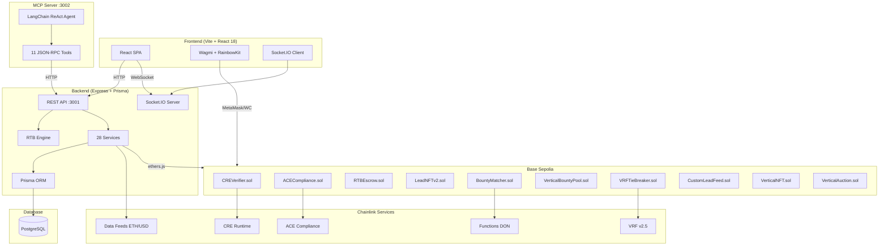

# Lead Engine CRE — Project Context (Single Source of Truth)

> **Last updated:** 2026-02-18  
> **Repo:** https://github.com/bnmbnmai/lead-engine-cre  
> **Hackathon:** Chainlink Convergence 2026 — Mandatory CRE + ACE Track  
> **Live demo:** https://lead-engine-cre-frontend.vercel.app

---

## 1. High-Level Architecture

Lead Engine CRE is a **decentralized, real-time bidding marketplace for verified leads**. Sellers submit leads, Chainlink CRE scores them, ACE clears compliance, and buyers compete in 60-second sealed-bid auctions settled in USDC.



### Data Flow Summary

1. **Seller submits lead** → Backend stores in PostgreSQL, calls CRE for quality scoring (0–10,000), ACE for KYC/jurisdiction check.
2. **Auction opens** → 60-second sealed-bid auction via WebSocket. Buyers receive non-PII preview. Bids are keccak256 commitments.
3. **Auction closes** → `auction-closure.service.ts` resolves winner, VRF breaks ties.
4. **Winner pays** → Client-side RTBEscrow USDC signing via MetaMask. Escrow funds, then releases PII + mints LeadNFT.
5. **Bounty matching** → Chainlink Functions checks if lead matches any buyer bounty pools; auto-releases bonus to seller.

---

## 2. Full Tech Stack

### Monorepo (npm workspaces)

| Layer | Technology | Version |
|-------|-----------|---------|
| **Runtime** | Node.js | ≥18 (CI uses 22) |
| **Package Manager** | npm | workspaces |
| **Monorepo Tool** | concurrently | ^8.2.2 |

### Backend (`/backend`)

| Technology | Version | Purpose |
|-----------|---------|---------|
| Express | ^4.18.3 | REST API server |
| Prisma | ^5.10.2 | ORM + PostgreSQL |
| Socket.IO | ^4.7.4 | Real-time WebSocket |
| ethers.js | ^6.11.1 | Blockchain interaction |
| LangChain | ^1.2.24 | AI agent framework |
| @langchain/openai | ^1.2.7 | LLM provider |
| jsonwebtoken | ^9.0.2 | JWT auth |
| zod | ^3.25.76 | Schema validation |
| helmet | ^7.1.0 | Security headers |
| node-cron | ^4.2.1 | Scheduled tasks |
| Jest | ^29.7.0 | Testing |
| Artillery | ^2.0.5 | Load testing |
| TypeScript | ^5.4.2 | Language |

### Frontend (`/frontend`)

| Technology | Version | Purpose |
|-----------|---------|---------|
| Vite | ^5.1.4 | Build tool |
| React | ^18.2.0 | UI framework |
| TailwindCSS | ^3.4.1 | Styling |
| Wagmi | ^2.5.7 | Wallet connection |
| RainbowKit | ^2.2.10 | Wallet modal UI |
| viem | ^2.8.4 | Ethereum utils |
| React Router | ^6.22.3 | Client routing |
| React Query | ^5.25.0 | Server state |
| Recharts | ^3.7.0 | Charts/analytics |
| Radix UI | various | Headless components |
| react-hook-form | ^7.51.0 | Form handling |
| i18next | ^23.10.1 | Internationalization |
| Cypress | ^15.10.0 | E2E testing |
| TypeScript | ^5.4.2 | Language |

### Smart Contracts (`/contracts`)

| Technology | Version | Purpose |
|-----------|---------|---------|
| Solidity | 0.8.24 | Contract language |
| Hardhat | ^2.20.1 | Dev framework |
| OpenZeppelin | ^5.0.1 | ERC-721, access control |
| @chainlink/contracts | ^1.5.0 | Chainlink interfaces |
| @chainlink/functions-toolkit | ^0.3.2 | Functions DON interaction |
| Optimizer | runs=200, viaIR | Gas optimization |

### MCP Server (`/mcp-server`)

| Technology | Purpose |
|-----------|---------|
| LangChain + OpenAI | ReAct agent |
| JSON-RPC | Tool exposure to AI agents |
| Port 3002 | Standalone server |

### Infrastructure & Deployment

| Service | Platform | Purpose |
|---------|----------|---------|
| Backend API | Render (free tier) | Production API |
| Frontend | Vercel | SPA hosting |
| Database | Render PostgreSQL (free tier) | Production DB |
| Blockchain | Base Sepolia | Primary testnet |
| Blockchain (fallback) | Ethereum Sepolia | Fallback testnet |
| CI/CD | GitHub Actions | 4-job pipeline |

---

## 3. Smart Contracts — Status & Deployment

All 12 contracts target **Solidity 0.8.24** with optimizer (200 runs, viaIR). Primary deployment is **Base Sepolia (chain 84532)**, with fallback on **Ethereum Sepolia (chain 11155111)**.

### Deployed Contracts (Base Sepolia)

| # | Contract | Base Sepolia Address | Purpose | Status |
|---|----------|---------------------|---------|--------|
| 1 | `CREVerifier.sol` | `0xe21F29e36c1884D5AbAa259E69c047332EeB4d67` | Quality scoring (0–10,000) + ZK fraud proofs | ✅ Deployed, Implemented |
| 2 | `ACECompliance.sol` | `0xAea2590E1E95F0d8bb34D375923586Bf0744EfE6` | Auto-KYC, jurisdiction policies, reputation (0–10,000) | ✅ Deployed, Implemented |
| 3 | `RTBEscrow.sol` | `0xff5d18a9fff7682a5285ccdafd0253e34761DbDB` | Atomic USDC escrow settlement | ✅ Deployed, Implemented |
| 4 | `LeadNFTv2.sol` | `0x37414bc0341e0AAb94e51E89047eD73C7086E303` | ERC-721 tokenized leads with royalties | ✅ Deployed, Implemented |
| 5 | `Marketplace.sol` | `0xfDf961C1E6687593E3aad9C6f585be0e44f96905` | On-chain marketplace logic | ✅ Deployed |
| 6 | `VerticalNFT.sol` | `0x60c248c24cC5ba0848b8306424eBaFE1fD07EC5b` | Community vertical ownership NFTs | ✅ Deployed |
| 7 | `VerticalAuction.sol` | `0x40504235526e3Bf07684b06Cfc7bafbCfef71003` | Ascending auctions for vertical NFTs | ✅ Deployed |
| 8 | `CustomLeadFeed.sol` | `0x195346968854049db1dee868C7b914D4Bb3C6d61` | Public market metrics data feed | ✅ Deployed |
| 9 | `BountyMatcher.sol` | — | Chainlink Functions bounty matching | ✅ Compiled, deployment pending |
| 10 | `VerticalBountyPool.sol` | — | Buyer-funded bounty pools | ✅ Compiled, deployment pending |
| 11 | `VRFTieBreaker.sol` | — | VRF v2.5 tie-breaking | ✅ Compiled, deployment pending |
| 12 | `LeadNFT.sol` | — | Legacy v1 NFT (superseded by v2) | Deprecated |

Also present: `contracts/interfaces/` (6 interface files) and `contracts/mocks/` (4 mock contracts for testing).

### Key Contract Functions

**CREVerifier.sol** — Quality scoring backbone:
- `scoreLead(bytes32 leadHash, uint256[] proof)` → returns score 0–10,000
- `verifyProof(bytes32 commitment, uint256[] proof)` → bool
- Scoring dimensions: TCPA consent, geo verification, parameter completeness, encryption validity, source trust

**ACECompliance.sol** — Identity & compliance:
- `verifyKYC(address wallet, bytes32 jurisdictionHash)` → bool + 1-year expiry
- `canTransact(address wallet, string vertical)` → bool (jurisdiction + KYC combined)
- `getReputationScore(address wallet)` → uint256 (0–10,000)
- `updateReputationScore(address wallet, uint256 newScore)`
- `isJurisdictionAllowed(address wallet, string vertical, string geo)` → bool

**RTBEscrow.sol** — Settlement:
- `fundEscrow(uint256 escrowId, uint256 amount)` — buyer deposits USDC
- `releaseEscrow(uint256 escrowId)` — releases to seller (minus 2.5% fee)
- `refundEscrow(uint256 escrowId)` — refund on dispute

**LeadNFTv2.sol** — ERC-721:
- `mintLeadNFT(address to, uint256 tokenId, string uri, uint256 qualityScore)` — mints with quality proof
- Royalties on resale (standard ERC-2981)

### Chainlink Service Integration

| Service | Contract / Backend | Integration Level |
|---------|-------------------|-------------------|
| **CRE** | `CREVerifier.sol` + `cre.service.ts` | ✅ Fully implemented, on-chain scoring |
| **ACE** | `ACECompliance.sol` + `ace.service.ts` | ✅ Implemented with DB fallback |
| **Functions** | `BountyMatcher.sol` + `functions.service.ts` | ✅ Implemented, DON secrets every 48h |
| **VRF v2.5** | `VRFTieBreaker.sol` + `vrf.service.ts` | ✅ Implemented with deterministic fallback |
| **Data Feeds** | `AggregatorV3Interface` + `datastreams.service.ts` | ✅ Implemented (ETH/USD on Base Sepolia: `0x4aDC67696bA383F43DD60A9e78F2C97Fbbfc7cb1`) |
| **DECO** | `deco.stub.ts` + `deco.service.ts` | 🔶 Stubbed (zkTLS awaiting mainnet) |
| **Confidential HTTP** | `confidential.stub.ts` + `confidential.service.ts` | 🔶 Stubbed (TEE integration post-hackathon) |

---

## 4. Database (PostgreSQL + Prisma)

**Schema:** `backend/prisma/schema.prisma` — 751 lines, 17 models.

| Model | Purpose | Key Fields |
|-------|---------|------------|
| `User` | Auth (SIWE) | walletAddress, role (BUYER/SELLER/ADMIN), nonce |
| `Session` | JWT sessions | token, expiresAt |
| `ApiKey` | API key auth | keyHash, permissions, prefix |
| `BuyerProfile` | Buyer settings | verticals, geoFilters, budgets, kycStatus |
| `BuyerPreferenceSet` | Auto-bid config | vertical, autoBidAmount, minQualityScore, geo |
| `BuyerFieldFilter` | Granular field rules | operator (EQUALS/IN/GT/LTE/BETWEEN/etc.), value |
| `SellerProfile` | Seller info | companyName, reputationScore, kycStatus |
| `Vertical` | Dynamic verticals | slug, formConfig, status, nftTokenId |
| `VerticalField` | Field definitions | key, fieldType, isFilterable, isBiddable, isPii |
| `VerticalAuction` | Vertical NFT auctions | reservePrice, highBid, leaseStatus |
| `Ask` | Seller asks | vertical, reservePrice, buyNowPrice, auctionDuration |
| `Lead` | Core lead data | vertical, geo, encryptedData, qualityScore, status |
| `AuctionRoom` | Live auction state | phase, bidCount, highestBid, biddingEndsAt |
| `Bid` | Sealed bids | commitment, amount, effectiveBid, status, source |
| `Transaction` | Payment records | txHash, escrowId, escrowReleased |
| `ComplianceCheck` | Audit trail | checkType, status, result |
| `AnalyticsEvent` | Event tracking | eventType, entityType, metadata |
| `VerticalSuggestion` | AI vertical suggestions | suggestedSlug, confidence, source |
| `PlatformConfig` | Key-value config | key, value |

---

## 5. Backend Architecture

### Entry Point

`backend/src/index.ts` — Express server on port 3001 with:
- Helmet security headers
- CORS (configured for `FRONTEND_URL`)
- Socket.IO server (`RTBSocketServer`)
- Health check at `/health` and `/api/health`
- Swagger UI at `/api/docs`
- Graceful shutdown handlers
- Startup auction sweep (resolves expired auctions)

### Route Modules (11)

| Route File | Prefix | Purpose |
|-----------|--------|---------|
| `marketplace.routes.ts` (80KB) | `/api/v1/marketplace` | Lead CRUD, search, auction lifecycle, Buy It Now |
| `demo-panel.routes.ts` (72KB) | `/api/v1/demo-panel` | Demo personas, lead injection, marketplace seeding |
| `vertical.routes.ts` (46KB) | `/api/v1/verticals` | Vertical CRUD, field management, form templates |
| `bidding.routes.ts` (30KB) | `/api/v1/bids` | Bid placement, auto-bid config, preference sets |
| `mcp.routes.ts` (29KB) | `/api/v1/mcp` | Agent chat, LangChain integration |
| `analytics.routes.ts` (24KB) | `/api/v1/analytics` | Buyer/seller/platform stats |
| `crm.routes.ts` (19KB) | `/api/v1/crm` | CRM export, webhooks (HubSpot/Zapier) |
| `lander.routes.ts` (17KB) | `/api/v1/lander` | Hosted form config, submissions, CRO |
| `integration.routes.ts` (17KB) | `/api/v1/integrations` | External API integrations |
| `auth.routes.ts` (13KB) | `/api/v1/auth` | SIWE, JWT, nonce, session management |
| `buyer.routes.ts` (1KB) | `/api/v1/buyer` | Buyer profile routes |

### Service Layer (28 services)

| Service | Purpose |
|---------|---------|
| `cre.service.ts` (26KB) | CRE quality scoring — on-chain calls to CREVerifier |
| `ace.service.ts` (17KB) | ACE compliance — KYC, jurisdiction, reputation |
| `agent.service.ts` (22KB) | LangChain ReAct agent for autonomous bidding |
| `auction.service.ts` (16KB) | Auction CRUD and state management |
| `auction-closure.service.ts` (21KB) | Auction resolution, winner selection, settlement |
| `auto-bid.service.ts` (15KB) | Auto-bid evaluation with field-level filters |
| `bounty.service.ts` (25KB) | Buyer bounty pools and matching |
| `vertical-optimizer.service.ts` (33KB) | AI vertical optimization and suggestion |
| `x402.service.ts` (29KB) | Escrow preparation + USDC settlement flow |
| `vertical-nft.service.ts` (20KB) | VerticalNFT minting, auction, revenue-share |
| `nft.service.ts` (14KB) | LeadNFT minting and ownership |
| `datastreams.service.ts` (16KB) | Data Feeds integration (ETH/USD floor pricing) |
| `piiProtection.ts` (12KB) | PII detection and field-level redaction |
| `privacy.service.ts` (9KB) | AES-256-GCM encryption/decryption of lead data |
| `vertical.service.ts` (13KB) | Vertical CRUD and hierarchy management |
| `notification.service.ts` (11KB) | Push notifications and alerts |
| `field-filter.service.ts` (6KB) | Field-level filter evaluation for auto-bid |
| `functions.service.ts` (7KB) | Chainlink Functions DON interaction |
| `vrf.service.ts` (6KB) | VRF v2.5 randomness requests |
| `zk.service.ts` (7KB) | ZK proof simulation (keccak256 commitments) |
| `confidential.service.ts` (8KB) | Confidential Compute TEE stub |
| `holder-perks.service.ts` (10KB) | VerticalNFT holder privileges |
| `perks-engine.ts` (6KB) | Perk calculation engine |
| `quarterly-reset.service.ts` (16KB) | Lease lifecycle + Keepers stub |
| `conversion-tracking.service.ts` (3KB) | Pixel/webhook conversion tracking |
| `analytics-mock.ts` (6KB) | Faker-based analytics data (dev only) |
| `vertical-field.service.ts` (5KB) | VerticalField queries and sync |
| `escrow.service.ts` (<1KB) | Thin escrow wrapper |

### RTB Engine (`backend/src/rtb/`)

- `engine.ts` (19KB) — `RTBEngine` class: `processLeadIntake`, `findMatchingAsks`, `notifyMatchingBuyers`, `matchBuyerToLead`, `initiateSettlement` (deprecated → client-side), `releaseEscrow`
- `socket.ts` (17KB) — `RTBSocketServer`: WebSocket events for auctions, bid updates, lead status changes, marketplace refresh

### Lib Layer (`backend/src/lib/`)

| File | Purpose |
|------|---------|
| `prisma.ts` | Prisma client singleton |
| `config.ts` | Environment configuration |
| `cache.ts` (9KB) | In-memory TTL cache |
| `fees.ts` (2KB) | Fee calculation (2.5% platform, $1 convenience) |
| `geo-registry.ts` (19KB) | Country/state/region mapping |
| `jurisdiction-policies.ts` (9KB) | ACE jurisdiction policy definitions |

### Chainlink Integration Layer (`backend/src/lib/chainlink/`)

| File | Purpose | Status |
|------|---------|--------|
| `cre-quality-score.ts` (6KB) | CRE quality scoring workflow | ✅ Implemented |
| `quality-score-workflow.ts` (8KB) | CRE scoring orchestration | ✅ Implemented |
| `deco.stub.ts` (15KB) | DECO zkTLS KYC verification | 🔶 Stub |
| `confidential.stub.ts` (13KB) | Sealed bid/reveal via TEE | 🔶 Stub |
| `confidential-http.stub.ts` (12KB) | Confidential HTTP aggregation | 🔶 Stub |
| `data-feed.stub.ts` (12KB) | Custom data feed publishing | 🔶 Stub |

---

## 6. Frontend Architecture

### Tech Summary

Vite + React 18 SPA. TailwindCSS 3 for styling. Wagmi 2 + RainbowKit 2 for wallet. Socket.IO for WebSocket. Deployed on Vercel.

### Pages (24)

| Page | Route | Purpose | Auth |
|------|-------|---------|------|
| `HomePage.tsx` (73KB) | `/`, `/marketplace` | Main marketplace + landing page | Public |
| `AuctionPage.tsx` (18KB) | `/auction/:leadId` | Live auction view with countdown | Public |
| `LeadDetailPage.tsx` (55KB) | `/lead/:id` | Full lead detail, escrow, PII reveal | Public |
| `AskDetailPage.tsx` (26KB) | `/marketplace/ask/:askId` | Ask/funnel detail page | Public |
| `HostedForm.tsx` (20KB) | `/f/:slug` | Public hosted lead capture form | Public |
| `MarketMetrics.tsx` (17KB) | `/market-metrics` | Public market data dashboard | Public |
| `BuyerDashboard.tsx` (29KB) | `/buyer` | Buyer main dashboard | Buyer |
| `BuyerBids.tsx` (9KB) | `/buyer/bids` | My bids history | Buyer |
| `BuyerAnalytics.tsx` (22KB) | `/buyer/analytics` | Buyer performance analytics | Buyer |
| `BuyerPreferences.tsx` (4KB) | `/buyer/preferences` | Auto-bid preferences editor | Buyer |
| `BuyerPortfolio.tsx` (30KB) | `/buyer/portfolio` | Won leads portfolio + NFTs | Buyer |
| `BuyerIntegrations.tsx` (18KB) | `/buyer/integrations` | CRM webhooks, API keys | Buyer |
| `SellerDashboard.tsx` (20KB) | `/seller` | Seller main dashboard | Seller |
| `SellerLeads.tsx` (16KB) | `/seller/leads` | My submitted leads | Seller |
| `SellerFunnels.tsx` (57KB) | `/seller/funnels` | My Funnels gallery (horizontal cards) | Seller |
| `SellerSubmit.tsx` (11KB) | `/seller/submit` | Submit new lead form | Seller |
| `SellerAnalytics.tsx` (34KB) | `/seller/analytics` | Seller performance analytics | Seller |
| `SellerIntegrations.tsx` (15KB) | `/seller/integrations` | Conversion tracking, webhooks | Seller |
| `SellerTemplates.tsx` (48KB) | `/seller/templates` | Template management (redirect) | Seller |
| `SellerAsks.tsx` (10KB) | `/seller/asks` | Legacy asks (redirect) | Seller |
| `CreateAsk.tsx` (3KB) | — | Ask creation (redirect) | Seller |
| `FormBuilder.tsx` (36KB) | `/admin/form-builder` | Drag-drop form builder | Admin |
| `AdminNFTs.tsx` (30KB) | `/admin/nfts` | VerticalNFT management | Admin |
| `AdminVerticals.tsx` (23KB) | `/admin/verticals` | Vertical CRUD + approval | Admin |

### Custom Hooks (12)

| Hook | Purpose |
|------|---------|
| `useAuth.tsx` (12KB) | SIWE auth, session, JWT, role management |
| `useEscrow.ts` (9KB) | Client-side RTBEscrow USDC signing flow |
| `useVerticals.ts` (6KB) | Vertical fetching and caching |
| `useAuction.ts` (4KB) | Auction state and countdown |
| `useFloorPrice.ts` (3KB) | Data Feeds floor price polling (60s refresh) |
| `useSocketEvents.ts` (3KB) | WebSocket event subscriptions |
| `useUTMPrefill.ts` (2KB) | UTM parameter auto-fill for forms |
| `useFormPersistence.ts` (2KB) | Form draft persistence (localStorage) |
| `useToast.ts` (2KB) | Toast notification management |
| `useMockData.ts` (1KB) | Mock data toggle for dev |
| `useDebounce.ts` (1KB) | Debounce utility |
| `useInterval.ts` (1KB) | Polling interval utility |

### Component Organization (68 components in 12 directories)

| Directory | Count | Purpose |
|-----------|-------|---------|
| `marketplace/` | 16 | Lead cards, filters, auction UI, bounty display |
| `ui/` | 22 | Shadcn-style primitives (Button, Dialog, Toast, etc.) |
| `forms/` | 11 | Form builder components, field renderers |
| `funnels/` | 3 | Funnel gallery cards |
| `bidding/` | 3 | Bid placement, auto-bid config |
| `auth/` | 3 | ProtectedRoute, WalletConnect, SIWE modal |
| `layout/` | 3 | Sidebar, Header, Footer |
| `agent/` | 2 | AgentChatWidget, agent tools |
| `wallet/` | 2 | Wallet connect button, balance display |
| `demo/` | 1 | DemoPanel overlay |
| `integrations/` | 1 | Integration cards |
| `preferences/` | 1 | Preference set editor |

---

## 7. MCP LangChain Agent System

### Architecture

Standalone TypeScript server on port 3002 (`/mcp-server`). Exposes tools via JSON-RPC protocol. LangChain ReAct agent chains tool calls for autonomous bidding.

### Available Tools (11)

| Tool | Method | Endpoint | Purpose |
|------|--------|----------|---------|
| `search_leads` | GET | `/api/v1/asks` | Search/filter marketplace leads |
| `search_leads_advanced` | POST | `/api/v1/marketplace/leads/search` | Field-level filtered search |
| `place_bid` | POST | `/api/v1/bids` | Place sealed bid (commitment hash) |
| `get_bid_floor` | GET | `/api/v1/bids/bid-floor` | Real-time floor pricing |
| `get_preferences` | GET | `/api/v1/bids/preferences/v2` | Get auto-bid rules |
| `set_auto_bid_rules` | PUT | `/api/v1/bids/preferences/v2` | Configure auto-bid with field filters |
| `get_vertical_fields` | GET | `/api/v1/verticals/{vertical}/fields` | Discover biddable fields |
| `export_leads` | GET | `/api/v1/crm/export` | CRM export (CSV/JSON) |
| `configure_crm_webhook` | POST | `/api/v1/crm/webhooks` | Register CRM webhooks |
| `ping_lead` | GET | `/api/v1/leads` | Query lead status |
| `suggest_vertical` | POST | `/api/v1/verticals/suggest` | AI vertical classification |

### Agent Backend Integration

- `backend/src/services/agent.service.ts` (22KB) — LangChain ReAct agent orchestration
- `backend/src/routes/mcp.routes.ts` (29KB) — MCP chat endpoint with Kimi API fallback
- Fallback: keyword-based response matching when `KIMI_API_KEY` is not set

---

## 8. Privacy & Security Model

### PII Protection

- **PII never touches the blockchain** — only non-PII previews (vertical, geo, quality score, reserve price) are visible pre-purchase
- **AES-256-GCM encryption** — lead data encrypted at rest in PostgreSQL `encryptedData` field
- **Field-level redaction** — `piiProtection.ts` detects and redacts PII fields (name, email, phone, SSN) from API responses
- **VerticalField.isPii flag** — PII fields (fullName, email, phone) are marked `isPii=true, isFilterable=false, isBiddable=false`
- **Post-purchase reveal** — decrypted PII shown only after escrow release (`escrowReleased=true`)

### Auction Privacy

- **Sealed-bid commit-reveal** — bids are keccak256 commitments (`solidityPackedKeccak256(amount, salt)`) preventing front-running
- **Commitment stored on-chain** — verified during reveal phase

### Authentication

- **SIWE (Sign-In with Ethereum)** — wallet-based auth via RainbowKit
- **JWT sessions** — server-side session management with `jsonwebtoken`
- **Role-based access** — BUYER, SELLER, ADMIN roles enforced by `ProtectedRoute` component and backend middleware

### Encryption Key

- `PRIVACY_ENCRYPTION_KEY` env var — 32-byte hex key for AES-256-GCM (auto-generated on Render)

---

## 9. Major Work Completed in Recent Sessions

### Session: Feb 18 (Today)
- Fixed **"ACE compliance contract unavailable" error** on bid placement — definitive multi-layer fix:
  1. **Render env var missing**: `ACE_CONTRACT_ADDRESS_BASE_SEPOLIA` not set on Render → falls back to old Sepolia address `0x746...` which doesn't exist on Base Sepolia chain → revert. **User must add `ACE_CONTRACT_ADDRESS_BASE_SEPOLIA=0xAea2590E1E95F0d8bb34D375923586Bf0744EfE6` to Render env vars.**
  2. ABI now Basescan-verified: `verifyKYC(address, bytes32, bytes)`, `canTransact(address, bytes32, bytes32)` — matches verified contract source
  3. `ensureVerticalPolicies()` rewritten with **manual nonce management** (fetch once, increment per tx), **3-attempt retry with 2s delay** and nonce refresh. Now includes both hyphen and underscore variants (`home-services` + `home_services` etc.)
  4. `canTransact` now **auto-sets missing vertical policies** on-chain and retries before denying — handles dynamic lander verticals
  5. Demo buyers registered on-chain via `aceService.autoKYC()` during demo-login
  6. Hardened init logging: explicit warnings if address or deployer key missing
- **ACE contract address confirmed** via Basescan: `0xAea2590E1E95F0d8bb34D375923586Bf0744EfE6` (Base Sepolia, verified, creator `0x6BBcf283...`, 5 txns including deploy + setup)
- Added **Dev Log panel** (bottom-left, auto-open in demo, 480×580px, 12px text) with copy buttons, Basescan links
  - Fixed socket wiring: added `ace:dev-log` to frontend `AuctionEventHandler` type and events relay array
- Fixed `cre.service.ts` same env var pattern (now prioritizes `_BASE_SEPOLIA`)
- Fixed sealed bid not-recorded bug (4-layer fix: buyer profile, KYC status, promise-based placeBid, error toasts)
- Fixed WebSocket limit bug where lead display defaulted to 20 instead of 100 after real-time updates

### Session: Feb 17
- **Data Feeds terminology fix** — corrected all "Data Streams" references to "Data Feeds" across codebase and docs; fixed incorrect use of Data Streams verifier proxy address with Data Feeds ABI; updated contract address to correct Base Sepolia ETH/USD feed (`0x4aDC67696bA383F43DD60A9e78F2C97Fbbfc7cb1`)
- **CI workflow fixes** — updated `.github/workflows/test.yml` for proper dependency installation, environment variables, and test execution
- **Project status document** — created `current-status.md` with priorities

### Session: Feb 16
- **Removed synthetic scoring** — eliminated off-chain fallback formula from `creService.getQualityScore()`; leads without on-chain scores show "Pending CRE" badge
- **Fixed Jest tests** — updated mocks and Prisma client usage for new models, adjusted tests for field filtering and quality score changes
- **Fixed off-chain fallbacks** — made failures visible instead of silently returning fake success
- **Fixed escrow UI state** — automatic data refresh after escrow funding; "You Won This Lead" card + decrypted PII display when `escrowReleased=true`
- **Deployed RTBEscrow + LeadNFT to Base Sepolia** — new contract addresses deployed and verified on Basescan

### Session: Feb 15
- **Client-side escrow signing refactor (TD-01)** — moved from server-side wallet signing to MetaMask client-side RTBEscrow signing
- **Tech debt audit** — comprehensive audit of all hacky workarounds, documented 17 stubs in `current-stubs-audit.md`
- **Transaction details** — added txHash and escrowId to lead detail response, Etherscan link for escrow transactions

### Session: Feb 14
- **Wallet assignment fix** — correct seller wallets (from `faucet-wallets.txt`) for injected/seeded leads; buyer bids use connected MetaMask wallet
- **README updates for judges** — CRE/ACE badges, fraud prevention section, Chainlink integration deep dive

### Session: Feb 13
- **Bid placement UX** — success toast, immediate card update after bid, responsive bid button
- **Vertical ordering & deletion** — "Contact Info" always last step in FormBuilder; approved vertical deletion

---

## 10. Current Bugs & Issues

### Bug 1: WebSocket Events May Still Reset Lead Limit in Edge Cases
- **Symptom:** After certain WebSocket events fire (like `marketplace:new-bin` or `lead:status-changed`), the leads list may flash back to a smaller set before re-fetching
- **Where:** `frontend/src/pages/HomePage.tsx` — socket event handlers calling `refetchData()`
- **Root cause:** Some event handlers may not consistently pass the current `limit` state; race conditions between multiple rapid WebSocket events
- **Severity:** Medium

### Bug 2: Escrow Address Mismatch Between Frontend & Backend
- **Symptom:** Frontend `.env` has `VITE_ESCROW_ADDRESS_BASE=0x80fA1d07a1D5b20Fd90845b4829BEB30B3f86507` while backend `.env` has `ESCROW_CONTRACT_ADDRESS_BASE_SEPOLIA=0xff5d18a9fff7682a5285ccdafd0253e34761DbDB`
- **Where:** `frontend/.env` line 23 vs `backend/.env` line 36
- **Root cause:** Possible re-deployment without updating both env files
- **Severity:** High — escrow operations will fail if addresses don't match

### Bug 3: MCP Agent Server Not Integrated into `npm run dev`
- **Symptom:** Running `npm run dev` only starts backend + frontend. The MCP server must be started separately.
- **Where:** Root `package.json` — `dev` script only runs `dev:backend` and `dev:frontend`
- **Root cause:** MCP server was added later as separate workspace; not included in concurrently script
- **Severity:** Low (demo inconvenience)

### Bug 4: CI Badge Shows Stale Test Count
- **Symptom:** README badge says "1288 passing" which is hardcoded, not dynamically generated
- **Where:** `README.md` line 4
- **Root cause:** Static badge URL
- **Severity:** Low (cosmetic)

### Bug 5: Duplicate DECO/Confidential Stubs
- **Symptom:** Overlapping functionality between `services/deco.service.ts` and `lib/chainlink/deco.stub.ts`; same for `confidential.service.ts` and `confidential.stub.ts`
- **Where:** See `current-stubs-audit.md` items #1-2 and #4-5
- **Root cause:** Organic growth without consolidation
- **Severity:** Medium (code confusion, maintenance burden)

### Bug 6: Missing `isStub` Flags on Off-Chain Fallbacks
- **Symptom:** NFT and x402 services silently fall back to database-only operations without flagging responses as degraded
- **Where:** `nft.service.ts`, `x402.service.ts`
- **Root cause:** Inline `if (this.contract)` checks without response metadata
- **Severity:** Medium (judges may think on-chain is working when it's actually falling back)
- **Note:** ACE and CRE services now correctly prioritize `_BASE_SEPOLIA` contract addresses (fixed Feb 18)

### Bug 7: Demo Panel May Inject Leads Without CRE Scoring
- **Symptom:** Demo-injected leads may have `qualityScore: null` and show "Pending CRE" badge permanently
- **Where:** `demo-panel.routes.ts` lead injection flow
- **Root cause:** After removing synthetic scoring, demo leads skip the CRE scoring call unless explicitly triggered post-injection
- **Severity:** Medium (demo quality — judges see "Pending CRE" instead of scores)

### Bug 8: KYC Verification URL Returns 404
- **Symptom:** Clicking the KYC verification link shows a 404 error
- **Where:** `auth.routes.ts` lines 240–248 — returns mock URL `https://verify.leadengine.io/kyc/{userId}`
- **Root cause:** No real KYC provider integrated
- **Severity:** Low (minor demo risk if judge clicks)

---

## 11. Feature Status Matrix

### ✅ Fully Working End-to-End

| Feature | Notes |
|---------|-------|
| Wallet connection (SIWE + RainbowKit) | MetaMask, WalletConnect supported |
| Role-based dashboards (Buyer/Seller/Admin) | Full routing + protected routes |
| Lead submission by sellers | Via platform form or API |
| CRE quality scoring (on-chain) | Calls CREVerifier on Base Sepolia |
| ACE compliance checks | With DB fallback when contract unavailable |
| 60-second sealed-bid auctions | WebSocket streaming, countdown timer |
| Bid placement (manual + auto-bid) | Commit-reveal with keccak256 |
| Auto-bid engine with field-level filters | AND-logic evaluation, preference sets |
| Client-side USDC escrow (RTBEscrow) | MetaMask signing flow |
| LeadNFT minting on purchase | ERC-721 with quality proof |
| Buyer portfolio with won leads | PII reveal after escrow release |
| Data Feeds floor pricing | ETH/USD dynamic floors, 60s refresh |
| 50+ dynamic verticals | Admin-created, auto-synced to forms |
| FormBuilder (drag-drop) | Steps, gamification, CRO features |
| Hosted lead capture forms (`/f/:slug`) | Public forms with CRO |
| My Funnels gallery (horizontal cards) | Search, pin, per-funnel metrics |
| Marketplace search + filters | Vertical, geo, quality, price range |
| Demo panel | Lead injection, persona switching, marketplace seeding |
| WebSocket real-time streaming | Auction updates, new leads, bid notifications |
| Analytics dashboards (buyer + seller) | Recharts-based, mock fallback in dev |
| CRM export (CSV/JSON) | Via API or MCP tool |
| CRM webhooks (HubSpot/Zapier) | Configurable event triggers |

### 🔶 Partially Working

| Feature | What Works | What's Missing |
|---------|-----------|----------------|
| MCP LangChain Agent | 11 tools defined, backend routes exist | Server not auto-started; Kimi API key needed for LLM; fallback is keyword-matching |
| Bounty pools | Backend logic complete, `VerticalBountyPool.sol` compiled | Contract not yet deployed to Base Sepolia; UI partially integrated |
| VRF tie-breaking | `VRFTieBreaker.sol` compiled, service exists | Contract not yet deployed; falls back to deterministic ordering |
| Chainlink Functions bounty matching | `BountyMatcher.sol` compiled, service exists | Contract not yet deployed; falls back to in-memory matching |
| Escrow UI post-purchase | Fund + release works | Edge cases with data refresh timing; possible address mismatch |
| AgentChatWidget | UI component exists, renders on all pages | Requires Kimi API key; fallback chat is basic keyword matching |
| Market metrics page | Public page exists | Data may be mock in dev mode |

### 🔴 Still Stubs / Not Functional

| Feature | Status |
|---------|--------|
| DECO zkTLS attestation | Fully stubbed — returns deterministic hashes |
| Confidential HTTP (TEE) | Fully stubbed — runs locally, not in TEE |
| ZK proofs (Circom/Groth16) | Keccak256 simulation only (except bid commitments which are real) |
| SMS requalification (Twilio) | Returns mock preview |
| Real KYC provider integration | Mock URL only |
| Custom data feed publishing | Stub — generates mock txHashes |
| VerticalNFT secondary market | Contracts ready, no UI |
| Cross-chain settlement | Architecture planned only |

---

## 12. Local Setup & Running Instructions

### Prerequisites

- Node.js ≥ 18 (CI uses 22)
- PostgreSQL running locally (or connection string in `.env`)
- MetaMask browser extension

### Install & Run

```bash
# 1. Clone
git clone https://github.com/bnmbnmai/lead-engine-cre.git
cd lead-engine-cre

# 2. Install all workspace dependencies
npm install

# 3. Configure environment
# Backend: copy backend/.env.example → backend/.env and fill values
# Frontend: copy frontend/.env.example → frontend/.env and fill values

# 4. Set up database
cd backend
npx prisma generate
npx prisma db push
cd ..

# 5. Seed verticals (optional)
npm run db:seed --workspace=backend

# 6. Start dev servers (backend + frontend)
npm run dev
# Backend: http://localhost:3001
# Frontend: http://localhost:5173 (Vite dev server)

# 7. Start MCP server (separate terminal)
cd mcp-server && npx ts-node index.ts
# MCP: http://localhost:3002
```

### Key Environment Variables

**Backend (`backend/.env`):**

| Variable | Purpose | Required |
|----------|---------|----------|
| `DATABASE_URL` | PostgreSQL connection string | ✅ |
| `JWT_SECRET` | Session signing | ✅ |
| `PORT` | Server port (default 3001) | ✅ |
| `FRONTEND_URL` | CORS origin | ✅ |
| `RPC_URL_BASE_SEPOLIA` | Base Sepolia RPC | ✅ |
| `DEPLOYER_PRIVATE_KEY` | Contract interaction signer | ✅ |
| `CRE_CONTRACT_ADDRESS` / `_BASE_SEPOLIA` | CREVerifier address | ✅ |
| `ACE_CONTRACT_ADDRESS` / `_BASE_SEPOLIA` | ACECompliance address | ✅ |
| `ESCROW_CONTRACT_ADDRESS` / `_BASE_SEPOLIA` | RTBEscrow address | ✅ |
| `LEAD_NFT_CONTRACT_ADDRESS` / `_BASE_SEPOLIA` | LeadNFTv2 address | ✅ |
| `USDC_CONTRACT_ADDRESS` | USDC token address | ✅ |
| `PRIVACY_ENCRYPTION_KEY` | AES-256-GCM key | ✅ |
| `CRE_API_KEY` | CRE service auth | ✅ |
| `ALCHEMY_API_KEY` | Alchemy RPC (Sepolia fallback) | Optional |
| `KIMI_API_KEY` | LLM for MCP agent chat | Optional |

**Frontend (`frontend/.env`):**

| Variable | Purpose | Required |
|----------|---------|----------|
| `VITE_API_URL` | Backend API URL | ✅ |
| `VITE_WALLETCONNECT_PROJECT_ID` | WalletConnect project ID | ✅ |
| `VITE_RPC_URL_BASE_SEPOLIA` | Base Sepolia RPC | ✅ |
| `VITE_ESCROW_ADDRESS_BASE` | RTBEscrow address | ✅ |
| `VITE_LEAD_NFT_ADDRESS_BASE` | LeadNFTv2 address | ✅ |
| `VITE_MARKETPLACE_ADDRESS_BASE` | Marketplace address | ✅ |
| `VITE_ACE_ADDRESS_BASE` | ACECompliance address | ✅ |
| `VITE_VERTICAL_NFT_ADDRESS_BASE` | VerticalNFT address | ✅ |

### Demo Deployment

| Component | URL | Platform |
|-----------|-----|----------|
| Frontend | https://lead-engine-cre-frontend.vercel.app | Vercel |
| Backend API | Render (free tier) | Render |
| Database | Render PostgreSQL | Render |

---

## 13. Test Suite

### Backend (Jest)

- **19 unit test files** in `backend/tests/unit/`
- **1 E2E test** in `backend/tests/e2e/`
- **1 compliance test** in `backend/tests/compliance/`
- **1 security test** in `backend/tests/security/`
- **2 root test files** — `auto-bid.test.ts`, `crm-webhooks.test.ts`
- Run: `npm test --workspace=backend`

### Contracts (Hardhat + Mocha)

- **14 test files** in `contracts/test/`
- Tests: ACECompliance, BountyMatcher, LeadNFT, Marketplace, VerticalAuction, VerticalBountyPool, VerticalNFT (3 files), VRFTieBreaker, Integration, E2E Chainlink stubs, E2E reorg, E2E settlement
- Run: `npm test --workspace=contracts`

### Frontend (Cypress)

- E2E tests in `frontend/cypress/`
- Run: `npx cypress run` (from frontend dir)

### Load Testing (Artillery)

- Artillery configs in `tests/load/`
- Advisory (CI `continue-on-error: true`)

### CI Pipeline (GitHub Actions)

4-job pipeline on push to `main`/`develop`:

1. **🔍 Lint** — ESLint on backend source
2. **🧪 Backend (Jest)** — Prisma generate + Jest with `--forceExit --detectOpenHandles`
3. **⛓️ Contracts (Hardhat)** — Compile + `hardhat test`
4. **🚀 Artillery (Load)** — Advisory, runs against real Postgres service container

---

## 14. Technical Debt & Watch-Outs

### Critical

| # | Issue | Location | Risk |
|---|-------|----------|------|
| TD-01 | **Escrow address mismatch** — frontend and backend .env files may reference different RTBEscrow addresses | `.env` files | Escrow operations fail silently |
| TD-02 | **17 stubs** still in codebase — DECO, Confidential HTTP are fully fake; ACE/NFT/x402 have implicit fallbacks | See `current-stubs-audit.md` | Judges may discover fake integrations |
| TD-03 | **Demo leads have null qualityScore** after synthetic scoring removal | `demo-panel.routes.ts` | Demo quality degraded |

### High

| # | Issue | Location | Risk |
|---|-------|----------|------|
| TD-04 | **BountyMatcher, VRFTieBreaker, VerticalBountyPool not deployed** to Base Sepolia | `contracts/` | Features fall back to off-chain logic |
| TD-05 | **MCP server not part of dev workflow** — must be started manually | `package.json`, `mcp-server/` | Demoing agent features requires extra step |
| TD-06 | **In-memory seal keys** in `confidential.stub.ts` — lost on server restart | `lib/chainlink/confidential.stub.ts` | Sealed bids lost if server restarts mid-auction |

### Medium

| # | Issue | Location | Risk |
|---|-------|----------|------|
| TD-07 | **Offset-based pagination** — degrades at depth; should be cursor-based | `marketplace.routes.ts` | Performance at scale |
| TD-08 | **Synchronous on-chain calls** in request handlers — CRE scoring, NFT minting block the request | Various services | High latency under load |
| TD-09 | **No Redis** configured in production — WebSocket rooms are in-memory only | `render.yaml` — no Redis service | WebSocket state lost on deploy |
| TD-10 | **Stale CI badge** — hardcoded "1288 passing" in README | `README.md` line 4 | Minor credibility issue |
| TD-11 | **Duplicate stub files** — DECO and Confidential each have 2 overlapping files | See stubs audit | Maintenance confusion |

### Low

| # | Issue | Location | Risk |
|---|-------|----------|------|
| TD-12 | **`initiateSettlement()` dead code** in RTB engine — marked deprecated | `rtb/engine.ts` | Minor cleanup |
| TD-13 | **KYC mock URL** looks real but returns 404 | `auth.routes.ts` | Minor demo risk |
| TD-14 | **`generateBidCommitment()`** lives in `zk.service.ts` but is real crypto, not a stub | `zk.service.ts` | Misleading file placement |

---

## 15. File Structure Overview

```
lead-engine-cre/
├── backend/                    # Express API server
│   ├── prisma/                 # Schema, migrations, seed
│   │   └── schema.prisma       # 751 lines, 17 models
│   ├── src/
│   │   ├── index.ts            # Entry point (Express + Socket.IO)
│   │   ├── config/             # Environment config
│   │   ├── data/               # Static data files
│   │   ├── lib/                # Core utilities
│   │   │   ├── chainlink/      # 6 Chainlink integration files
│   │   │   ├── cache.ts        # In-memory TTL cache
│   │   │   ├── prisma.ts       # Prisma singleton
│   │   │   └── ...
│   │   ├── middleware/         # Auth, rate limiting
│   │   ├── routes/             # 11 route modules
│   │   ├── rtb/                # RTB engine + WebSocket server
│   │   ├── services/           # 28 service files
│   │   └── utils/              # Utilities
│   ├── tests/                  # Jest test suites (25 files)
│   └── swagger.yaml            # OpenAPI spec
├── frontend/                   # Vite + React SPA
│   ├── src/
│   │   ├── App.tsx             # Root with routing
│   │   ├── components/         # 68 components in 12 dirs
│   │   ├── hooks/              # 12 custom hooks
│   │   ├── pages/              # 24 page components
│   │   ├── lib/                # Wagmi config, API clients
│   │   └── utils/              # Frontend utilities
│   ├── cypress/                # E2E tests
│   └── vercel.json             # Vercel deployment config
├── contracts/                  # Hardhat + Solidity
│   ├── contracts/              # 12 .sol files + interfaces + mocks
│   ├── test/                   # 14 test files
│   ├── scripts/                # Deploy + utility scripts (14)
│   └── hardhat.config.ts       # Base Sepolia + Sepolia networks
├── mcp-server/                 # LangChain MCP agent
│   ├── index.ts                # JSON-RPC server
│   ├── tools.ts                # 11 tool definitions
│   └── agent-logger.ts         # Agent action logging
├── docs/                       # 16 documentation files
├── scripts/                    # 12 utility scripts
├── tests/                      # Root-level test configs
├── .github/workflows/          # CI pipeline
│   └── test.yml                # 4-job CI (Lint, Jest, Hardhat, Artillery)
├── render.yaml                 # Render deployment blueprint
├── package.json                # Root package (workspaces)
└── current-stubs-audit.md      # 17-entry stubs audit
```

---

*This document is the single source of truth for Lead Engine CRE project state as of 2026-02-18.*
