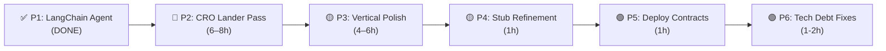

# Lead Engine CRE — Current Status & Priorities

**Updated:** February 17, 2026 (post P4–P6 execution)  
**Branch:** `main`

---

## Where We Are

### What's Working — Production-Ready

| System | Status | Details |
|--------|--------|---------|
| **Marketplace** | ✅ Live | 50+ verticals, field-level filtering, sealed-bid auctions (60s), buy-it-now for unsold leads |
| **Escrow (Base Sepolia)** | ✅ Live | Single-signature flow: USDC approve → createAndFundEscrow (atomic). On-chain allowance check skips approve if sufficient. $1 convenience fee. RTBEscrow `0xff5d…DbDB` (redeployed Feb 17) |
| **LeadNFTv2 (Base Sepolia)** | ✅ Live | ERC-721 tokenization with packed metadata. `0x3741…` |
| **CREVerifier (Sepolia)** | ✅ Live | On-chain quality scoring via Chainlink Functions. `0xe21F…` |
| **Quality Scoring** | ✅ Working | Two-stage: pre-auction JS scoring (immediate) + on-chain CREVerifier (post-mint) |
| **Auto-Bid Engine** | ✅ Working | Per-vertical preference sets with geo, quality, budget, and USDC allowance checks |
| **Privacy/Encryption** | ✅ Working | AES-256-GCM PII encryption, seller attribution, PII unlock on escrow release |
| **MCP Agent** | ✅ Upgraded | 9 tools, LangChain `AgentExecutor` + `ChatOpenAI` (Kimi K2.5), 3-tier fallback (LangChain → raw Kimi → keyword), persistent floating chat widget with `sessionStorage`, mutual exclusion with Demo Panel |
| **Demo Panel** | ✅ Working | Lead injection, auction start, settlement, bid simulation, mutual exclusion with Agent Chat |
| **Analytics** | ✅ Working | Mock toggle for dev, real Prisma/Redis queries in production |
| **Seller Funnels** | ✅ Working | Form builder, hosted forms at `/f/:slug`, lander export |
| **SIWE Auth** | ✅ Working | MetaMask wallet sign-in, race-condition mutex, no double-prompt |
| **USDC Autobid Allowance** | ✅ Working | On-chain allowance check, UI display |

### What's Stubbed — Clearly Labelled

After today's consolidation, Chainlink stubs are organized in `lib/chainlink/`:

| Stub | File | Purpose | isStub Flag |
|------|------|---------|-------------|
| **Confidential HTTP** | `confidential-http.stub.ts` | Enclave HTTP requests for scoring-data | ✅ Yes |
| **Quality Score Workflow** | `quality-score-workflow.ts` | CRE workflow: trigger → CHTT → score → return | ✅ Yes |
| **DECO (consolidated)** | `deco.stub.ts` | Web attestation + KYC verification (zkTLS) | ✅ Yes |
| **Confidential Compute** | `confidential.stub.ts` | Sealed bids & PII (auction privacy) | ✅ Yes |
| **Data Feed** | `data-feed.stub.ts` | CustomLeadFeed on-chain metric publishing | ✅ Yes |
| **CRE Quality Score** | `cre-quality-score.ts` | Shared scoring algorithm (DON source JS) | ❌ Not a stub — real logic |

Other stubs: `confidential.service.ts` (TEE compute), `datastreams.service.ts` (Data Streams metrics), analytics mock (Faker.js, prod-gated).

### Smart Contracts — All Deployed to Base Sepolia ✅

| Contract | Base Sepolia Address | Notes |
|----------|---------------------|-------|
| LeadNFTv2 | `0x3741…E303` | ERC-721 tokenization, packed metadata |
| RTBEscrow | `0xff5d…DbDB` | Redeployed Feb 17, single-sig |
| ACECompliance | `0xAea2…EfE6` | KYC/AML + reputation |
| CREVerifier | `0xe21F…eB4d` | Chainlink Functions quality scoring |
| Marketplace | `0xfDf9…6905` | On-chain commit-reveal |
| VerticalNFT | `0x60c2…EC5b` | ERC-721 + ERC-2981 royalties |
| VerticalAuction | `0x4050…1003` | Holder-priority auctions |
| CustomLeadFeed | `0x1953…6d61` | On-chain platform metrics |

---

## Priority List (Ranked)

### ✅ ~~Priority 1: LangChain MCP Agent~~ — DONE

**Completed Feb 17.** Commits: `ac5c438` → `9ee200e` → `b3200c7` → `ed891b5`

**What was delivered:**
- **Persistent Chat Widget** — Floating bubble (bottom-right, beside beaker) available on every page. `sessionStorage` persistence, unread badge, ARIA labels, keyboard shortcuts, mobile responsive.
- **LangChain Integration** — `agent.service.ts` using `ChatOpenAI` from `@langchain/openai` pointed at Kimi K2.5's OpenAI-compatible API (`api.kimi.com/coding/v1`). 9 `DynamicStructuredTool`s with Zod schemas. 3-tier fallback: LangChain → raw Kimi ReAct → keyword.
- **Mutual Exclusion** — Agent chat and Demo Panel occupy the same space, auto-close each other via custom events.
- **Self-Review** — Found and fixed critical bug (ChatMoonshot → ChatOpenAI), plus 7 additional fixes (minPrice falsy, MCP error handling, type safety, duplicate buttons, Escape conflict, ARIA).

---

### 🔴 Priority 2: CRO Pass on Hosted Landers (Highest Impact for Real Usage)

**Why next:** The hosted forms at `/f/:slug` are the actual lead capture entry point — every conversion starts here. A bad form kills the entire pipeline. CRO (conversion rate optimization) improvements compound: even a 10% uplift on form conversion translates directly into more auction volume, more revenue, and a stronger demo.

**What to do — every trick in the book:**

#### Layout & UX
- **Single-column layout** — mobile-first, no side-by-side fields on small screens
- **Sticky progress bar** — shows step completion percentage at the top
- **Trust badges** — "256-bit encrypted", "TCPA compliant", "Verified by Chainlink CRE" above the fold
- **Social proof counter** — "X leads verified today" (real count from DB)
- **Exit-intent modal** — "Don't lose your progress!" with save-and-resume

#### Form Design
- **Smart field ordering** — easy fields first (property type, timeline), hard fields last (email, phone)
- **Conditional fields** — show/hide based on prior answers (e.g., "cash-out amount" only if "refinance" selected)
- **Field-level validation** — instant inline validation with green checkmarks, not red error walls
- **Auto-format** — phone numbers auto-format as `(xxx) xxx-xxxx`, zip codes validate live with state cross-check
- **Placeholder examples** — every field has a realistic example ("e.g., $350,000")

#### Gamification (Already Partially Built)
- **Progress ring** — animated circular progress indicator per step
- **Micro-animations** — field entrance animations, success confetti on completion
- **Nudge messages** — "Almost there! Just 2 more fields" between steps
- **Speed badge** — "Completed in under 60 seconds" for fast submitters

#### Technical
- **Prefill from UTM params** — `?vertical=solar&state=CA` auto-selects fields
- **Form state persistence** — `sessionStorage` save on every field change, restore on revisit
- **A/B test hooks** — `variant` query param for testing different layouts
- **PageSpeed optimization** — lazy-load non-critical JS, preconnect to API
- **Conversion pixel** — fire seller's `conversionPixelUrl` on successful submit

#### Copy & Branding
- **Headline formula** — "Get Your Free [Vertical] Quote in 60 Seconds"
- **CTA button text** — "Get My Free Quote" not "Submit" (action-oriented)
- **Below-fold explainer** — how the platform works, privacy guarantee, blockchain verification
- **Vertical-specific hero images** — generate for top 10 verticals

**Effort:** ~6–8 hours for a thorough pass. **Impact:** Highest — directly increases lead volume and demo quality.

---

### 🟡 Priority 3: Polish 50+ Verticals (Fields, Steps, Form Design)

**Why after CRO:** Vertical polish supports the CRO goals — better fields → better forms → better leads → higher quality scores → more convincing demo. But the CRO framework needs to be in place first so the polished fields render in an optimized layout.

**What to examine for each vertical:**

#### Field Quality Audit
- **Are the fields relevant?** — e.g., does `roofing.gutter` really need `linearFeet`? Most consumers don't know this.
- **Are options exhaustive?** — e.g., `insurance.auto.drivingRecord` has `clean | 1-2 tickets | DUI | accidents` — missing "no driving history" for new drivers
- **Are labels consumer-friendly?** — `occupancy` should be "Is this your primary home?" not "Occupancy"
- **Are required fields minimal?** — every required field costs ~5% conversion. Only require what's needed to score and match.
- **Are there too many fields?** — ideal is 5–7 per step. Some verticals have 8+ in the Details step.

#### Step Flow Optimization
- **3-step forms** for complex verticals — split Details into "Property Info" + "Your Situation" for mortgage
- **2-step forms** for simple verticals — keep current structure for roofing, HVAC, etc.
- **1-step forms** for ultra-simple verticals — legal consultation, tax prep could be one step

#### Vertical-Specific Improvements (Top 10)

| Vertical | Current Fields | Suggested Changes |
|----------|---------------|-------------------|
| `solar` | roofType, roofAge, electricBill, creditScore, timeline | Add `monthlyElectricBill` (number, not range), add `ownOrRent`, move creditScore to step 2 |
| `mortgage.purchase` | purchasePrice, downPayment, loanType, purchaseTimeline, preApproved | Add `firstTimeBuyer` (boolean), add `currentRentPayment`, reorder: timeline → price → down → loan |
| `mortgage.refinance` | currentRate, loanBalance, homeValue, cashOutAmount, refinanceGoal | Add `currentLender`, make `cashOutAmount` conditional on goal="cash-out" |
| `insurance.auto` | vehicleType/Year, coverageType, drivingRecord, currentCarrier, multiCar | Add `annualMileage`, split vehicleType into make/model/year |
| `roofing.replacement` | roofAge, roofSqft, budget, preferredMaterial | Remove `roofSqft` (consumers don't know this), add `storiesInHome` instead |
| `legal.personal_injury` | injuryType, severity, estimated value, hasAttorney, incidentDate | Add `atFaultParty`, make `estimatedCaseValue` optional (consumers don't know) |
| `home_services.hvac` | serviceType, systemAge, homeSqft, fuelType | Remove `homeSqft`, add `systemType` (central, window, mini-split), add `urgency` |
| `b2b_saas.crm` | currentSolution, usersNeeded, keyFeatures | Add `annualBudget`, add `integrationNeeds` (Salesforce, HubSpot, etc.) |
| `financial_services.debt` | totalDebt, debtType, monthlyIncome, behindOnPayments | Add `creditScoreRange`, reorder: income → debt → type → behind |
| `real_estate.residential` | propertyType, priceRange, bedrooms, preApproved, financing | Add `moveInTimeline`, add `currentLivingSituation` (rent, own, with family) |

#### Form Design System
- **Consistent spacing** — 16px between fields, 32px between steps
- **Consistent select styling** — all selects should be dropdowns (not radio buttons) on mobile
- **Consistent button sizing** — primary CTA always full-width, 48px tall minimum
- **Consistent error states** — red border + inline error text, not toast notifications

**Effort:** ~4–6 hours for a thorough polish pass. **Impact:** Medium-high — improves lead quality and supports CRO.

---

### ✅ ~~Priority 4: Remaining Chainlink Stub Refinement~~ — DONE

**Completed Feb 17.** `confidential.service.ts` and `datastreams.service.ts` already had `isStub: true`. Added `isOnChain: false` to `ace.service.ts` off-chain fallbacks (`autoKYC`, `updateReputation`). Demo toggle persistence already using `PlatformConfig`.

---

### ✅ ~~Priority 5: Deploy Contracts to Base Sepolia~~ — ALREADY DONE

**All 8 contracts already deployed per `.env`.** Deploy script (`deploy-remaining-base-sepolia.ts`) has been updated with correct RTBEscrow address.

---

### ✅ ~~Priority 6: Tech Debt Quick Wins~~ — DONE

| TD | Issue | Status |
|----|-------|--------|
| TD-08 | `consentProof` hijacked as demo tag | ✅ Fixed — `LeadSource.DEMO` enum added, all references migrated |
| TD-04 | USDC check uses DB wallet, not session wallet | ✅ Already fixed |
| TD-14 | Hardcoded Sepolia chain ID | ✅ Already fixed (84532) |
| ~~TD-12~~ | ~~USDC approve uses 10× amount~~ | ✅ Already fixed |

---

## Recommended Execution Order

**Rationale:** P1 is done ✅. P4–P6 are done ✅. P2 is the highest-ROI investment (more leads = more demo activity). P3 builds on P2's foundation.

**Remaining effort:** ~10–14 hours for P2–P3.
