# Lead Engine CRE — Current Status & Priorities

**Updated:** February 17, 2026  
**Branch:** `main`

---

## Where We Are

### What's Working — Production-Ready

| System | Status | Details |
|--------|--------|---------|
| **Marketplace** | ✅ Live | 50+ verticals, field-level filtering, sealed-bid auctions (60s), buy-it-now for unsold leads |
| **Escrow (Base Sepolia)** | ✅ Live | Single-signature flow: USDC approve → createAndFundEscrow (atomic). On-chain allowance check skips approve if sufficient. $1 convenience fee. RTBEscrow `0xff5d…DbDB` (redeployed Feb 17) |
| **LeadNFTv2 (Base Sepolia)** | ✅ Live | ERC-721 tokenization with packed metadata. `0x3741…` |
| **CREVerifier (Sepolia)** | ✅ Live | On-chain quality scoring via Chainlink Functions. `0xe21F…` |
| **Quality Scoring** | ✅ Working | Two-stage: pre-auction JS scoring (immediate) + on-chain CREVerifier (post-mint) |
| **Auto-Bid Engine** | ✅ Working | Per-vertical preference sets with geo, quality, budget, and USDC allowance checks |
| **Privacy/Encryption** | ✅ Working | AES-256-GCM PII encryption, seller attribution, PII unlock on escrow release |
| **MCP Agent** | ✅ Working | 9 tools, Kimi K2.5 reasoning with keyword fallback, navigation detection, PII sanitization |
| **Demo Panel** | ✅ Working | Lead injection, auction start, settlement, bid simulation |
| **Analytics** | ✅ Working | Mock toggle for dev, real Prisma/Redis queries in production |
| **Seller Funnels** | ✅ Working | Form builder, hosted forms at `/f/:slug`, lander export |
| **SIWE Auth** | ✅ Working | MetaMask wallet sign-in, race-condition mutex, no double-prompt |
| **USDC Autobid Allowance** | ✅ Working | On-chain allowance check, UI display |

### What's Stubbed — Clearly Labelled

After today's consolidation, Chainlink stubs are organized in `lib/chainlink/`:

| Stub | File | Purpose | isStub Flag |
|------|------|---------|-------------|
| **Confidential HTTP** | `confidential-http.stub.ts` | Enclave HTTP requests for scoring-data | ✅ Yes |
| **Quality Score Workflow** | `quality-score-workflow.ts` | CRE workflow: trigger → CHTT → score → return | ✅ Yes |
| **DECO (consolidated)** | `deco.stub.ts` | Web attestation + KYC verification (zkTLS) | ✅ Yes |
| **Confidential Compute** | `confidential.stub.ts` | Sealed bids & PII (auction privacy) | ✅ Yes |
| **Data Feed** | `data-feed.stub.ts` | CustomLeadFeed on-chain metric publishing | ✅ Yes |
| **CRE Quality Score** | `cre-quality-score.ts` | Shared scoring algorithm (DON source JS) | ❌ Not a stub — real logic |

Other stubs: `confidential.service.ts` (TEE compute), `datastreams.service.ts` (Data Streams metrics), analytics mock (Faker.js, prod-gated).

### Smart Contracts — Not Yet Deployed to Base Sepolia

| Contract | Sepolia Only | Notes |
|----------|-------------|-------|
| ACECompliance | `0x7462…` | KYC/AML + reputation — needs Base Sepolia deployment |
| Marketplace | `0x3b1b…` | On-chain commit-reveal — needs Base Sepolia deployment |
| VerticalNFT | Not deployed | ERC-721 + ERC-2981 royalties for vertical ownership |
| VerticalAuction | Not deployed | Holder-priority auctions with 1.2× multiplier |
| CustomLeadFeed | Not deployed | On-chain platform metrics consumer |

---

## Priority List (Ranked)

### 🔴 Priority 1: LangChain MCP Agent Toggle (Quick Win, High Visibility)

**Why first:** Judges see it immediately. The MCP agent is the most "wow" feature — an AI that searches leads, places bids, and manages preferences. Currently uses Kimi K2.5 with keyword fallback. Adding a LangChain option via a Demo Panel toggle gives judges a choice of AI backends and demonstrates MCP tool compliance.

**What to do:**
- Add a `LLM Provider` dropdown to the Demo Panel: `Kimi K2.5 | LangChain (OpenAI) | Keyword Fallback`
- Store the selection in `localStorage` (same pattern as `VITE_USE_MOCK_DATA`)
- Frontend passes `x-llm-provider` header on `/api/v1/mcp/chat` calls
- Backend routes to the selected provider (Kimi, LangChain with OpenAI, or keyword)
- LangChain integration: `@langchain/openai` + `createToolCallingAgent` with the existing 9 MCP tools
- Needs `OPENAI_API_KEY` env var (or use a free-tier model)

**Effort:** ~2–3 hours. **Impact:** High — judges see a real agent with tool use, plus a "choice of AI backbone" differentiator.

---

### 🔴 Priority 2: CRO Pass on Hosted Landers (Highest Impact for Real Usage)

**Why next:** The hosted forms at `/f/:slug` are the actual lead capture entry point — every conversion starts here. A bad form kills the entire pipeline. CRO (conversion rate optimization) improvements compound: even a 10% uplift on form conversion translates directly into more auction volume, more revenue, and a stronger demo.

**What to do — every trick in the book:**

#### Layout & UX
- **Single-column layout** — mobile-first, no side-by-side fields on small screens
- **Sticky progress bar** — shows step completion percentage at the top
- **Trust badges** — "256-bit encrypted", "TCPA compliant", "Verified by Chainlink CRE" above the fold
- **Social proof counter** — "X leads verified today" (real count from DB)
- **Exit-intent modal** — "Don't lose your progress!" with save-and-resume

#### Form Design
- **Smart field ordering** — easy fields first (property type, timeline), hard fields last (email, phone)
- **Conditional fields** — show/hide based on prior answers (e.g., "cash-out amount" only if "refinance" selected)
- **Field-level validation** — instant inline validation with green checkmarks, not red error walls
- **Auto-format** — phone numbers auto-format as `(xxx) xxx-xxxx`, zip codes validate live with state cross-check
- **Placeholder examples** — every field has a realistic example ("e.g., $350,000")

#### Gamification (Already Partially Built)
- **Progress ring** — animated circular progress indicator per step
- **Micro-animations** — field entrance animations, success confetti on completion
- **Nudge messages** — "Almost there! Just 2 more fields" between steps
- **Speed badge** — "Completed in under 60 seconds" for fast submitters

#### Technical
- **Prefill from UTM params** — `?vertical=solar&state=CA` auto-selects fields
- **Form state persistence** — `sessionStorage` save on every field change, restore on revisit
- **A/B test hooks** — `variant` query param for testing different layouts
- **PageSpeed optimization** — lazy-load non-critical JS, preconnect to API
- **Conversion pixel** — fire seller's `conversionPixelUrl` on successful submit

#### Copy & Branding
- **Headline formula** — "Get Your Free [Vertical] Quote in 60 Seconds"
- **CTA button text** — "Get My Free Quote" not "Submit" (action-oriented)
- **Below-fold explainer** — how the platform works, privacy guarantee, blockchain verification
- **Vertical-specific hero images** — generate for top 10 verticals

**Effort:** ~6–8 hours for a thorough pass. **Impact:** Highest — directly increases lead volume and demo quality.

---

### 🟡 Priority 3: Polish 50+ Verticals (Fields, Steps, Form Design)

**Why after CRO:** Vertical polish supports the CRO goals — better fields → better forms → better leads → higher quality scores → more convincing demo. But the CRO framework needs to be in place first so the polished fields render in an optimized layout.

**What to examine for each vertical:**

#### Field Quality Audit
- **Are the fields relevant?** — e.g., does `roofing.gutter` really need `linearFeet`? Most consumers don't know this.
- **Are options exhaustive?** — e.g., `insurance.auto.drivingRecord` has `clean | 1-2 tickets | DUI | accidents` — missing "no driving history" for new drivers
- **Are labels consumer-friendly?** — `occupancy` should be "Is this your primary home?" not "Occupancy"
- **Are required fields minimal?** — every required field costs ~5% conversion. Only require what's needed to score and match.
- **Are there too many fields?** — ideal is 5–7 per step. Some verticals have 8+ in the Details step.

#### Step Flow Optimization
- **3-step forms** for complex verticals — split Details into "Property Info" + "Your Situation" for mortgage
- **2-step forms** for simple verticals — keep current structure for roofing, HVAC, etc.
- **1-step forms** for ultra-simple verticals — legal consultation, tax prep could be one step

#### Vertical-Specific Improvements (Top 10)

| Vertical | Current Fields | Suggested Changes |
|----------|---------------|-------------------|
| `solar` | roofType, roofAge, electricBill, creditScore, timeline | Add `monthlyElectricBill` (number, not range), add `ownOrRent`, move creditScore to step 2 |
| `mortgage.purchase` | purchasePrice, downPayment, loanType, purchaseTimeline, preApproved | Add `firstTimeBuyer` (boolean), add `currentRentPayment`, reorder: timeline → price → down → loan |
| `mortgage.refinance` | currentRate, loanBalance, homeValue, cashOutAmount, refinanceGoal | Add `currentLender`, make `cashOutAmount` conditional on goal="cash-out" |
| `insurance.auto` | vehicleType/Year, coverageType, drivingRecord, currentCarrier, multiCar | Add `annualMileage`, split vehicleType into make/model/year |
| `roofing.replacement` | roofAge, roofSqft, budget, preferredMaterial | Remove `roofSqft` (consumers don't know this), add `storiesInHome` instead |
| `legal.personal_injury` | injuryType, severity, estimated value, hasAttorney, incidentDate | Add `atFaultParty`, make `estimatedCaseValue` optional (consumers don't know) |
| `home_services.hvac` | serviceType, systemAge, homeSqft, fuelType | Remove `homeSqft`, add `systemType` (central, window, mini-split), add `urgency` |
| `b2b_saas.crm` | currentSolution, usersNeeded, keyFeatures | Add `annualBudget`, add `integrationNeeds` (Salesforce, HubSpot, etc.) |
| `financial_services.debt` | totalDebt, debtType, monthlyIncome, behindOnPayments | Add `creditScoreRange`, reorder: income → debt → type → behind |
| `real_estate.residential` | propertyType, priceRange, bedrooms, preApproved, financing | Add `moveInTimeline`, add `currentLivingSituation` (rent, own, with family) |

#### Form Design System
- **Consistent spacing** — 16px between fields, 32px between steps
- **Consistent select styling** — all selects should be dropdowns (not radio buttons) on mobile
- **Consistent button sizing** — primary CTA always full-width, 48px tall minimum
- **Consistent error states** — red border + inline error text, not toast notifications

**Effort:** ~4–6 hours for a thorough polish pass. **Impact:** Medium-high — improves lead quality and supports CRO.

---

### 🟡 Priority 4: Remaining Chainlink Stub Refinement

**Why lower:** The stubs are now cleanly organized and clearly labelled. Further refinement is about making them look better in the code review, not functional improvements.

- **Confidential HTTP:** Already done (today). `confidential-http.stub.ts` + `quality-score-workflow.ts` + CRE service integration.
- **DECO:** Already consolidated (today). Single `deco.stub.ts` with both web attestation and KYC verification.
- **Remaining:** Update `confidential.service.ts` to add `isStub` metadata (currently implicitly labelled). Update `datastreams.service.ts` with clearer stub documentation.

**Effort:** ~1 hour. **Impact:** Low — code quality, not user-facing.

---

### 🟢 Priority 5: Deploy ACECompliance + Marketplace to Base Sepolia

**Why last:** These contracts work on Sepolia already. Deploying to Base Sepolia is mechanical — just `npx hardhat run scripts/deploy-X.ts --network baseSepolia`. But the contracts aren't actively exercised in the demo flow today (the backend uses off-chain fallbacks when contracts aren't configured).

**Effort:** ~1 hour. **Impact:** Low — nice-to-have for completeness.

---

### 🟢 Priority 6: Tech Debt Quick Wins

From the 24-item `TECH_DEBT.md`, these are the lowest-effort highest-visibility fixes:

| TD | Issue | Effort |
|----|-------|--------|
| TD-08 | `consentProof` hijacked as demo tag → add `isDemo` boolean | 30 min |
| TD-04 | USDC check uses DB wallet, not session wallet | 15 min |
| TD-14 | Hardcoded Sepolia chain ID in Transaction update | 10 min |
| ~~TD-12~~ | ~~USDC approve uses 10× amount~~ — **FIXED**: on-chain allowance check in `useEscrow.ts` | ✅ Done |

**Effort:** ~1 hour for remaining three. **Impact:** Medium — removes obvious code-review red flags.

---

## Recommended Execution Order

```mermaid
graph LR
    A["🔴 P1: LangChain Agent Toggle\n(2–3h)"] --> B["🔴 P2: CRO Lander Pass\n(6–8h)"]
    B --> C["🟡 P3: Vertical Polish\n(4–6h)"]
    C --> D["🟡 P4: Stub Refinement\n(1h)"]
    D --> E["🟢 P5: Deploy Contracts\n(1h)"]
    E --> F["🟢 P6: Tech Debt Fixes\n(1-2h)"]
```

**Rationale:** P1 is a quick win that judges notice first. P2 is the highest-ROI investment (more leads = more demo activity). P3 builds on P2's foundation. P4–P6 are cleanup that can be parallelized or deferred.

**Total estimated effort:** ~16–22 hours for all six priorities.
