# Granular Bounties via Chainlink Functions

## Overview

Lead Engine CRE supports **per-vertical, per-lead granular bounty pools** where buyers pre-fund USDC escrow pools with specific matching criteria (geo, quality score, credit score, lead age). When a seller wins an auction with a matching lead, the bounty auto-releases on-chain as a bonus on top of the winning bid.

Matching is verified through **Chainlink Functions** — the DON executes JavaScript matching logic off-chain and writes an attested result on-chain. This ensures trustless, chain-verified criteria evaluation with gas costs ~10× cheaper than on-chain Solidity logic.

---

## Architecture

```mermaid
flowchart TD
    A[Buyer Deposits USDC] -->|VerticalBountyPool.depositBounty| B[(VerticalBountyPool Contract)]
    B -->|poolId + criteria stored in formConfig| C[(PostgreSQL — Vertical.formConfig.bountyPools)]

    D[Lead Wins Auction] -->|auction-closure.service| E[bountyService.matchBounties]

    E -->|BOUNTY_FUNCTIONS_ENABLED=true| F[functions.service.requestBountyMatch]
    F -->|BountyMatcher.requestBountyMatch| G[(BountyMatcher Contract\n0x897f8CCa...)]
    G -->|Chainlink Functions DON| H[JavaScript Matching Logic\nDON Execution]
    H -->|fulfillRequest callback| G
    G -->|MatchResult: matchedPoolIds, matchFound| I[functions.service.waitForMatchResult\n30s timeout, 2s poll]
    I -->|matched pool IDs| E

    E -->|BOUNTY_FUNCTIONS_ENABLED=false\nor Functions timeout| J[In-Memory Criteria Matching\nfallback]

    E -->|2+ pools tied on amount| K[VRFTieBreaker\n0x86c8f348...]
    K -->|randomWord % candidates| E

    E -->|bounty stacking cap\n≤ 2× lead price| L[capped MatchedBounty list]
    L -->|for each matched pool| M[bountyService.releaseBounty]
    M -->|VerticalBountyPool.releaseBounty| B
    M -->|tx hash logged| N[ace:dev-log]
```



---

## Deployed Contracts

| Contract | Address | Network | Role |
|---|---|---|---|
| **BountyMatcher** | `0x897f8CCa48B6Ed02266E1DB80c3967E2fdD0417D` | Base Sepolia | Chainlink Functions DON matching |
| **VerticalBountyPool** | *(deploy with `deploy-bounty-pool.ts` if needed)* | Base Sepolia | USDC escrow per vertical |

**BountyMatcher** is verified on [Basescan](https://sepolia.basescan.org/address/0x897f8CCa48B6Ed02266E1DB80c3967E2fdD0417D#code).

### BountyMatcher Constructor Args
| Arg | Value |
|---|---|
| `_router` | `0xf9B8fc078197181C841c296C876945aaa425B278` (Chainlink Functions Router, Base Sepolia) |
| `_donId` | `fun-base-sepolia-1` (bytes32) |
| `_subscriptionId` | `581` |
| `_initialOwner` | `0x6BBcf283847f409a58Ff984A79eFD5719D3A9F70` (deployer) |

---

## Criteria Supported

| Criterion | Type | Logic | Example |
|---|---|---|---|
| `minQualityScore` | `number (0–10000)` | Lead CRE score ≥ threshold | `7500` = Q3+ quality |
| `geoStates` | `string[]` | Lead state must be in list | `["CA","TX","FL"]` |
| `geoCountries` | `string[]` | Lead country must be in list | `["US","CA"]` |
| `minCreditScore` | `number (300–850)` | Lead credit score ≥ threshold | `680` |
| `maxLeadAge` | `number (hours)` | Lead created within N hours | `24` |

All criteria use **AND logic** — a lead must satisfy EVERY specified criterion to match a pool.

---

## Code Paths

### Buyer Deposits Bounty
```
POST /api/v1/bounties/deposit
Body: { buyerId, verticalSlug, amount, criteria?, buyerWallet? }

→ bounty.service.ts:depositBounty()
  → VerticalBountyPool.depositBounty(slugHash, amountWei)   [on-chain, if BOUNTY_POOL_ADDRESS set]
  → prisma.vertical.update({ formConfig.bountyPools })       [off-chain tracking]
```

### Lead Win Triggers Matching
```
auction-closure.service.ts:closeAuction()
→ bounty.service.ts:matchBounties(lead, winningBid)
  → [if BOUNTY_FUNCTIONS_ENABLED=true && isFunctionsConfigured()]
    → functions.service.ts:requestBountyMatch(leadId, attrs, criteria[])
      → BountyMatcher.requestBountyMatch(leadIdHash, args[])
      → Chainlink Functions DON executes _matchSource JS
      → fulfillRequest() stores MatchResult on-chain
    → functions.service.ts:waitForMatchResult(leadId, 30_000ms)
      → polls BountyMatcher.getMatchStatus() every 2s
      → returns { matchedPoolIds[], matchFound }
  → [fallback: in-memory criteria matching]
  → [if 2+ tied: VRFTieBreaker.requestResolution()]
  → bounty stacking cap: max = 2× winning bid
→ for each matched pool: bounty.service.ts:releaseBounty()
  → VerticalBountyPool.releaseBounty(poolId, sellerWallet, amountWei, leadId)
```

### Agent Queries Available Bounties
```
MCP tool: query_open_granular_bounties
GET /api/v1/bounties/available?vertical=solar&state=CA&minScore=6000

→ bounties.routes.ts
  → bountyService.getVerticalBountyTotal(vertical)
  → prisma.vertical.findUnique → formConfig.bountyPools
  → filter by state / minScore
  → returns { totalAvailableUSDC, poolCount, pools[{ poolId, availableUSDC, criteria }] }
```

---

## Environment Variables

| Variable | Default | Description |
|---|---|---|
| `BOUNTY_MATCHER_ADDRESS` | — | `0x897f8CCa48B6Ed02266E1DB80c3967E2fdD0417D` — deployed BountyMatcher |
| `BOUNTY_POOL_ADDRESS` | — | VerticalBountyPool contract address (if deployed) |
| `BOUNTY_FUNCTIONS_ENABLED` | `false` | Set `true` to activate Chainlink Functions matching path |
| `DEPLOYER_PRIVATE_KEY` | — | Signs `requestBountyMatch` transactions |
| `RPC_URL_BASE_SEPOLIA` | `https://sepolia.base.org` | RPC endpoint for contract calls |

---

## How Agents Use Bounties

Agents (powered by the Kimi/LangChain MCP layer) can:

1. **Discover ROI opportunity:**
   ```json
   { "name": "query_open_granular_bounties", "arguments": { "vertical": "solar", "state": "CA" } }
   ```
   → Returns pools offering $X bounty for CA solar leads with specified criteria.

2. **Factor bounty into bid strategy:**  
   If `totalAvailableUSDC > 0` for a matching vertical, the agent's auto-bid budget can increase — the bounty is additional revenue on top of the winning bid.

3. **Post-win confirmation:**  
   After winning, `bountyService.matchBounties()` fires automatically — agent sees the release event in the on-chain dev log.

---

## Seller Dashboard Integration

The seller dashboard and lander preview can call `GET /api/v1/bounties/available?vertical=<slug>` to:
- Show "💰 $X bounty available for this vertical" in the lander CRO banner
- Display per-criteria requirements so sellers know which leads qualify

```typescript
// Example frontend call
const data = await fetch('/api/v1/bounties/available?vertical=solar').then(r => r.json());
// data.totalAvailableUSDC, data.poolCount, data.pools[].criteria
```

---

## Redeployment Guide

```bash
# 1. Deploy BountyMatcher
cd contracts
FUNCTIONS_SUBSCRIPTION_ID=581 npx hardhat run scripts/deploy-bounty-matcher.ts --network baseSepolia

# 2. Verify on Basescan
npx hardhat verify --network baseSepolia <NEW_ADDRESS> \
  "0xf9B8fc078197181C841c296C876945aaa425B278" \
  "0x66756e2d626173652d7365706f6c69612d310000000000000000000000000000" \
  581 \
  "<DEPLOYER_ADDRESS>"

# 3. Add contract as consumer on functions.chain.link (subscription 581)

# 4. Update backend .env:
BOUNTY_MATCHER_ADDRESS=<NEW_ADDRESS>
BOUNTY_FUNCTIONS_ENABLED=true
```

---

*Last updated: 2026-02-24 | BountyMatcher: `0x897f8CCa48B6Ed02266E1DB80c3967E2fdD0417D` | Subscription: 581*
