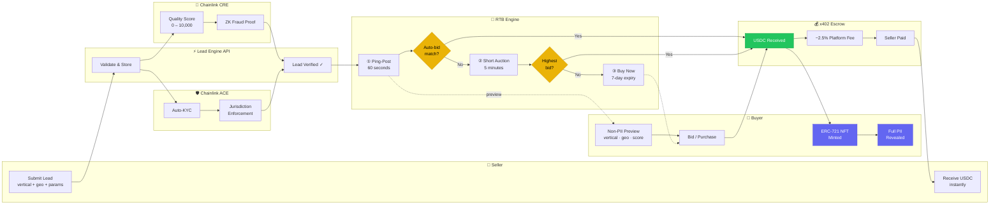

# Smart Lightning Flow

```mermaid
flowchart LR
    subgraph seller["🏢 Seller"]
        direction TB
        s1["Submit Lead<br/>vertical + geo + params"]
        s2["Receive USDC<br/>instantly"]
    end

    subgraph api["⚡ Lead Engine API"]
        direction TB
        a1["Validate & Store"]
        a2["Lead Verified ✓"]
    end

    subgraph cre["🔗 Chainlink CRE"]
        direction TB
        c1["Quality Score<br/>0 – 10,000"]
        c2["ZK Fraud Proof"]
        c1 --> c2
    end

    subgraph ace["🛡️ Chainlink ACE"]
        direction TB
        ac1["Auto-KYC"]
        ac2["Jurisdiction<br/>Enforcement"]
        ac1 --> ac2
    end

    subgraph rtb["🔄 RTB Engine"]
        direction TB
        r1["① Ping-Post<br/>60 seconds"]
        r2{"Auto-bid<br/>match?"}
        r3["② Short Auction<br/>5 minutes"]
        r4{"Highest<br/>bid?"}
        r5["③ Buy Now<br/>7-day expiry"]
        r1 --> r2
        r2 -->|No| r3
        r3 --> r4
        r4 -->|No| r5
    end

    subgraph buyer["👤 Buyer"]
        direction TB
        b1["Non-PII Preview<br/>vertical · geo · score"]
        b2["Bid / Purchase"]
        b3["ERC-721 NFT<br/>Minted"]
        b4["Full PII<br/>Revealed"]
        b1 --> b2
        b3 --> b4
    end

    subgraph escrow["💰 x402 Escrow"]
        direction TB
        e1["USDC Received"]
        e2["−2.5% Platform Fee"]
        e3["Seller Paid"]
        e1 --> e2 --> e3
    end

    s1 --> a1
    a1 --> c1
    a1 --> ac1
    c2 --> a2
    ac2 --> a2
    a2 --> r1
    r1 -.->|preview| b1
    r2 -->|"Yes"| e1
    r4 -->|"Yes"| e1
    r5 -.-> b2
    b2 --> e1
    e1 --> b3
    e3 --> s2

    style r2 fill:#eab308,stroke:#ca8a04,color:#000
    style r4 fill:#eab308,stroke:#ca8a04,color:#000
    style e1 fill:#22c55e,stroke:#16a34a,color:#fff
    style b3 fill:#6366f1,stroke:#4f46e5,color:#fff
    style b4 fill:#6366f1,stroke:#4f46e5,color:#fff
```
